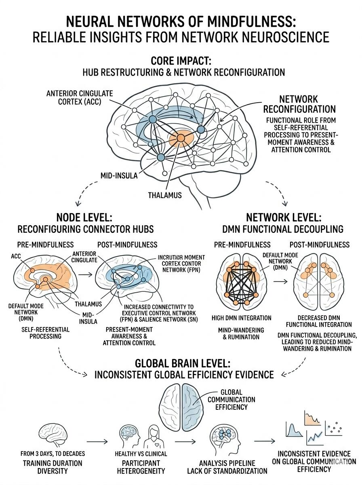

# 【最新综述】冥想是如何影响大脑的？



用网络神经科学研究正念，目前到底得到了哪些可靠的结论？
过去的正念神经影像研究，结论充满了矛盾：有的研究说正念增强了脑区连接，有的说减弱了；有的说激活了这个脑区，有的说没有。这篇综述通过系统整合，把这些零散、矛盾的结论放到了统一的网络框架下，提炼出了三个层级的可靠结论：
节点层面：正念最核心的影响，是重构连接器枢纽的连接模式，核心靶点包括前扣带皮层、丘脑、中脑岛——这些枢纽负责跨脑区的信息整合，正念让它们从“服务于自我参照加工”转向“服务于当下的觉知与注意控制”；
网络层面：唯一在所有研究中都稳定重复的结论，是正念训练后默认模式网络（DMN）的内部连接显著降低——这不是某个脑区的活动下降，而是整个DMN模块的功能去耦合，从根源上减少了思维漫游与自我反刍的神经环路；
全脑层面：关于正念能否提升全脑全局通信效率，目前的证据尚不统一——这不是正念没有效果，而是现有研究的设计差异极大：训练时长从3天静修到数十年的练习，被试从健康大学生到临床患者，分析流程没有统一规范，自然无法得到一致的结论。
PRAKASH R S, SHANKAR A, TRIPATHI V, 等. Mindfulness Meditation and Network Neuroscience: Review, Synthesis, and Future Directions. Biological Psychiatry: Cognitive Neuroscience and Neuroimaging, 2025, 10(4): 350-358. DOI: 10.1016/j.bpsc.2024.11.005.
	
https://pubmed.ncbi.nlm.nih.gov/39561891/

```
#认知科学# #科研作图# #脑科学# #冥想# #大脑可塑性# #大脑# #呼吸与冥想# #大脑潜能开发#
```


