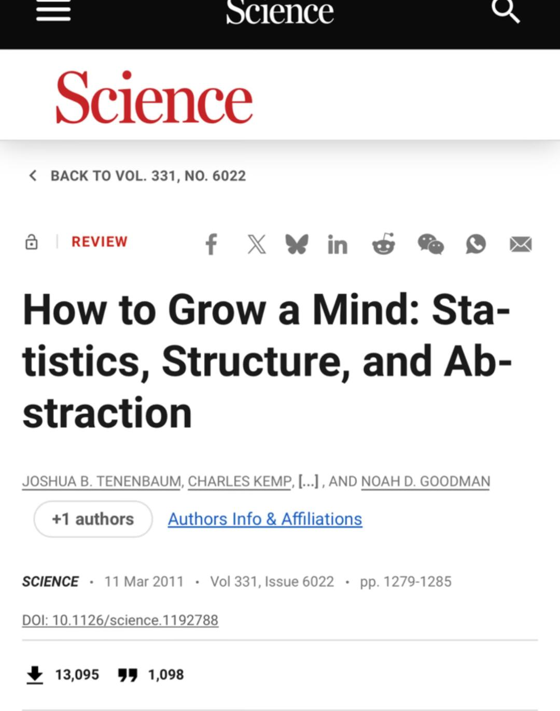

# 十五年前经典综述精准点名大模型困境



最近刷到 Tenenbaum 2011 年的老综述 "How to Grow a Mind"，当场笑了——这哥们 15 年前就把今天 LLM 被喷的点全说了一遍。
论文问了三个超级核心的问题：
1. 为什么人类可以几乎不需要数据就学会一个新概念？
——解释 one-shot / few-shot generalization
---AI:再来10TB
2. 抽象知识到底是什么形式？
——是图？规则？因果结构？程序？还是其他根本更深的结构？
---AI：我不知道，我可以预测下一个词。（当然Transformer会涌现一些结构但这些都太隐式了）
3. 人类的知识结构是怎么来的？先天？发展？世界模型？
——先天？经验？发展？结构创新的机制是什么？
--- AI：我不管，我就是统计匹配。
这篇文章当然是偏贝叶斯路线的，这里先不展开（这个部分有小伙伴喜欢的我可以专门出一期）就不赘述了.但我觉得更有意思的，是它对纯 connectionist 视角的那个批评：
小孩不是靠看上亿张图片才学会“猫”的。他能学得快，是因为脑子里本来就不是一张白纸，而是带着某种关于物体、因果、空间、行动者的初始理解框架。也就是说不是先有海量数据，才有理解；而是先有结构，数据才变得有意义。
然后你看这周的新闻：LeCun 离开 Meta 搞了 AMI Labs，刚融了 10 亿美金做 world model；李飞飞的 World Labs 上个月也融了 10 亿做 spatial intelligence。
两个顶级学者，两边押注的其实是同一件事：AI 不能只理解词，得理解世界。
	
所以有时候会觉得，AI 这几年吵来吵去，好像很新；但其实很多最根本的问题，15 年前就已经被说得很明白了。只不过当年是认知科学的问题，今天变成了 20 亿美元的创业赛道。
历史确实是个圈。

```
#人工智能# #科研论文# #大模型# #认知科学# #世界模型# #李飞飞# #ai# #贝叶斯##科技# #Science#
```


