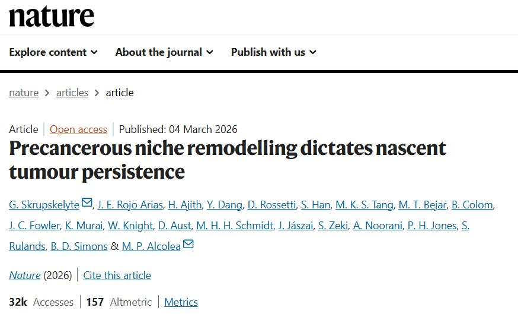
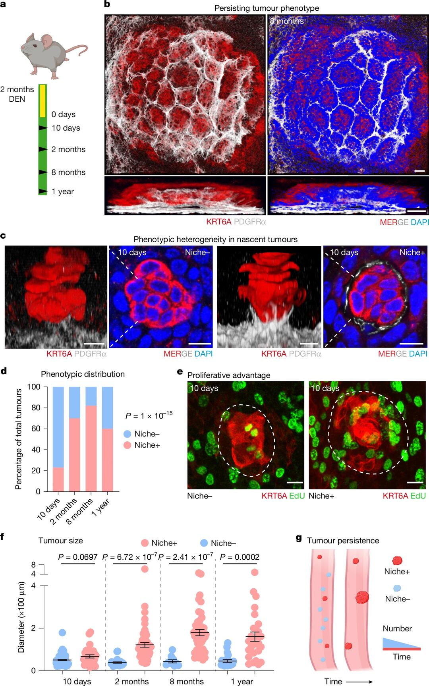
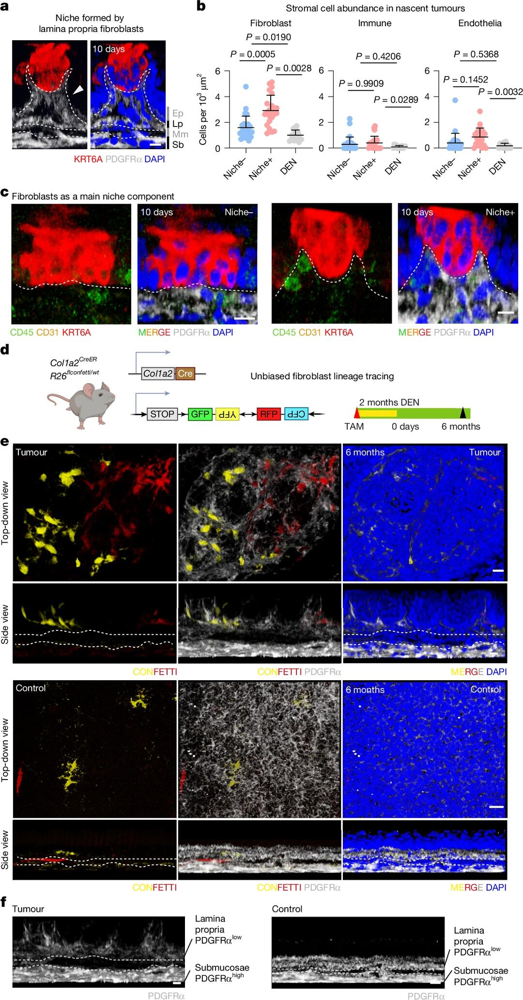
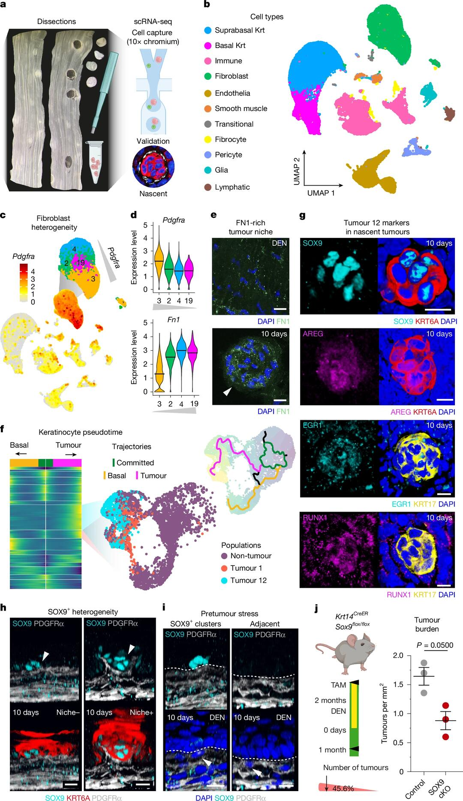
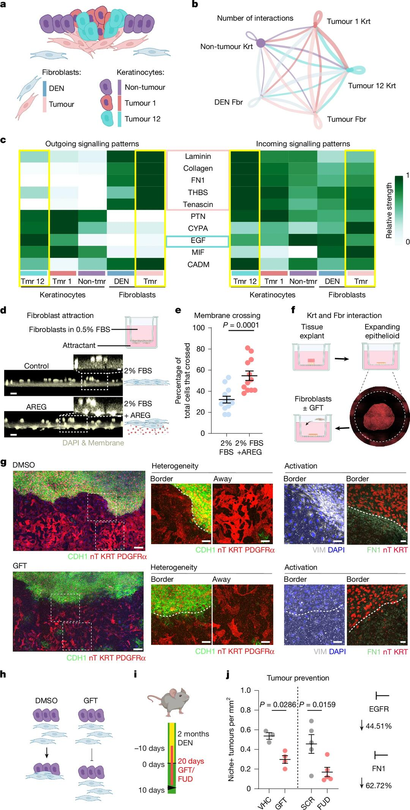
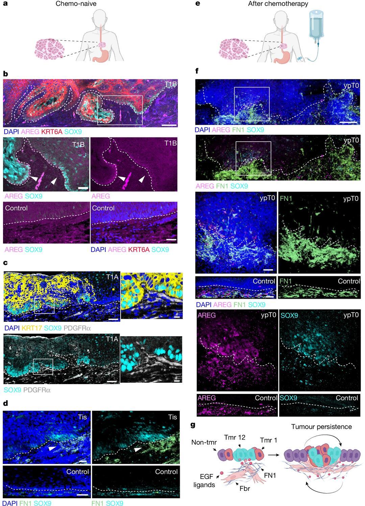

# 3W人已看！Nature关于肿瘤微环境最新论文！



🎯 早期肿瘤命运并非全由突变决定
我们习惯认为，只有突变够猛才能让微小肿瘤继续发展。然而剑桥科学家发现，当肿瘤刚出现时，周围健康组织如何反应，同样影响它能否生存和进展。在小鼠食管模型中，有些刚长出的病灶很快被邻近细胞淘汰，有些则顽强留下。
🔍 癌前生态位：微环境先行一步
研究提出“癌前生态位”概念。早期肿瘤会向下方基质发送“求救信号”，招募浅层成纤维细胞。这些成纤维细胞启动类似伤口修复的反应，产生纤维化支架，形成一个庇护所。这种支架本身甚至能让健康细胞表现出肿瘤样特征。正是这种互作，而非突变本身，决定哪些微小病灶有机会存活。
🧬 主导者是谁？SOX9+应激细胞
单细胞分析发现，早期病灶内存在异质性。一小群SOX9高表达的上皮细胞，伴随应激标记和AREG等生长因子，正是这场招募行动的发动者。它们通过EGF信号诱使PDGFRα低表达成纤维细胞聚集，并促成FN1沉积。形成的FN1富集支架又反过来促进肿瘤增殖，构成正反馈回路。
📌 人类早期病变同样存在
这不是小鼠特有现象。研究者在人类早期食管癌和治疗后残余增生中，亦观察到SOX9异质性表达、AREG高表达以及相应成纤维细胞和FN1沉积。这表明早期肿瘤“驯化”微环境的策略在人类也可能存在。
💡 阻断对话即可扭转结果
令人鼓舞的是，通过抑制EGFR信号或阻断FN1组装，研究者显著减少了建立生态位的病灶数量。这意味着干预肿瘤与基质的沟通有望成为预防策略，而不仅仅是瞄准肿瘤突变本身。
	
📣 启示
早期微环境塑造——肿瘤能否“站稳脚跟”，取决于是否成功构建支持性的纤维化生态位，而非突变强度。
成纤维细胞角色前移——癌前阶段，局部成纤维细胞已提前动员，搭建“脚手架”。
应激细胞驱动——SOX9+亚群作为信号发射源，主导早期生态位建构，敲除SOX9会让早期病灶难以存活。
这项研究提醒我们，早期癌变是一个生态学过程，突变只是其中一环。理解并干预肿瘤与微环境的互动，或许是未来癌症早期预防与诊治的新突破点。
	
主页还有更多科研干货哦，有生信分析需求也可以联系～

```
#生物信息学# #生物医学科研# #科研# #生信分析# #单细胞分析# #sci# #生物实验# #医学实验# #细胞实验# #单细胞测序#
```







