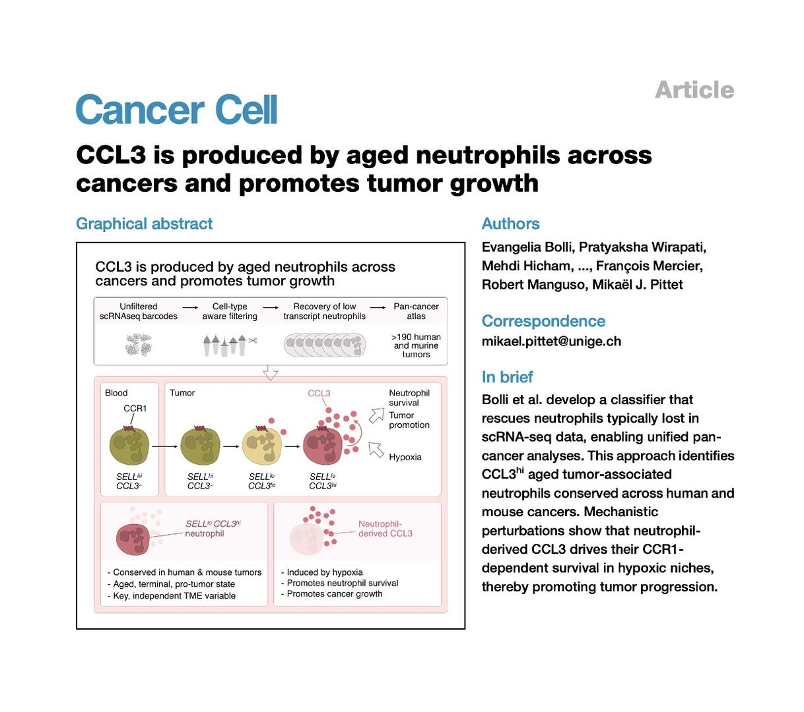
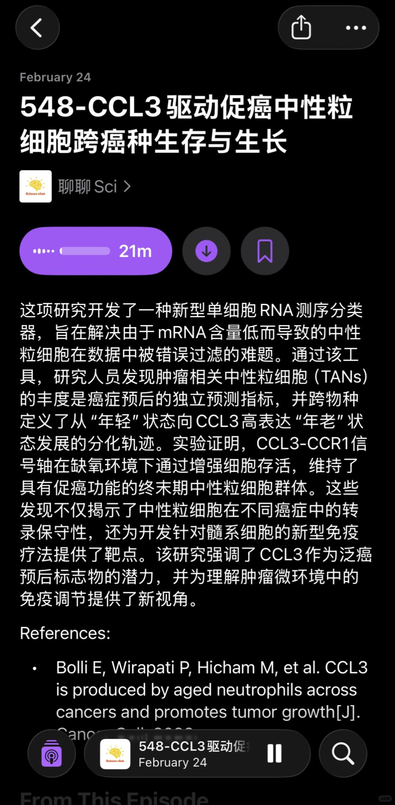
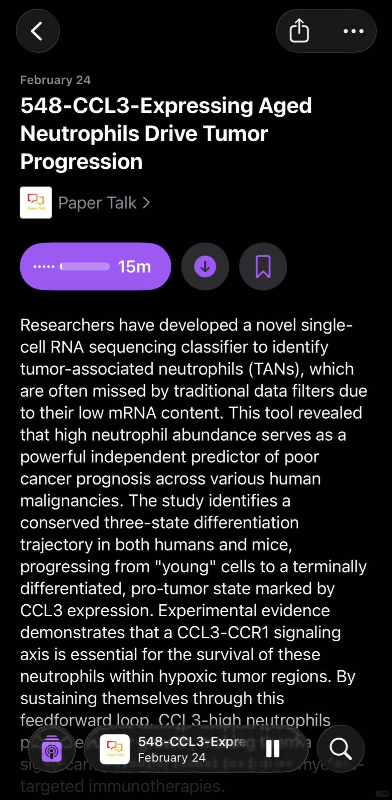

# CCL3驱动促癌中性粒细胞跨癌种生存与生长



🌋节省精力，去听播客🌋
🌋详细内容欢迎收听podcast：聊聊Sci🌋
🌋英文版podcast：Paper Talk🌋
这项研究开发了一种新型单细胞RNA测序分类器，旨在解决由于mRNA含量低而导致的中性粒细胞在数据中被错误过滤的难题。通过该工具，研究人员发现肿瘤相关中性粒细胞（TANs）的丰度是癌症预后的独立预测指标，并跨物种定义了从“年轻”状态向CCL3高表达“年老”状态发展的分化轨迹。实验证明，CCL3-CCR1信号轴在缺氧环境下通过增强细胞存活，维持了具有促癌功能的终末期中性粒细胞群体。这些发现不仅揭示了中性粒细胞在不同癌症中的转录保守性，还为开发针对髓系细胞的新型免疫疗法提供了靶点。该研究强调了CCL3作为泛癌预后标志物的潜力，并为理解肿瘤微环境中的免疫调节提供了新视角。
References:
Bolli E, Wirapati P, Hicham M, et al. CCL3 is produced by aged neutrophils across cancers and promotes tumor growth. Cancer Cell, 2026.

```
#科研# #研究生# #博士# #线粒体与衰老# #细胞# #科研学习# #生物学# #神经干细胞# #衰老# #癌症#
```




