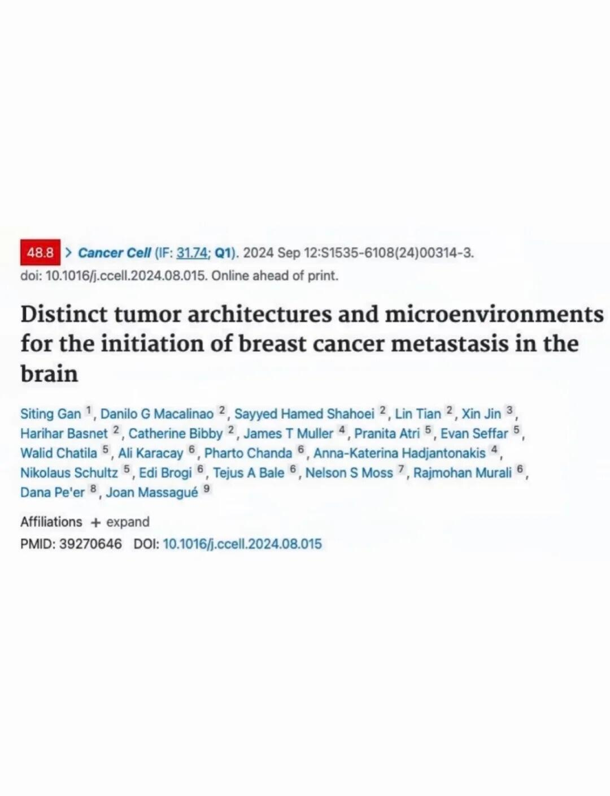
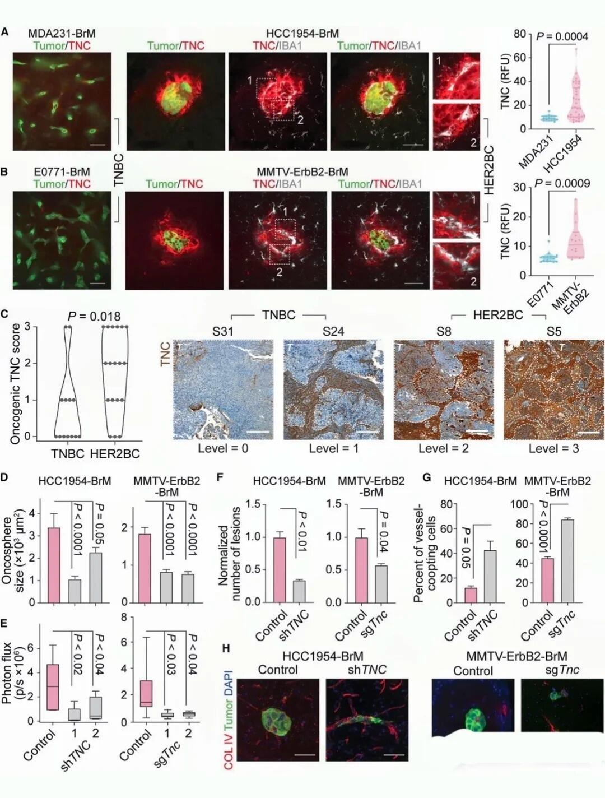
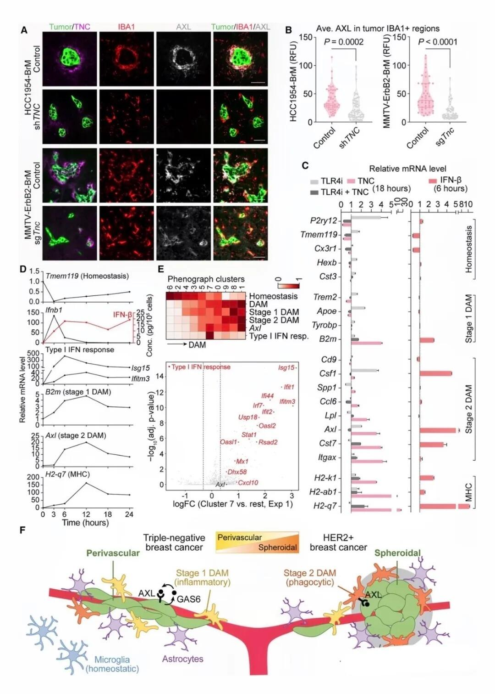
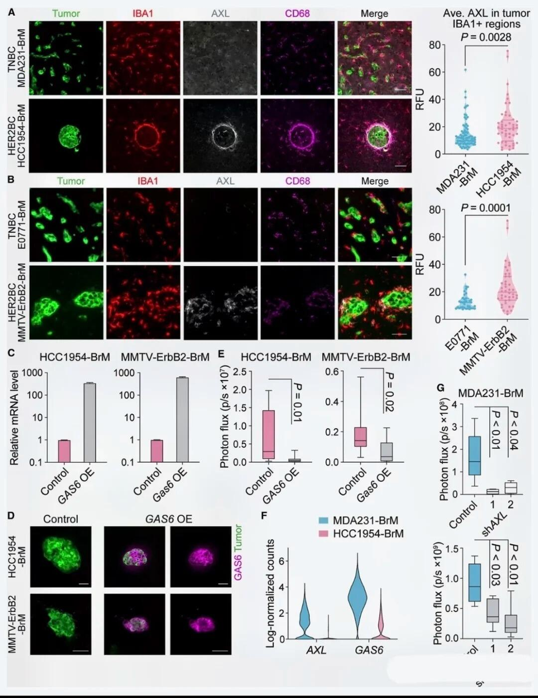
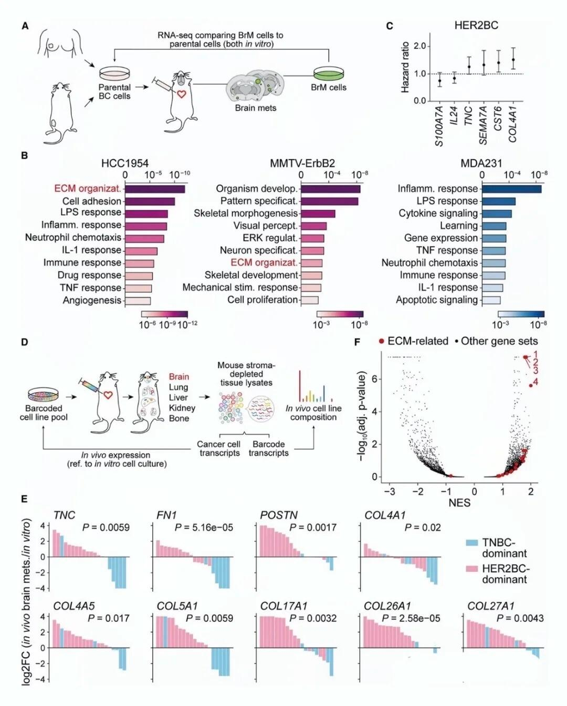
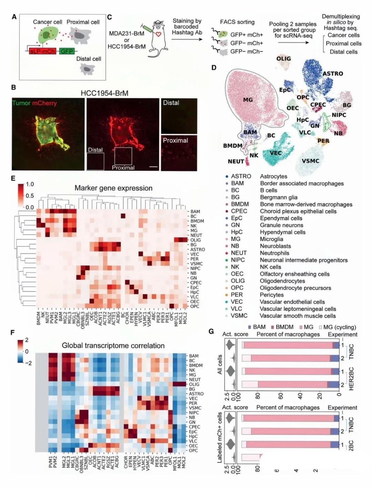
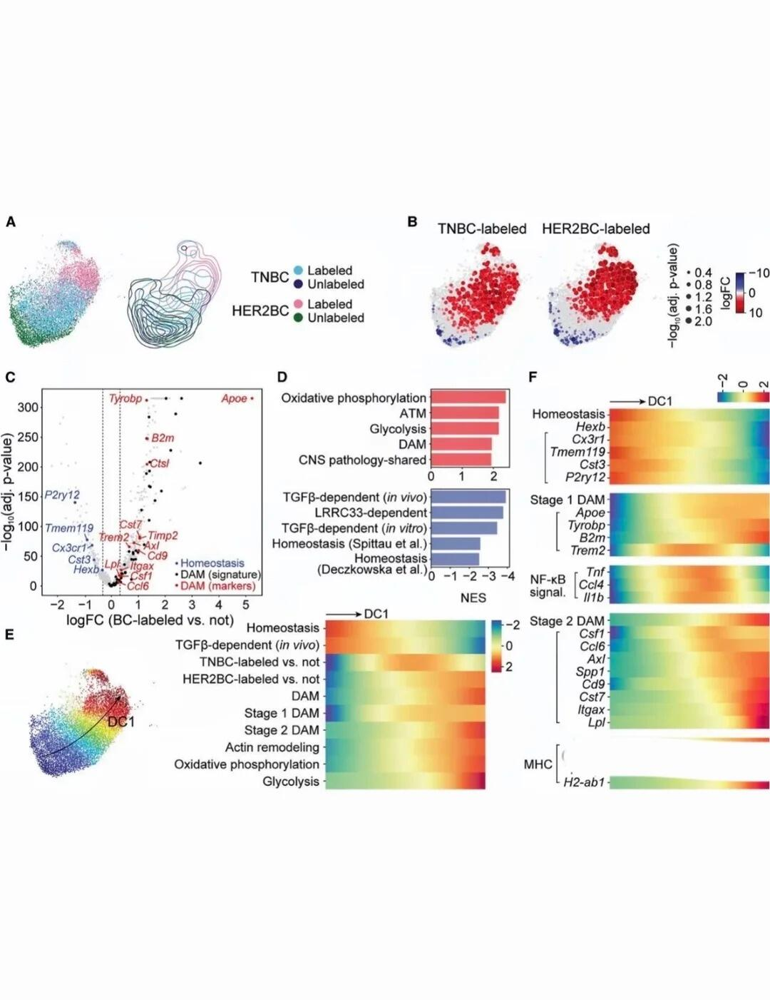
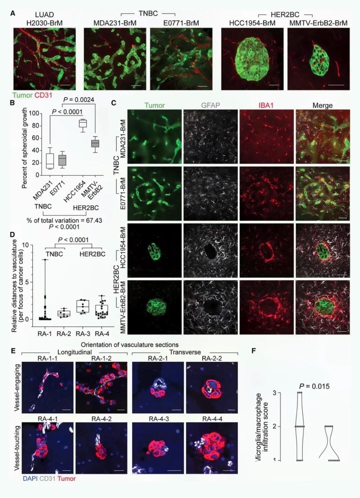
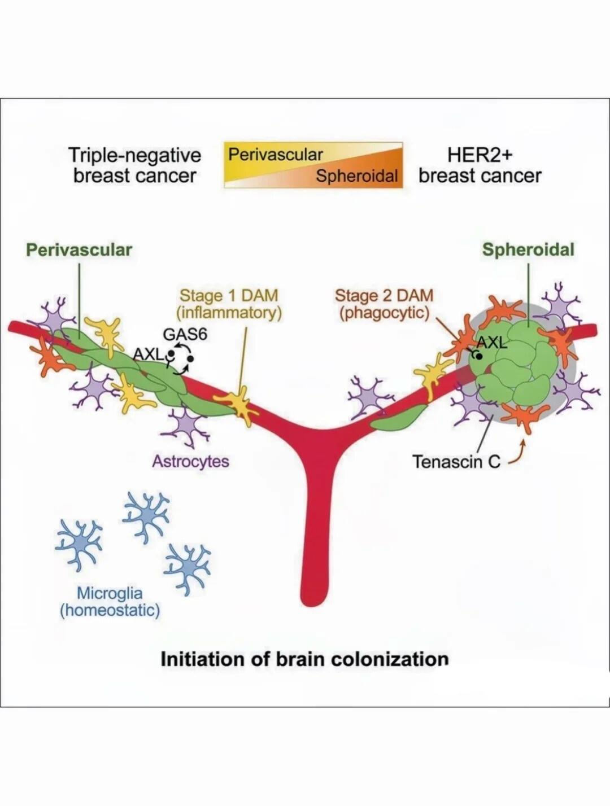

# CancerCell又一力作乳腺癌脑转移的两种模式

## 相关链接

- 更正式的脑转移精读：[[文献精读/乳腺癌脑转移/脑转移基因组免疫谱_2025|脑转移基因组免疫谱]]
- 同样聚焦脑转移适应，但从代谢机制切入：[[文献精读/乳腺癌脑转移/p53-SCD1脑转移_2026|p53-SCD1 脑转移]]
- 如果要放回更大的器官特异性框架：[[文章思路/乳腺癌转移器官特异性免疫生态文章逻辑|乳腺癌转移器官特异性免疫生态文章逻辑]]



脑转移是癌症的一种严重并发症，取决于播散性癌细胞的初始存活、微环境适应和生长。脑转移定植的关键早期阶段决定了播散性癌细胞的主要命运，然而，脑转移形成的空间特征及其在疾病进展中的作用尚不清楚。
	
今天，小编要和大家分享一篇2024年9月发表在Cancer Cell（IF：48.8）上的文章，通过使用小鼠模型和人体组织样本，研究了脑复发的两种常见来源：三阴性乳腺癌（TNBC）和 HER2+ （HER2BC）乳腺癌启动脑转移定植的特征
一、亮点
1.脑转移瘤起始于独特的肿瘤结构和基质
2.血管周围和球状微转移引起不同的小胶质细胞反应
3.乳腺癌细胞衍生的腱蛋白C（TNC）促进球状集落生长
4.TNC通过I型干扰素反应触发疾病相关的小胶质细胞状态
	
二、主要结果
大脑中血管周围和球状转移的起始模式 首先，作者构建了不同的乳腺癌脑转移小鼠模型。一个是TNBC脑转移，包括利用人MDA-MB-231-BrM（简称MDA231-BrM）细胞在无胸腺小鼠中和小鼠E0771-BrM细胞在免疫活性小鼠中，体现的是以血管共生为主的生长模式。另一个是HER2BC脑转移，如人类 HCC1954-BrM 和小鼠 MMTV-ErbB2-BrM 模型，代表的是以球形集落生长的生长模式。这表明，脑实质的转移定植遵循不同的特征模式，包括TNBC中常见的弥漫性血管周围模式，以及HER2BC中丰富的先前未报道的紧密球状模式。 接下来，作者研究了大脑微环境如何响应血管共生和球状初始两种生长模式，以及是什么驱动了这些不同的转移定植模式。 针对第一个问题，作者研究了大脑定植模式与星形胶质细胞、小胶质细胞和巨噬细胞（大脑TME的主要组成部分）在空间上的相互作用。
	
结果发现，在TNBC细胞形成的以血管共生为主的集落中，癌细胞暴露于GFAP+星形胶质细胞和IBA1+小胶质细胞和巨噬细胞并与其混合。而在HER2BC细胞形成的球形集落中，星形胶质细胞和小胶质细胞/巨噬细胞很大程度上局限于其外围。 对两名TNBC患者和两名HER2BC患者快速尸检中获得的含有微观转移灶的脑组织标本的临床相关性的分析也支持了人类乳腺癌细胞在启动大脑定植时对两种生长模式具有不同的倾向。

```
#医学SCI# #生信分析# #医学# #细胞# #医学博士# #科研# #sci# #文献# #cell# #生物医学科研#
```










