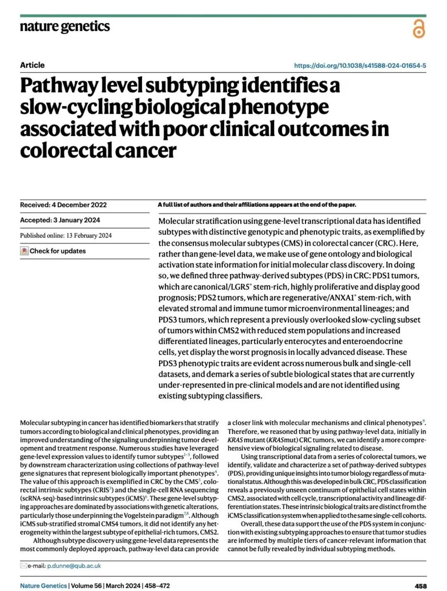
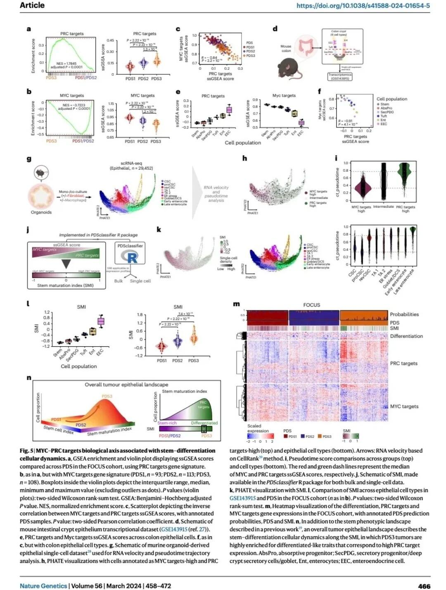
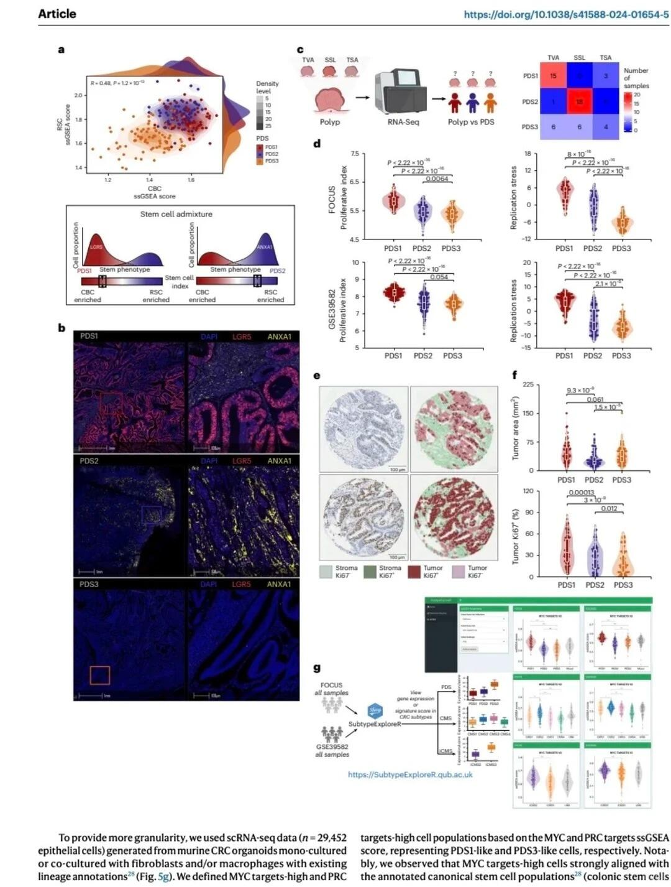
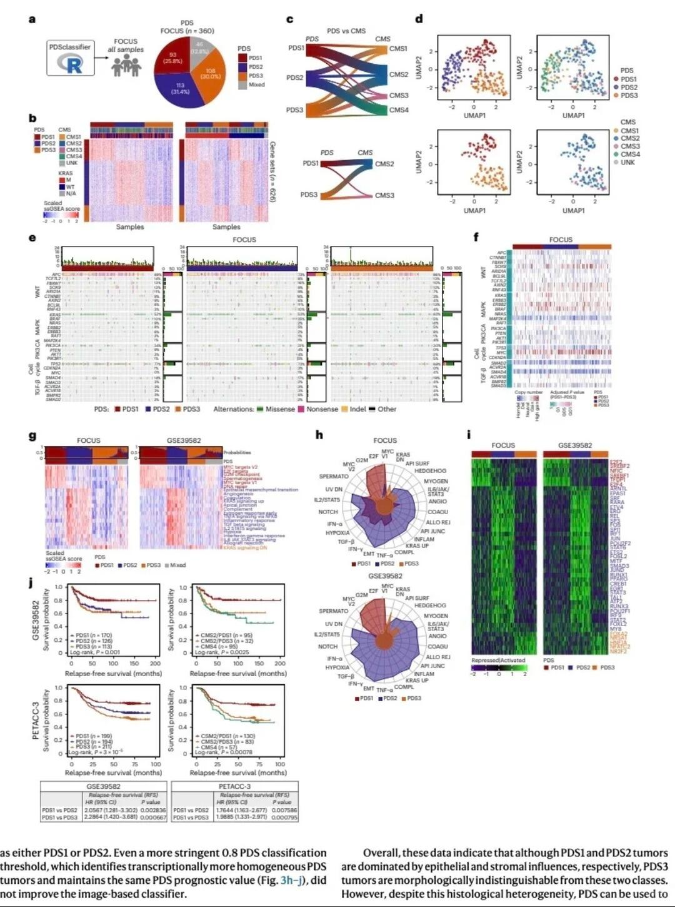
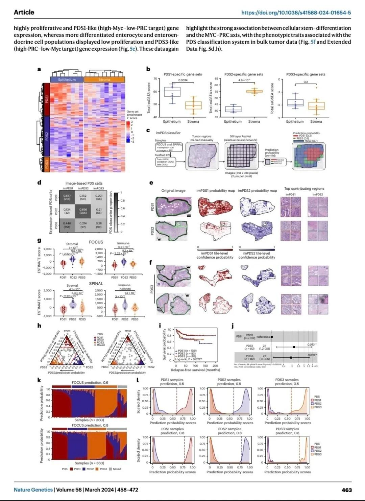
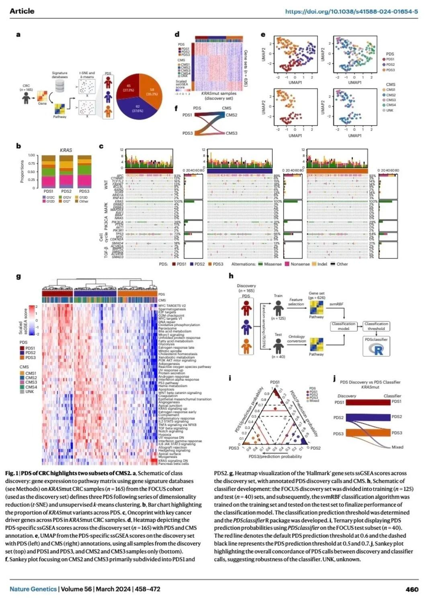

# Nature Genetics通路级别生信分析！太绝了



转录组研究大都依赖基因表达，试图把差异基因与表型联系起来。然而，较基因水平数据，通路往往能提供与机制和表型更密切的联系。平时在分析时总觉得缺点什么，直到看到这个工作，恍然大悟！这篇文章共8张大图，丰富、详细、逻辑严谨，层层递进，很适合大家去看一看。
	
文章介绍了一种基于通路级别的肿瘤亚型发现方法，这种方法通过对结直肠癌（CRC）患者的基因本体和生物学活性状态信息进行初步的分析，定义了三种派生自通路的亚型（PDS）。这一研究方法与传统基于基因水平的数据分析不同，它更多地关注在生物学通路层面上对疾病进行分类和理解。
	
背景：以前的研究多依赖于基因表达数据来进行肿瘤亚型的分类，这些研究大多关注特定的遗传变异。然而，这篇文章强调了通过研究通路级别的数据能更深入地理解肿瘤的生物学特性和临床表现。
	
研究思路：作者提出通过分析通路级数据，特别是在KRAS突变的结直肠癌样本中，能够揭示更广泛的生物信号过程。研究采用了单样本基因集富集分析（ssGSEA），基于不同的生物学通路定义了三种通路派生亚型（PDS）。
	
研究内容： PDS1：表现为高增殖性，具有良好的预后。 PDS2：显示出高的间质和免疫细胞成分，预后较差。 PDS3：代表一种慢周期的细胞状态，具有最差的预后，这种状态在以前的分类中未被注意到。
	
结果：通过分析大规模的单细胞和整体样本数据集，发现PDS3具有明显的病理特征和不良的临床结果。这些特征在之前的预临床模型中没有被识别，说明通路级的亚型能提供新的生物标记物和治疗ba点。
	
创新性：本文的创新点在于使用通路级别的数据来定义肿瘤亚型，这不仅可以揭示基因表达变化背后的复杂生物学机制，而且可以识别出传统方法中未能注意到的肿瘤生物学特性。
	
划重点：通路level的研究方法强调的是通过分析通路和生物过程的活性来分类和理解疾病，而非单一基因或基因变异。这种方法通过整合更广泛的生物信息分析，提供了一种全面的视角来观察和处理复杂的生物学问题，特别是在疾病分类和预后预测方面具有潜在优势。

```
#科研学习# #生信分析# #SCI期刊# #医学SCI# #细胞# #sci# #生物信息学# #科研# #科研日常#
```







