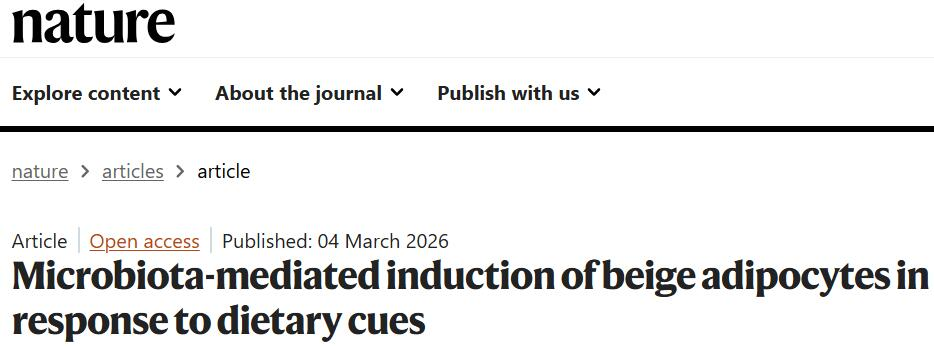
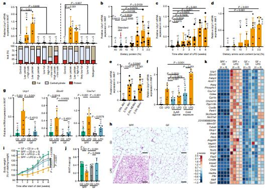
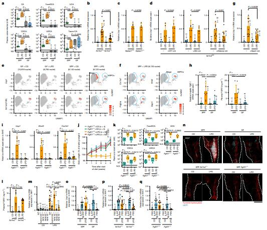
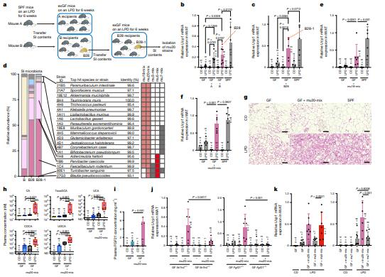
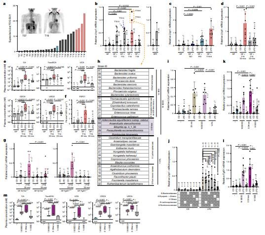
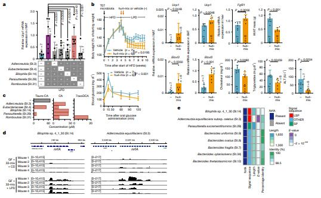
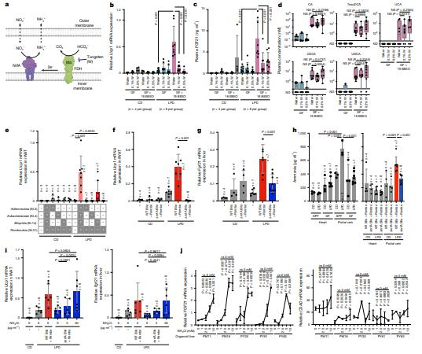

# 为什么你的机制研究总停在表面？答案在这里



很多人做机制研究，往往看到某条通路变了、几个基因上调了、表型出来了，就觉得故事讲完了。但这篇文章最值得学的地方，不是又验证了一条下游通路，而是作者没有停在“脂肪变了”这一步，而是继续往上追：到底是谁在驱动这个变化？
文章一开始先用小鼠模型证明，低蛋白饮食能明显诱导脂肪组织进入更强的“产热”状态。作者不是只放一张结果图就收尾，而是通过不同营养比例对比、不同蛋白浓度、不同喂养时间、不同氨基酸组成，再结合组织切片、基因表达热图等方法，把这个现象先做扎实：这个变化是真的、稳定的，而且有强弱差异。
接着，作者没有只盯着脂肪本身，而是进一步追问：这个变化是不是有更上游的来源？ 于是他们用了无菌小鼠和菌群干预做对照，结果发现，一旦没有肠道菌群，低蛋白饮食诱导的脂肪“变棕”现象就明显减弱。文章也因此从“饮食影响脂肪”推进到了“菌群是关键中间环节”。
找到菌群后，作者继续往下拆，去找真正传递信号的“桥梁”。他们通过代谢检测、LC–MS/MS、基因敲除等方法，发现胆汁酸、FXR 和肝脏分泌的 FGF21 都参与了这个过程。与此同时，作者还加入了单核测序和 UMAP 图，去看哪些细胞在表达这些关键信号、哪些细胞在低蛋白条件下发生了变化。这样，文章就不只是“信号变了”，而是开始回答：到底是谁在响应。
更进一步，作者没有停在“菌群参与”这种大结论上，而是继续从复杂菌群里往下拆。通过菌群移植、定义菌群组合、16S测序、qPCR、胆汁酸和 FGF21 检测，他们证明真正起作用的不是“所有菌”，而是特定菌群组合。随后，作者又把这个思路推进到人来源菌群，并结合 FDG-PET、更小的功能菌组合筛选、代谢表型验证，说明这条机制不仅在小鼠里成立，也有一定的人群相关性和转化潜力。
最后，文章把机制继续追深到具体功能分子。作者锁定了某些菌的 nrfA 依赖性产氨能力，再通过抑制实验、缺失菌株对照、血氨检测、补加氯化铵救援、人肝类器官验证，证明这些菌能通过“氨—FGF21”这条线推动脂肪产热程序。也就是说，这篇文章真正高级的地方，不是找到几个点，而是把现象、菌群、信号、细胞和功能机制一层层串成了完整闭环。

```
#华哥生信# #生信思路# #生信分析# #提供思路和创新点#
```








