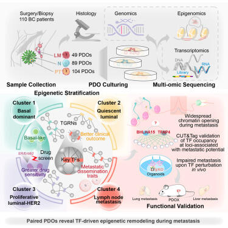
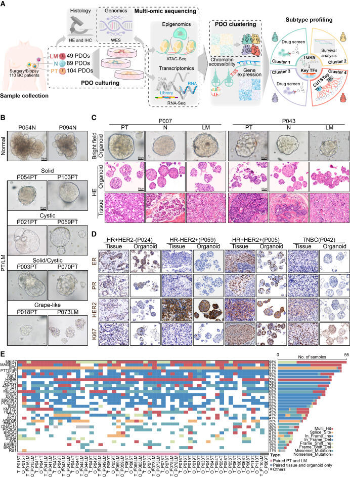
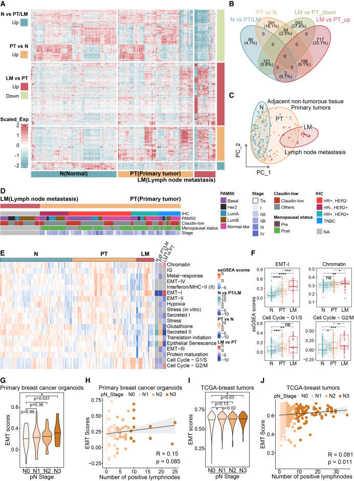
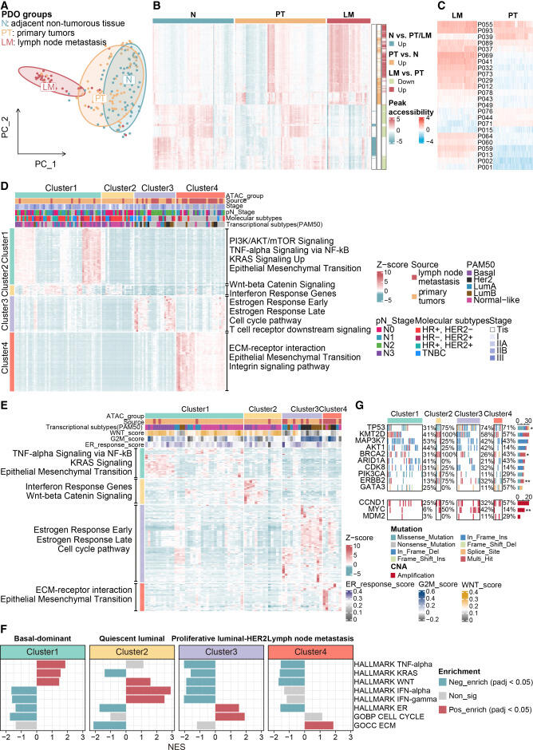
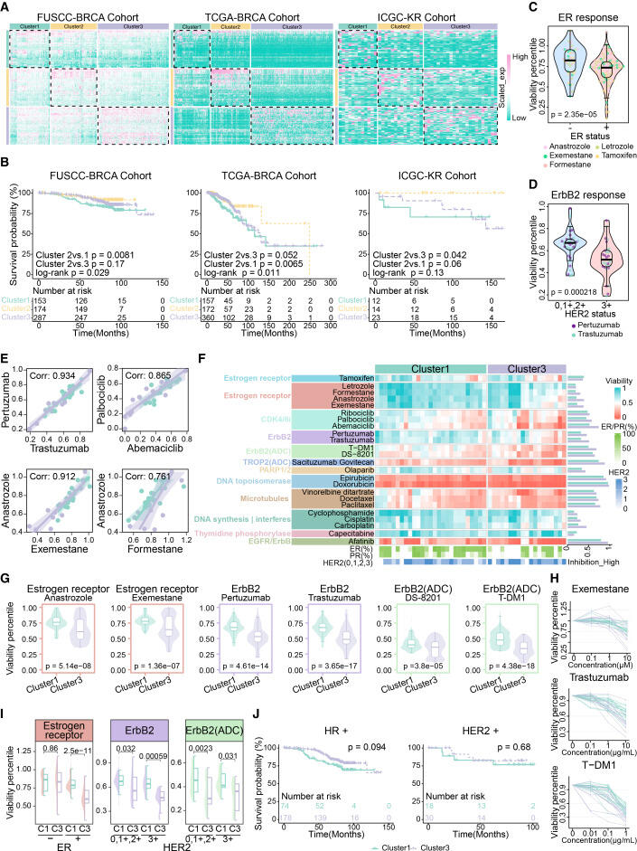
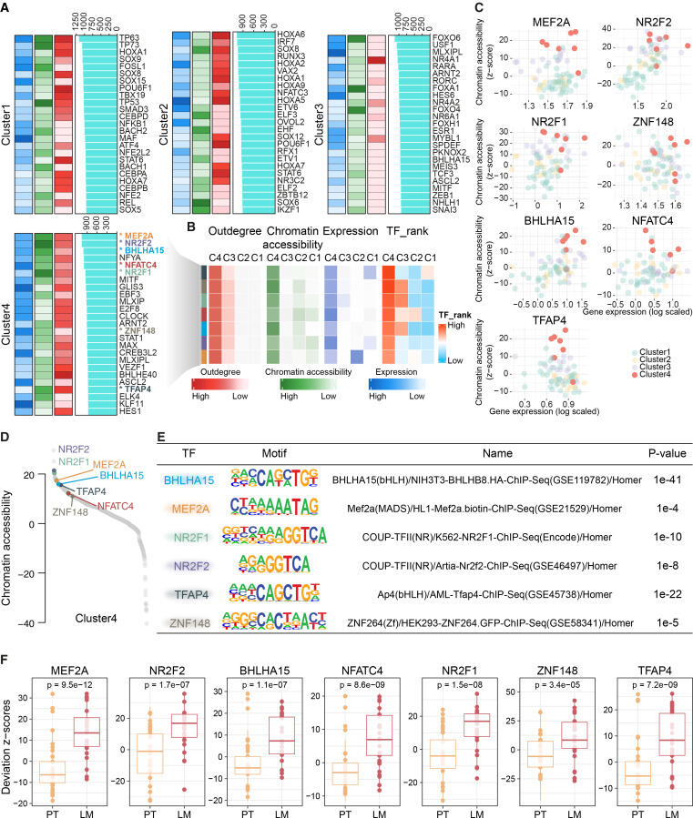
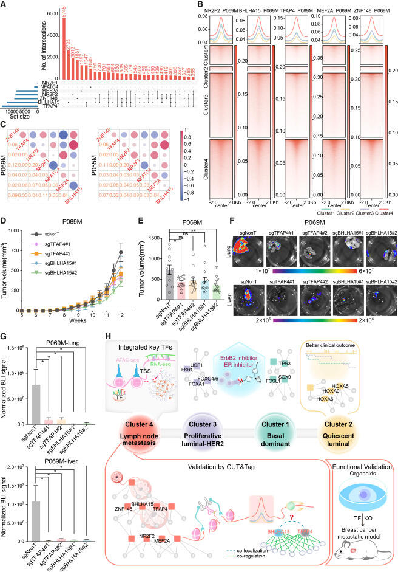

# 乳腺癌转移表观遗传重塑机制研究



🌐 一、研究全景速览
乳腺癌进展伴随显著临床异质性与表观遗传重编程，现有亚型难以捕捉转移相关分子变化。本研究构建配对患者源类器官库，解析转移进程中转录因子驱动的表观遗传重塑。
💡 二、核心创新突破
首次基于配对类器官系统，揭示乳腺癌转移中由特定转录因子驱动的广泛表观遗传重编程，明确了与转移潜能相关的分子簇与调控网络。
🧪 三、关键材料设计与验证
建立包含匹配原发肿瘤、邻近正常组织及淋巴结转移的类器官库，通过多组学分析保留肿瘤分子特征，验证了不同表观遗传簇的转移潜能与核心转录因子调控通路。
🤔 四、我们的启发与延伸
（1）逆向思维：跳出传统亚型分类，从表观遗传层面解析转移驱动机制
（2）体系化设计：整合类器官模型与多组学技术，实现临床样本的精准分子解析
（3）平台潜力：为乳腺癌进展调控机制研究提供类器官表观遗传表征平台
📄 五、原文信息
（1）期刊来源：Cell Stem Cell
（2）原文标题：配对的患者源类器官揭示了乳腺癌转移中转录因子驱动的表观遗传重塑

```
#医工交叉# #纳米医学# #科研# #科研日常# #干细胞研究# #乳腺癌# #表观遗传学# #类器官模型#
```








