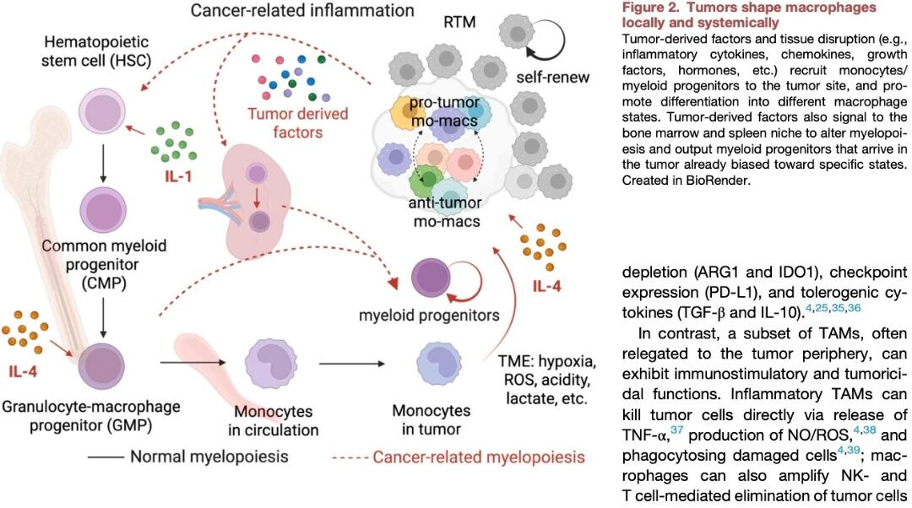
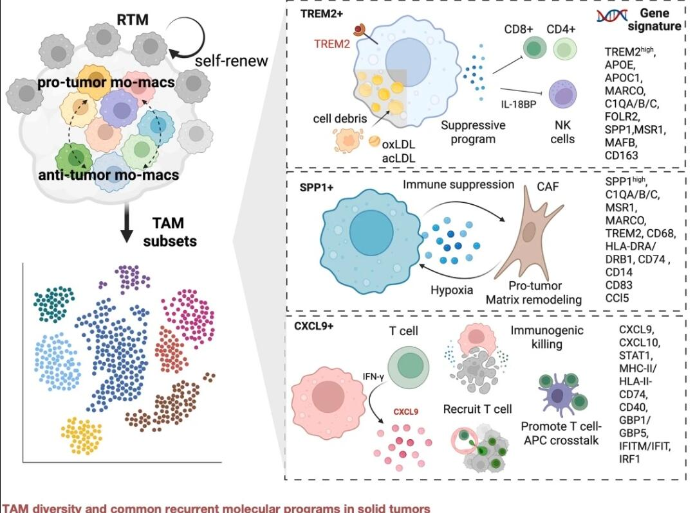
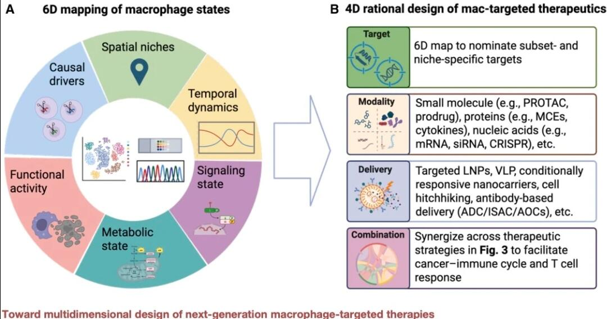

# 多维组学解析巨噬细胞状态



一、肿瘤驱动的髓系生成与TAM起源
肿瘤通过系统性炎症重塑骨髓造血过程，打破正常髓系生成平衡。肿瘤来源因子（如IL-1、IL-4）及组织损伤信号，一方面直接招募循环单核细胞向肿瘤部位浸润，另一方面作用于骨髓和脾脏微环境，改变造血干细胞（HSC）向粒-巨噬系祖细胞（GMP）的分化方向，使输出的髓系祖细胞预先偏向促肿瘤表型。这种“系统性教育”使TAM不仅源于局部单核细胞浸润，还来自肿瘤远程调控的髓系生成，为TAM的持续富集和功能极化提供了源头保障。
二、TAM的功能异质性与分子亚型
TAM存在显著的功能二分性与亚型多样性：
- 促肿瘤亚型：以TREM2⁺、SPP1⁺亚群为代表，高表达ARG1、IDO1、PD-L1等免疫抑制分子，通过清除细胞碎片、代谢重编程及分泌TGF-β、IL-10等抑制性细胞因子，构建免疫抑制微环境；SPP1⁺亚群还与癌相关成纤维细胞（CAF）协同，介导基质重塑和缺氧适应，促进肿瘤侵袭转移。
​
- 抗肿瘤亚型：以CXCL9⁺亚群为代表，受IFN-γ等信号激活，高表达CXCL9/10等趋化因子，招募并激活CD8⁺ T细胞，增强抗原呈递与免疫杀伤功能，发挥抗肿瘤免疫作用。
​
- 可塑性调控：TAM在促肿瘤与抗肿瘤状态间动态转换，受TME缺氧、酸性、乳酸等微环境信号及细胞间互作（如RTM自我更新、IL-4极化）的精准调控。
三、多维组学驱动的TAM靶向治疗设计
基于6D巨噬细胞状态图谱（空间生态位、时间动态、信号状态、代谢状态、功能活性、因果驱动），研究提出了4D理性化治疗设计框架：
1. 靶点筛选：通过多维组学定位亚型特异性分子（如TREM2、SPP1、CXCL9），实现精准靶向。
​
2. ** modality选择**：涵盖小分子药物（PROTAC、前药）、蛋白药物（细胞因子、单克隆抗体）、核酸药物（mRNA、siRNA）等多种形式
​
3. 递送优化：采用靶向脂质纳米颗粒（LNP）、抗体偶联药物（ADC）等技术，实现TAM亚型特异性递送，降低脱靶毒性
​
4. 联合策略：与免疫检查点抑制剂、化疗等联用，协同激活抗肿瘤免疫循环，增强T细胞应答
四、研究意义与临床转化前景
该研究系统解析了TAM从起源到功能的全链条调控机制，打破了传统M1/M2二元分类的局限，为肿瘤免疫治疗提供了新方向：一方面，靶向促肿瘤TAM的清除或重编程可逆转免疫抑制；另一方面，激活抗肿瘤TAM亚型可增强免疫效应细胞功能。这种多维精准靶向策略，有望克服当前免疫治疗的耐药性问题，为下一代巨噬细胞靶向疗法奠定理论与技术基础。

```
#sci# #生信分析# #生物信息学#
```




