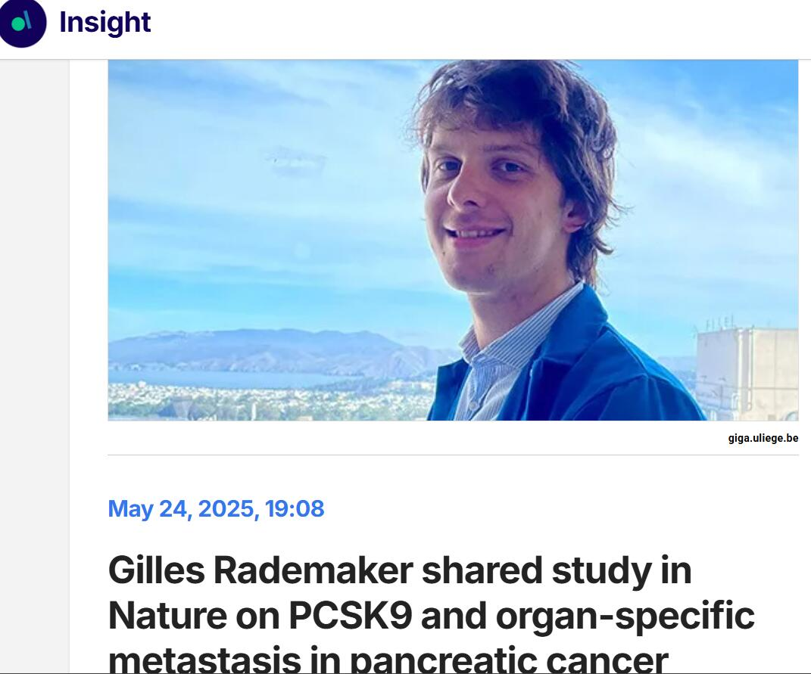
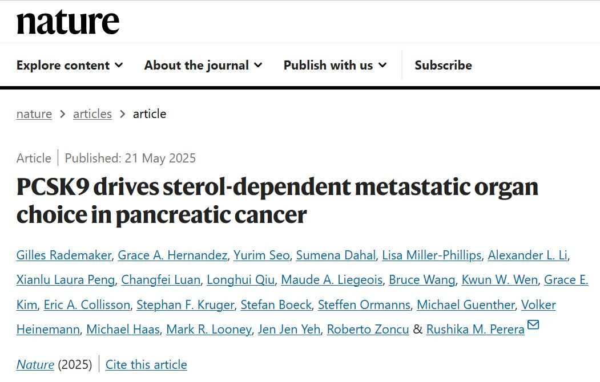
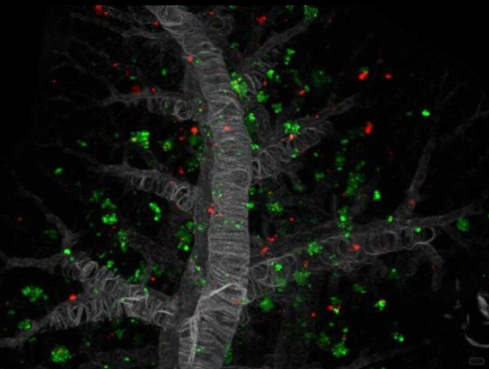

# 我们团队Nature最新文章-胰腺癌转移机制



第一作者是比利时博士Gilles Rademaker，现已回国开了他自己的实验室。Gilles非常好相处，对肿瘤代谢研究感兴趣的学弟学妹们可以加入他课题组。 这篇文章从2020开始做到2025, Gilles几乎没有休过长假。当然，里面大部分作者都参与做了好多实验, 比如第三作者Sarah做了所有的3D clearing imaging实验，然后我们负责所有小鼠手术模型（这个课题总共实验超过500只小鼠模型，当然希望将来可以少用小鼠模型）。
	
该研究于2025年5月发表在《Nature》上，揭示了PCSK9（前蛋白转化酶枯草杆菌蛋白酶9）如何通过胆固醇代谢机制决定胰腺导管腺癌（PDAC）的转移器官选择。研究发现，PCSK9表达水平不同的癌细胞会偏好不同的转移部位：低表达PCSK9的PDAC细胞更倾向于转移到富含LDL胆固醇的肝脏，而高表达PCSK9的细胞则偏向转移至肺部。
	
机制方面，PCSK9低表达细胞通过增强LDL摄取激活mTORC1通路，并将胆固醇代谢为24(S)-羟胆固醇，促使肝脏微环境释放养分；而高表达PCSK9的细胞上调远端胆固醇合成通路，产生7-脱氢胆固醇等物质，增强对肺部高氧环境中铁死亡的抵抗。
	
功能性实验表明，操控PCSK9表达即可改变PDAC细胞的转移器官方向，说明PCSK9是转移定位的关键决定因子。这一发现不仅深化了对肿瘤转移机制的理解，也为开发针对PCSK9的抗转移治疗策略提供了潜在路径，尤其是考虑到现有PCSK9抑制剂已广泛用于心血管疾病。

```
#科技# #科研# #我的留学故事# #文献阅读# #Nature# #CNS# #肿瘤# #代谢#
```




