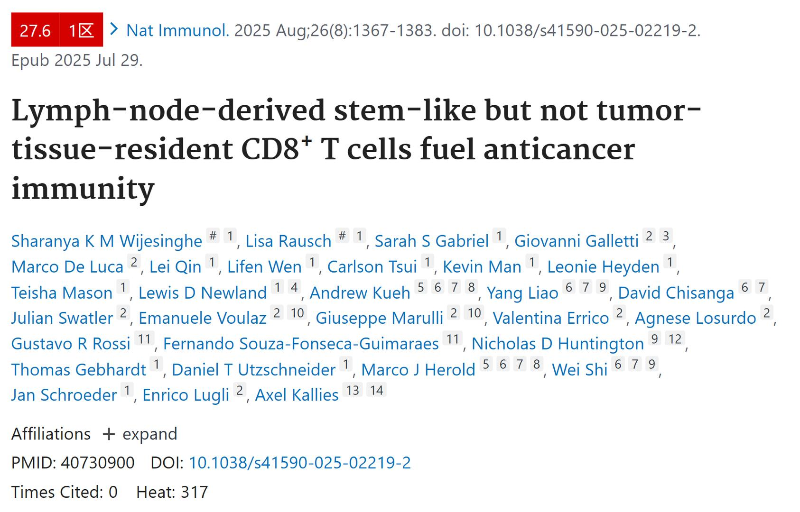
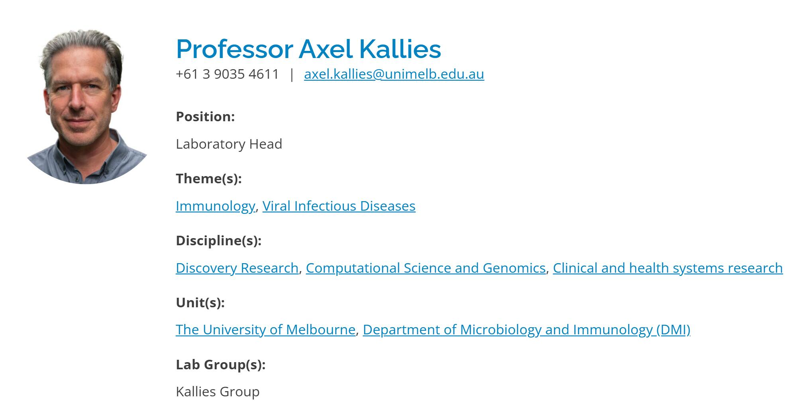

# 搞肿瘤免疫的梦中情组

强烈推荐这个课题组，聚焦于强异质性的PD1+CD8T细胞的亚群细化（尤其是耗竭前体CD8+T细胞（Tpex，我习惯叫祖耗）到终耗CD8+T细胞（Tex），不是简单的PD1和TIM3/TIGIT等的组合），之前说过CD8+T细胞需要从多个方面去表征，包括marker、TF和effector，这个组喜欢聚焦在TF；
我先看了另外一篇NI（25年NI姊妹篇，引流淋巴结中CD62L+Tpex和效应样CX3CR1+Tex细胞依赖于转录因子KLF2和迁移的DC提供抗原和共刺激信号），觉得应该是个大组并且有研究基础，就去看了大通的简介和文章，觉得文章我都想看！于是找了和我肿瘤免疫最相关的这篇文章精读；
这篇文章的核心是耗竭前体-驻留记忆CD8+T细胞（Tpex-rm）这个亚群（Trm的核心转录因子是Hobit，这个也是他们的研究基础，发表在16年的science），首先表征该亚群的marker（祖耗marker+组织驻留marker，例如CD127+CD103+/ID3+Hobit+）；证明该亚群的存在（单细胞signature和流式验证肿瘤组织里面CD44+CD8+T细胞和引流淋巴结中PD1+CD8+T细胞的祖耗和组织驻留CD8+T细胞的基因特征同时存在）；存在部位（主要在肿瘤组织内，在脾和引流淋巴结中很少）；功能：对抗肿瘤和响应ICB无效，与之对应的是引流淋巴结中的CD62L+Tpex和其产生的CX3CR1+Tex细胞抑制肿瘤和响应ICB（详见姊妹篇）；诱导：是由于Tpex的TGF-β信号通路的传导，在tdLN中主要是抑制CD62L+CD8+T细胞的产生和CX3CR1+效应CD8+T细胞的分化，在肿瘤组织中主要是获取或维持Trm细胞表型；最后是在小鼠上做了因果性后要在人标本上做验证和相关性；其余很多内容都是针对这个核心亚群的补充，然后对文章结构和逻辑进行重排，比如说第1部分的肿瘤组织中存在组织驻留特征的祖耗和终耗CD8+T细胞（Tex-rm就是陪跑）和第5部分的tdLN的Tpex的抗癌效应和响应ICB依赖于转录因子MYB（文章发在了22年的nature）；第6部分的TGFβ是Trm细胞发育的关键驱动因素（发在21年的immunity和NI）；
梦中情组啊，直接打开了我ICB的视野，看他们的文章对于生信分析有好处，并且不得再被骗了，之前看到不同非专业组对Tpex抗癌表征不一样；

