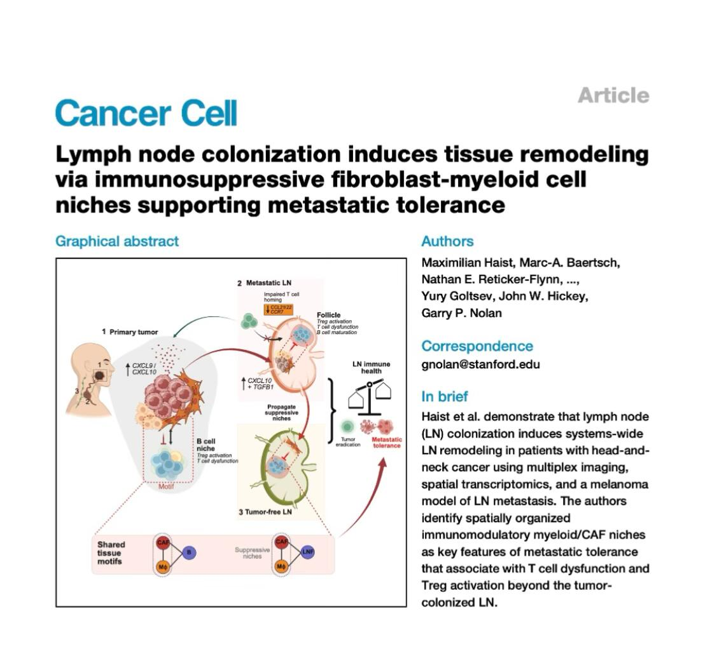
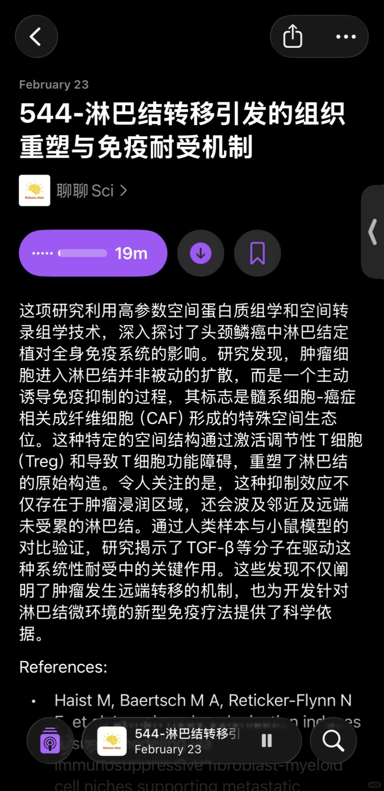
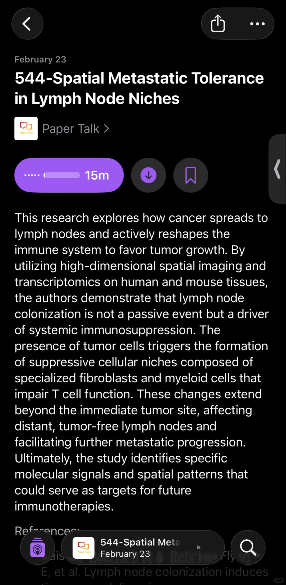

# 淋巴结转移引发的组织重塑与免疫耐受机制



🌋节省精力，去听播客🌋
🌋详细内容欢迎收听podcast：聊聊Sci🌋
🌋英文版podcast：Paper Talk🌋
这项研究利用高参数空间蛋白质组学和空间转录组学技术，深入探讨了头颈鳞癌中淋巴结定植对全身免疫系统的影响。研究发现，肿瘤细胞进入淋巴结并非被动的扩散，而是一个主动诱导免疫抑制的过程，其标志是髓系细胞-癌症相关成纤维细胞（CAF）形成的特殊空间生态位。这种特定的空间结构通过激活调节性T细胞（Treg）和导致T细胞功能障碍，重塑了淋巴结的原始构造。令人关注的是，这种抑制效应不仅存在于肿瘤浸润区域，还会波及邻近及远端未受累的淋巴结。通过人类样本与小鼠模型的对比验证，研究揭示了TGF-β等分子在驱动这种系统性耐受中的关键作用。这些发现不仅阐明了肿瘤发生远端转移的机制，也为开发针对淋巴结微环境的新型免疫疗法提供了科学依据。
References:
Haist M, Baertsch M A, Reticker-Flynn N E, et al. Lymph node colonization induces tissue remodeling via immunosuppressive fibroblast-myeloid cell niches supporting metastatic tolerance. Cancer Cell, 2026.

```
#科研# #研究生# #博士# #医学# #免疫# #肿瘤# #癌症# #单细胞# #生信分析#
```




