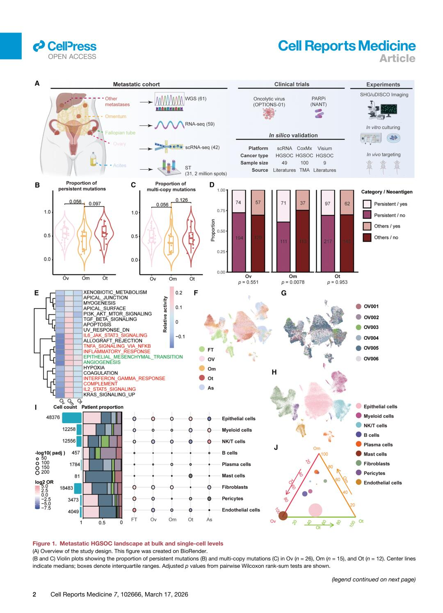
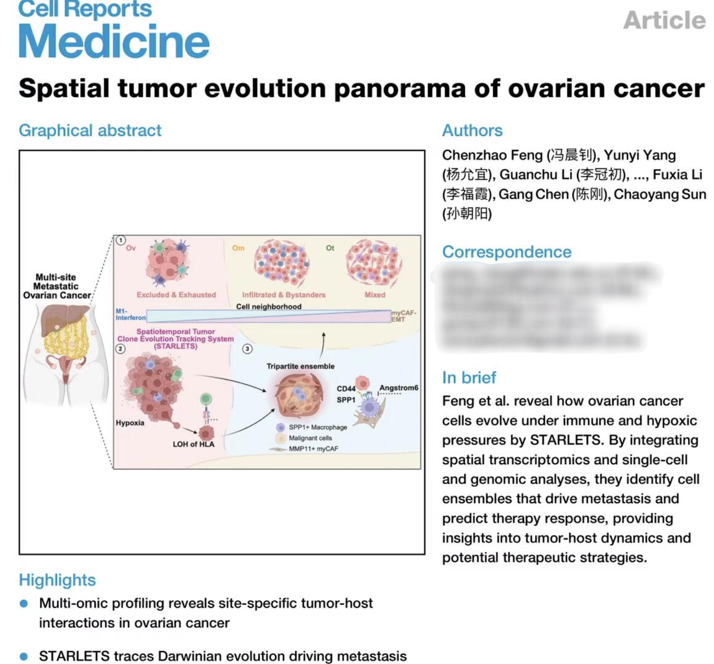
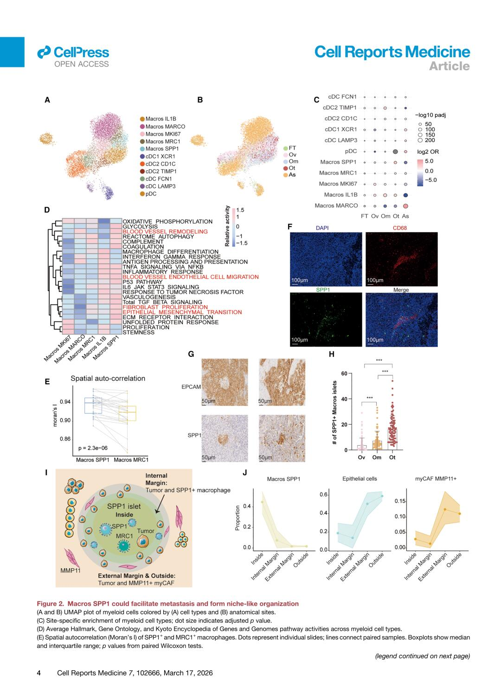
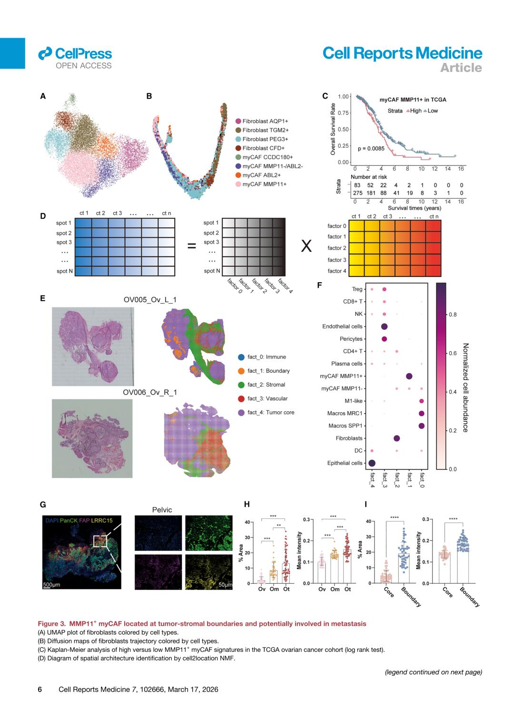
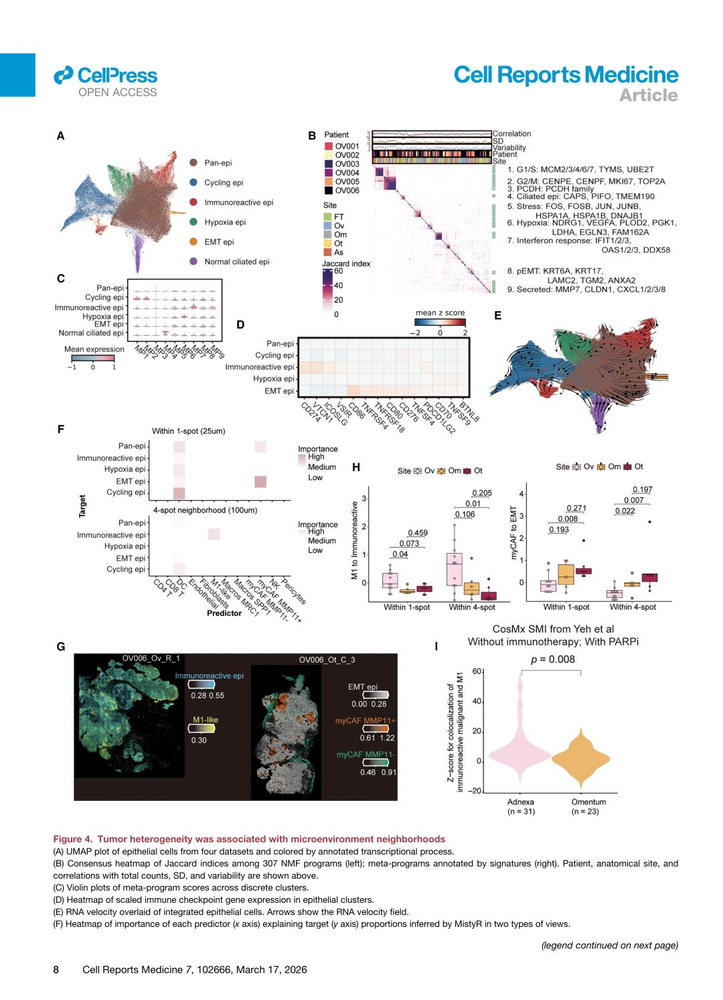
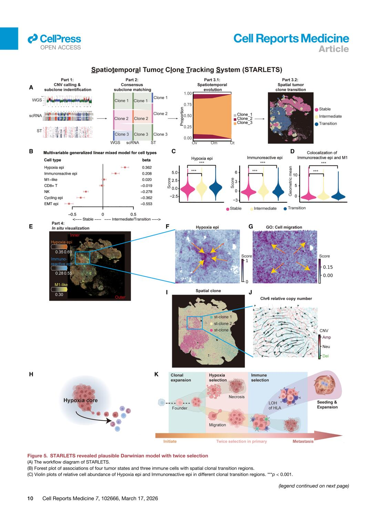
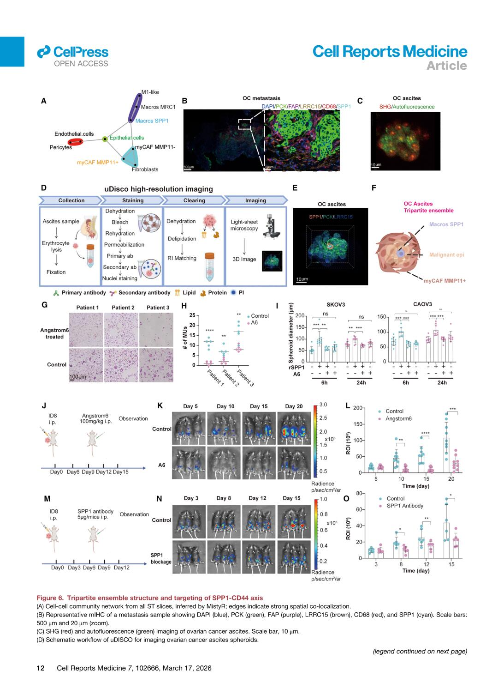
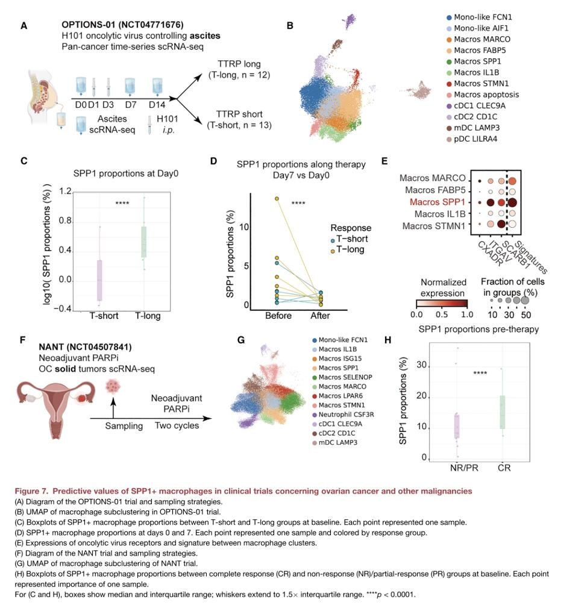

# 空间经典文章，卵巢癌转移，框架资源直接学



卵巢高ji别浆液性癌（HGSOC）作为zui常见的卵巢癌亚型，超过70%的患者确诊时已发生腹腔转移，现有PARP抑制剂、免疫干预等手段仅能轻度改善患者总生存，核心原因在于对转移过程中肿瘤细胞如何适应微环境压力、如何与基质免疫细胞互作驱动转移的机制不清楚。
传统 bulk 测序只能得到混合细胞的平均信号，单细胞测序丢失了空间位置信息，而早期空间转录技术分辨率不足，无法解析原位肿瘤-宿主的动态互作，因此一直缺乏完整的卵巢癌转移空间进化图谱。
	
这项研究的核心突破在于，通过大样本多部位配对采样（对60余例HGSOC患者的原发灶、大网膜转移灶、远处转移灶和腹水进行多部位配对采样，整合了全基因组测序、bulk RNA测序、单细胞RNA测序、空间转录组四种技术，获得2.5百万个空间转录组 spots），整合多组学技术构建了目前分辨率zui高的卵巢癌原发-转移空间进化全景图，开发了专门用于空间肿瘤克隆演化追踪的分析框架STARLETS，专门用于空间层面的肿瘤克隆进化追踪，整合基因组克隆信息和空间转录组的表达信息，能够还原肿瘤细胞在微环境选择压力下的达尔文进化轨迹，明确了HGSOC在缺氧和免疫选择压力下的两步达尔文进化轨迹：原发部位的免疫压力筛选出免疫逃逸能力更强的克隆，随后在转移微环境的缺氧压力下进一步进化出高侵袭能力，zui终形成转移灶。
	
更重要的是，研究通过高分辨率空间转录组和全器官透明成像（结合空间转录组、二次谐波成像、全器官透明溶剂qing除成像（uDISCO）三种成像技术，在原位和全器官层面验证细胞ji合的空间共定位特征），精准鉴定出由SPP1+巨噬细胞、MMP11+肌成纤维细胞癌相关成纤维细胞（myCAFs）和肿瘤上皮细胞共同组成的三元转移驱动细胞ji合，证明靶向SPP1-CD44互作可以抑制转移形成，同时SPP1+巨噬细胞的比例可以yu测卵巢癌患者对溶瘤病毒、PARP抑制剂的响应，为临床预后判断和靶向干预提供了明确的可转化靶点。

```
#生物信息学# #生信分析# #代码分享# #单细胞测序# #转录组# #空间转录组# #生物医学科研# #科研学习#
```









