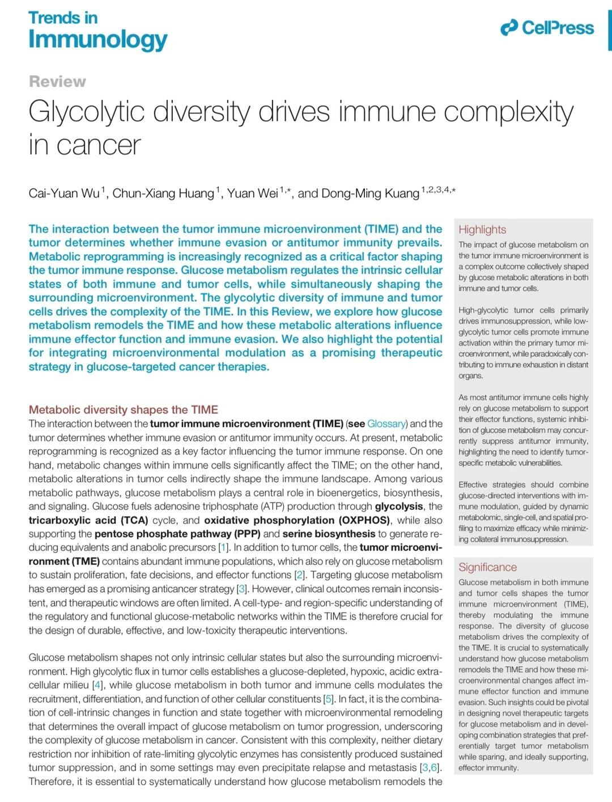
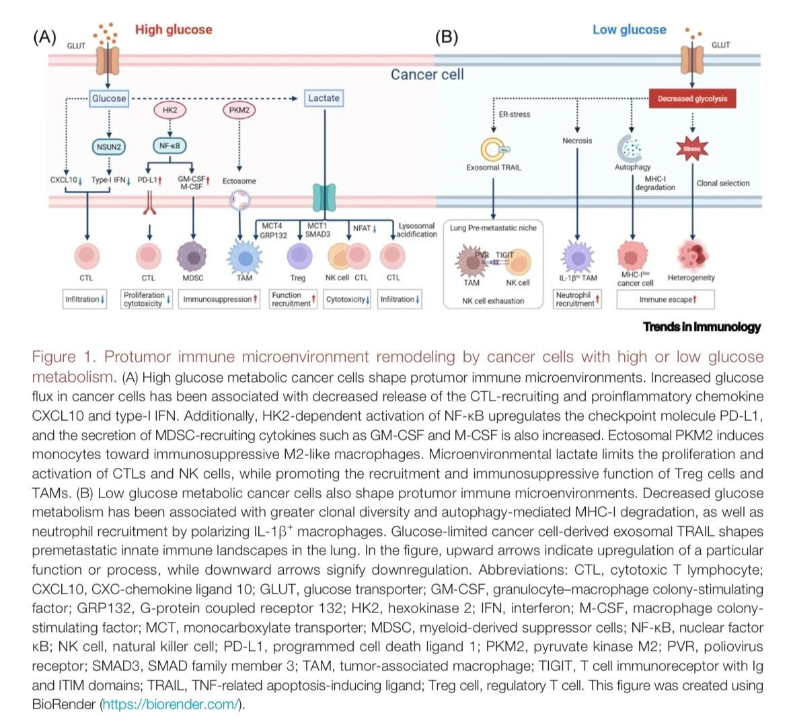
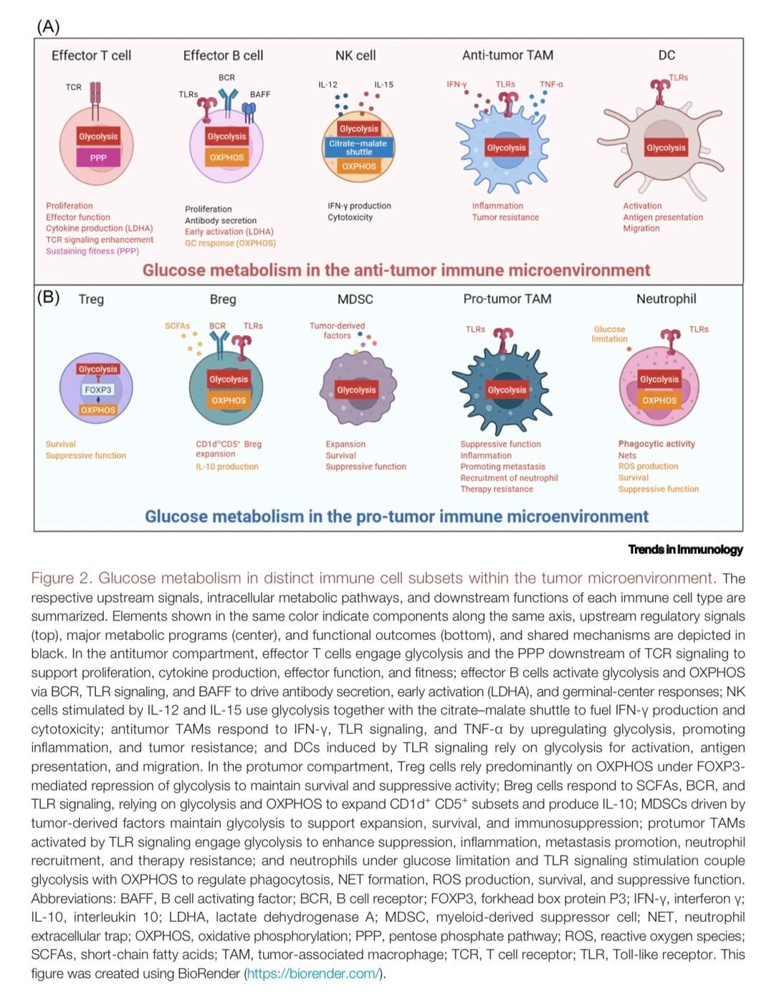
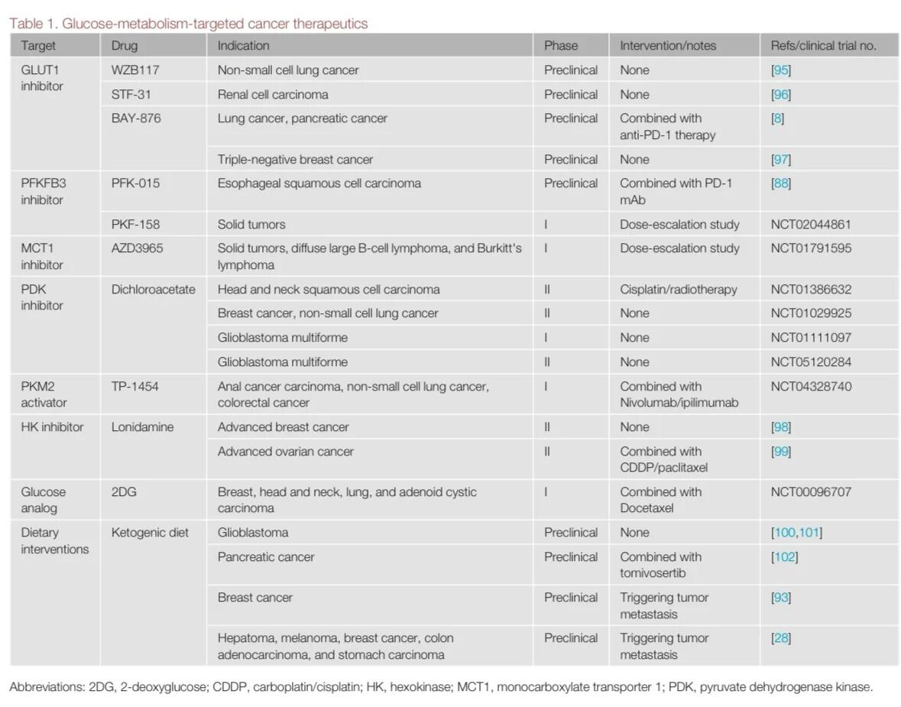

# 糖代谢重塑肿瘤免疫微环境的双面逻辑



肿瘤免疫微环境（TIME）中免疫反应的走向，本质上受糖代谢的精确调控。最新《Trends in immunology》综述揭示，这种调控并非单向抑制，而是肿瘤与免疫细胞代谢互作的动态结果。
	
核心机制：细胞特异性代谢程序决定免疫功能
1. 高糖酵解肿瘤细胞通过乳酸堆积、PD-L1上调和免疫抑制性细胞募集，主动构建免疫豁免微环境。
2. 低糖酵解肿瘤细胞则展现空间异质性效应：在原位可能缓解代谢竞争而激活免疫，在远端器官却通过外泌体介导的免疫重塑为转移创造前哨生态位。
	
关键矛盾：治疗靶点的选择困境 效应免疫细胞（如CD8+ T细胞）同样依赖糖酵解执行杀伤功能。全局性代谢抑制在削弱肿瘤的同时可能耗竭抗肿瘤免疫，这解释了单纯糖酵解抑制剂或生酮饮食在临床中疗效受限且可能促进转移的悖论。
	
🔥前沿方向：时空精确的代谢干预 未来治疗策略需整合单细胞代谢组学与空间多组学技术，解析TIME内代谢通路的细胞来源与空间分布。最具潜力的途径包括： · 靶向肿瘤特异性代谢节点（如MCT4） · 利用果糖/甘露糖等替代糖源选择性支持免疫细胞代谢 · 开发代谢-免疫检查点协同阻断方案
	
科学启示：代谢调控需超越“Warburg效应”的简单框架 研究者应建立能模拟TIME代谢异质性的实验模型，并重点关注代谢物如何作为信号分子（如乳酸化修饰）直接调控表观遗传与细胞分化。治疗响应评估需纳入动态代谢影像学生物标志物。
	
开放问题： 如何建立体外系统，模拟高/低糖代谢肿瘤细胞亚群与免疫细胞的空间共定位与代谢互作？何种代谢成像技术最能预测免疫代谢疗法的时空特异性效应？

```
#医学SCI# #生信分析# #科研# #细胞# #生物学# #文献# #科研学习# #医学#
```





