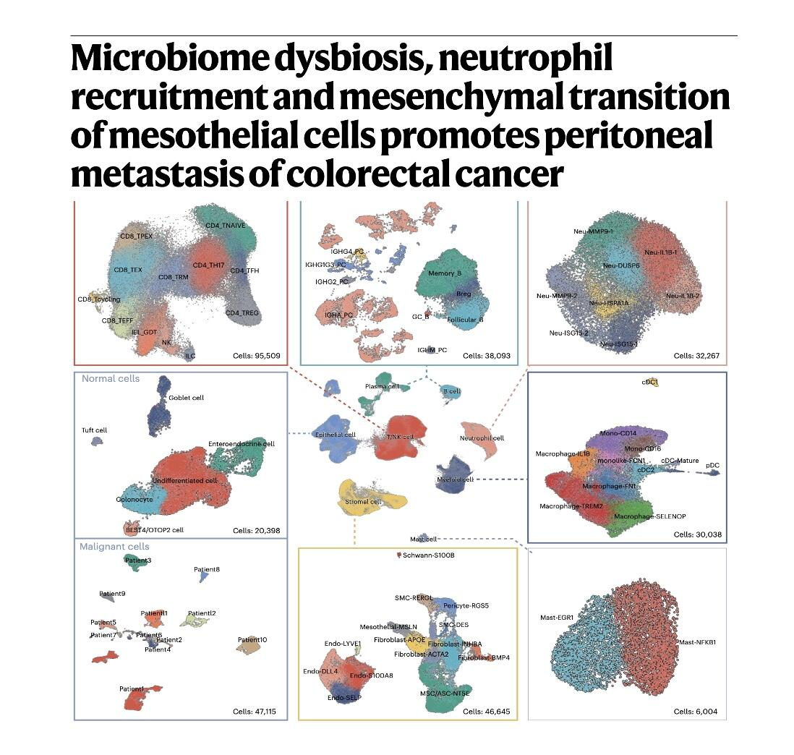
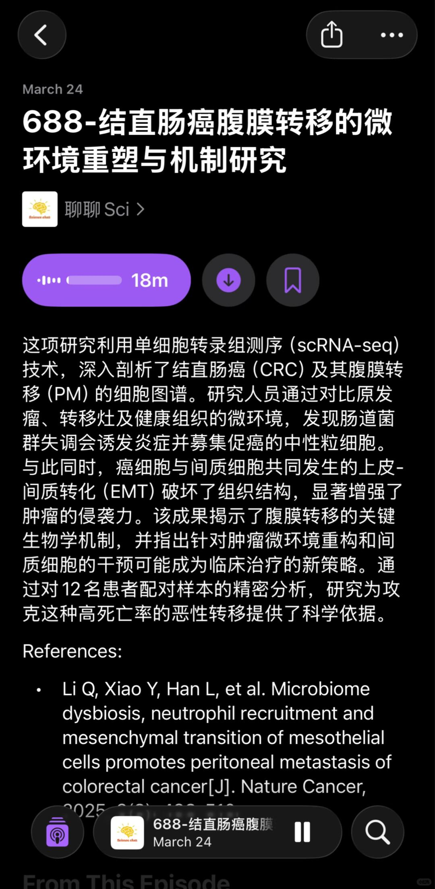
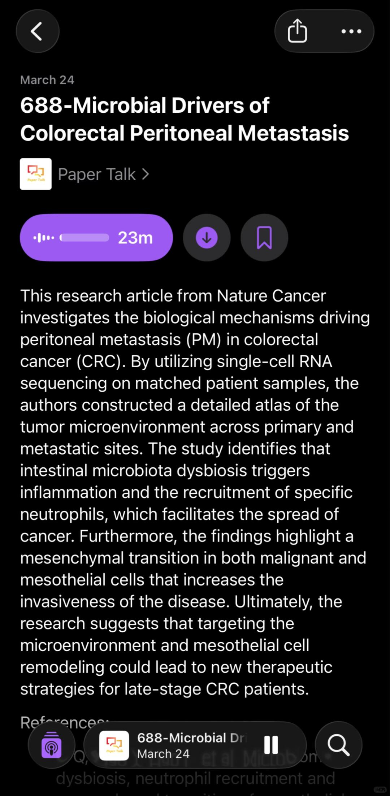

# 结直肠癌腹膜转移的微环境重塑与机制研究



🌋节省精力，去听播客🌋
🌋详细内容欢迎收听podcast：聊聊Sci🌋
🌋英文版podcast：Paper Talk🌋
这项研究利用单细胞转录组测序（scRNA-seq）技术，深入剖析了结直肠癌（CRC）及其腹膜转移（PM）的细胞图谱。研究人员通过对比原发瘤、转移灶及健康组织的微环境，发现肠道菌群失调会诱发炎症并募集促癌的中性粒细胞。与此同时，癌细胞与间质细胞共同发生的上皮-间质转化（EMT）破坏了组织结构，显著增强了肿瘤的侵袭力。该成果揭示了腹膜转移的关键生物学机制，并指出针对肿瘤微环境重构和间质细胞的干预可能成为临床治疗的新策略。通过对12名患者配对样本的精密分析，研究为攻克这种高死亡率的恶性转移提供了科学依据。
References:
Li Q, Xiao Y, Han L, et al. Microbiome dysbiosis, neutrophil recruitment and mesenchymal transition of mesothelial cells promotes peritoneal metastasis of colorectal cancer. Nature Cancer, 2025, 6(3): 493-510.

```
#科研# #研究生# #博士# #免疫# #肿瘤# #癌症# #生信分析# #科研学习# #医学# #sci#
```




