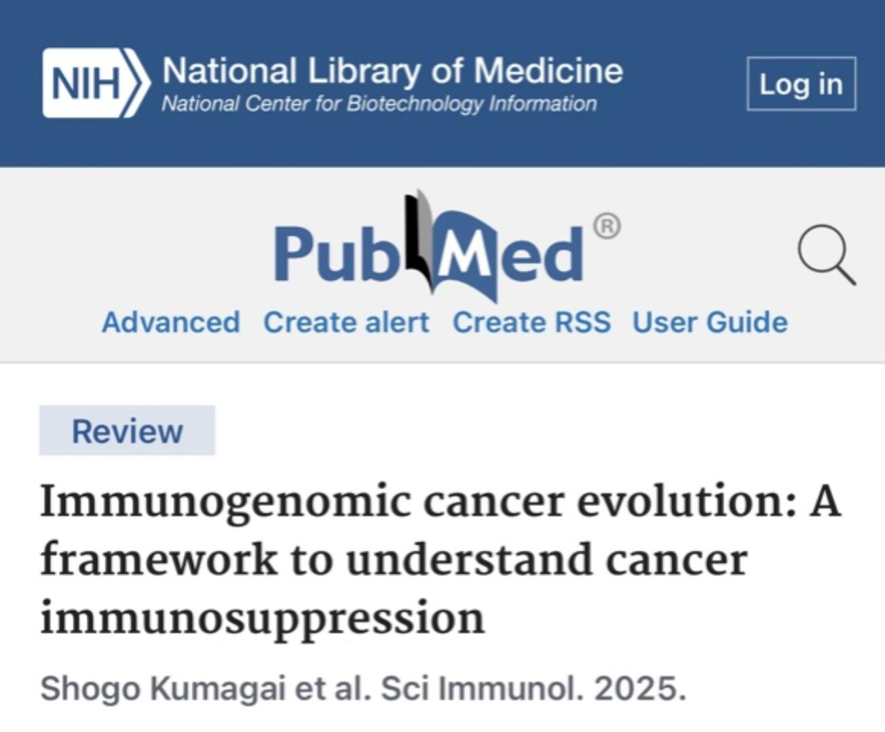

# 肿瘤免疫逃逸的机制



最近，日本国立癌症研究中心的Nishikawa教授在Science Immunology上发表了一篇综述，详细讨论了肿瘤如何逃避免疫系统的监测，强调癌症的基因组进化如何塑造免疫抑制性免疫微环境（TME），并提出结合免疫治疗和分子靶向药物的精准医疗策略
	
1. 癌症免疫逃逸机制
『』降低肿瘤细胞免疫原性：驱动基因突变（如EGFR、KRAS）导致肿瘤抗原性降低、MHC表达下调，减少T细胞识别
『』趋化因子抑制：某些基因异常（如EGFR、RHOA突变）抑制CXCL10等趋化因子，阻碍效应T细胞和树突状细胞浸润。
『』免疫检查点上调：PI3K-AKT、MAPK等信号通路激活PD-L1等分子，抑制T细胞功能。
『』代谢重编程：肿瘤细胞通过乳酸、腺苷、色氨酸代谢产物（如IDO1）等抑制免疫细胞活性，形成免疫抑制性微环境
	
2. 免疫抑制细胞的作用
『』调节性T细胞（Tregs）：通过CCL22-CCR4轴被招募至TME，依赖脂肪酸氧化代谢存活，并分泌TGF-β、IL-10等抑制免疫反应。
『』肿瘤相关巨噬细胞（TAMs）：MYC扩增、PTEN缺失等驱动基因异常促进TAM浸润，通过PD-L1表达和抑制炎症的细胞因子分泌抑制抗肿瘤免疫
『』髓系抑制细胞（MDSCs）与中性粒细胞：KRAS突变、p53缺失等通过CXCL5等趋化因子招募这些细胞，增强免疫抑制
	
🧬整合基因组与免疫学分析是突破当前免疫治疗瓶颈的关键，通过靶向癌基因信号通路与免疫抑制微环境的协同干预，有望实现更精准、持久的抗癌效果

```
#医学##生物#
```


