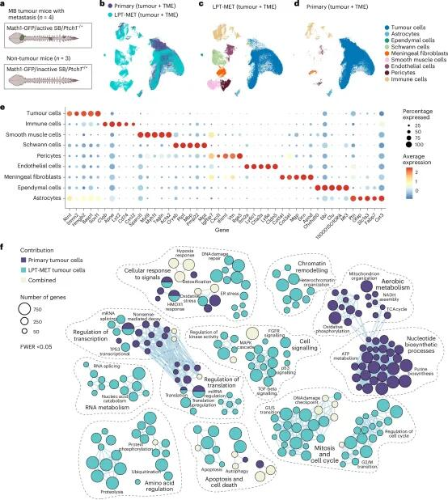
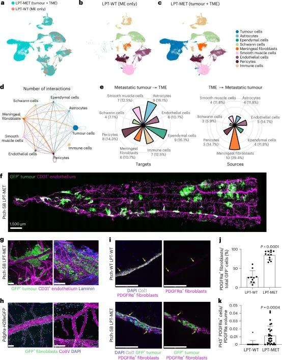
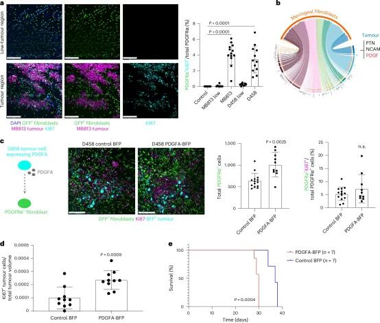
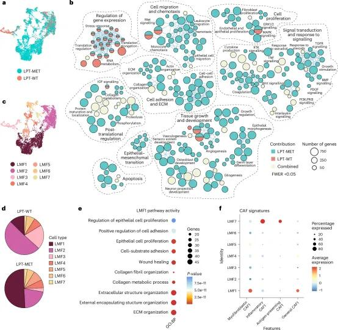
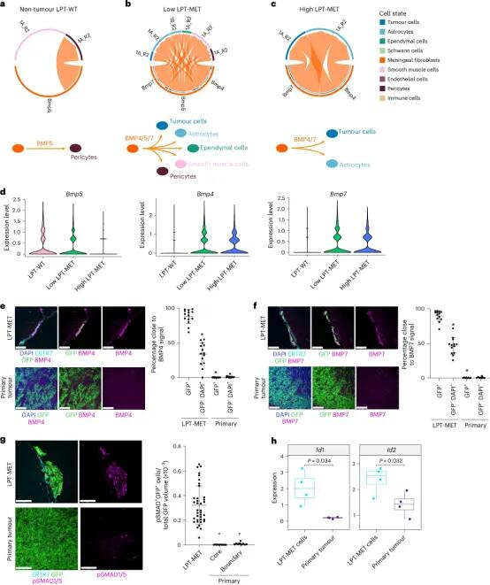
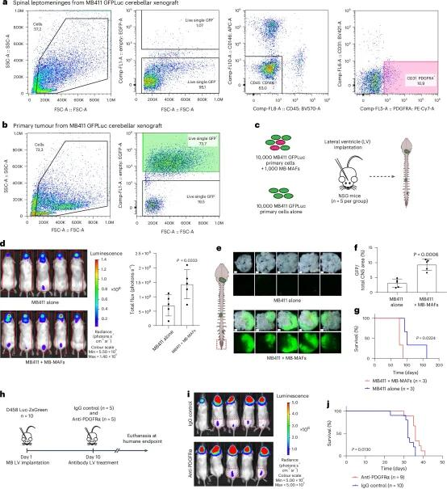

# 肿瘤细胞通过重编程脑膜成纤维细胞构建转移



髓母细胞瘤（MB）是儿童最常见的恶性脑肿瘤，目前临床治疗主要依赖手术、全脑脊髓放疗和化疗，但缺乏针对转移灶的靶向疗法。该肿瘤转移具有明显的软脑膜特异性倾向，但其机制尚不明确。软脑膜作为缺乏血管的营养贫瘠环境，与原发性肿瘤所处的微环境存在显著差异，提示转移细胞需建立特殊的微环境支持才能定植和扩增。
	
2025年4月，得克萨斯州休斯敦贝勒医学院的Michael D. Taylor的研究团队在Nature cell biology（IF：17.3）杂志上发表了题为Metastatic medulloblastoma remodels the local leptomeningeal microenvironment to promote further metastatic colonization and growth的文章, 研究揭示了MB软脑膜转移的细胞间通讯机制：转移性肿瘤细胞通过分泌PDGF配体趋化性招募脑膜成纤维细胞，并将其重编程为转移相关脑膜成纤维细胞（MB-MAFs）。MB-MAFs具有独特的转录组和分泌组特征，可分泌骨形态发生蛋白（BMPs）等因子，显著增强肿瘤细胞在软脑膜的定植能力和转移灶生长。动物实验证实，PDGF受体α中和抗体治疗可有效阻断这一过程并延长生存期。该研究首次阐明了MB转移生态系统中肿瘤细胞与基质细胞的互作级联反应，为靶向干预软脑膜转移提供了新策略。
	
该研究系统揭示了髓母细胞瘤（MB）软脑膜转移灶中肿瘤微环境（TME）的复杂性，强调转移生态位在MB复发与死亡中的核心作用。研究发现，脑膜成纤维细胞在肿瘤定植中发挥关键作用：肿瘤细胞通过PDGFA招募并重编程脑膜成纤维细胞（MB-MAFs），后者分泌BMP4/7激活肿瘤细胞的增殖信号，推动转移灶扩展。通过构建体内模型并干预PDGFRα通路，研究验证了“PDGF–BMP轴”对转移灶形成的重要性，提示该通路可能成为临床抗转移策略的干预靶点。尽管临床中获取软脑膜转移样本困难，阻碍了对转移机制的深入研究，但本研究明确提出：仅聚焦原发灶远不足以解决MB治疗困境，未来应针对转移生态位的各个环节（细胞募集、信号重塑、微环境互作）开展多维联合治疗，为转移性MB的预防与治疗提供新方向。

```
#国家自然科学基金# #sci# #生物医学科研# #科研学习# #细胞# #科研# #感受态细胞转化# #医学实验#
```








