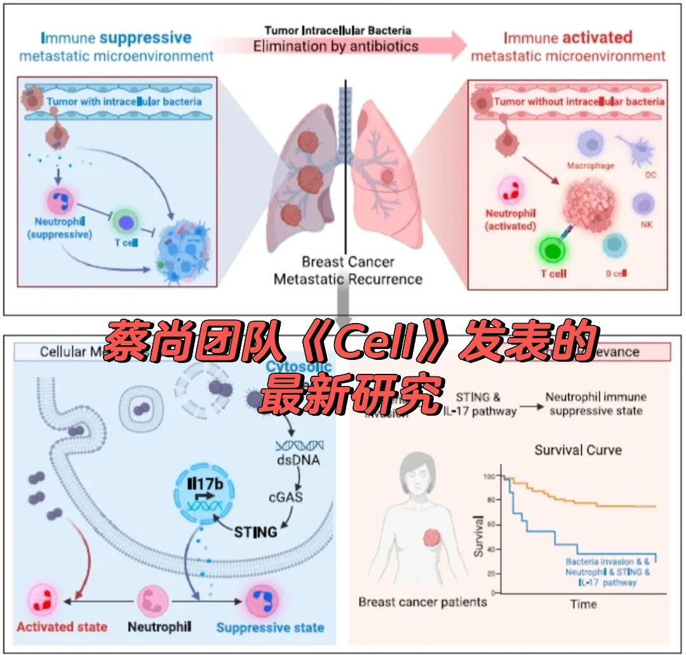
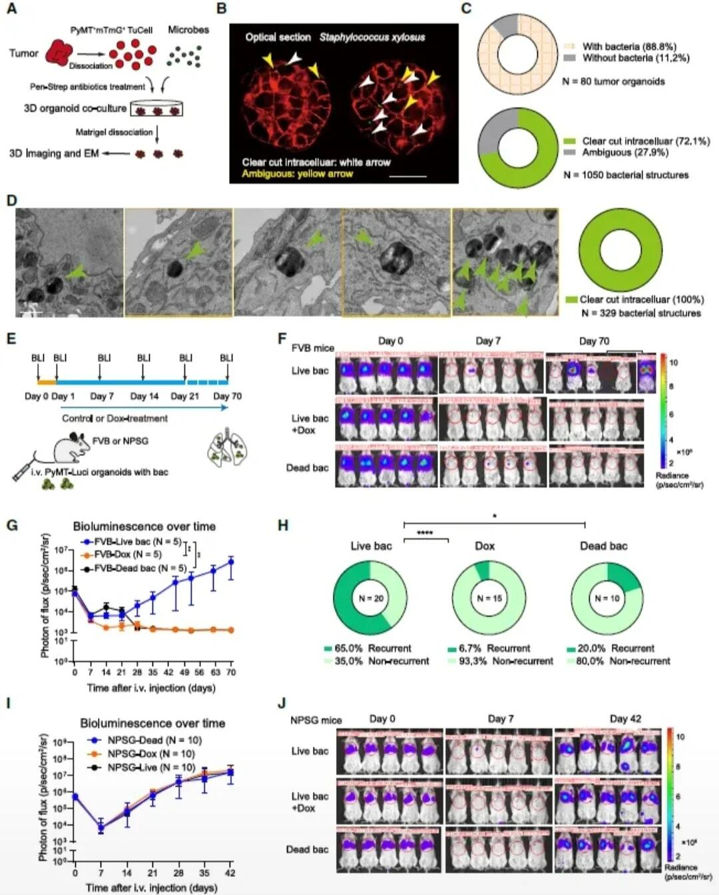
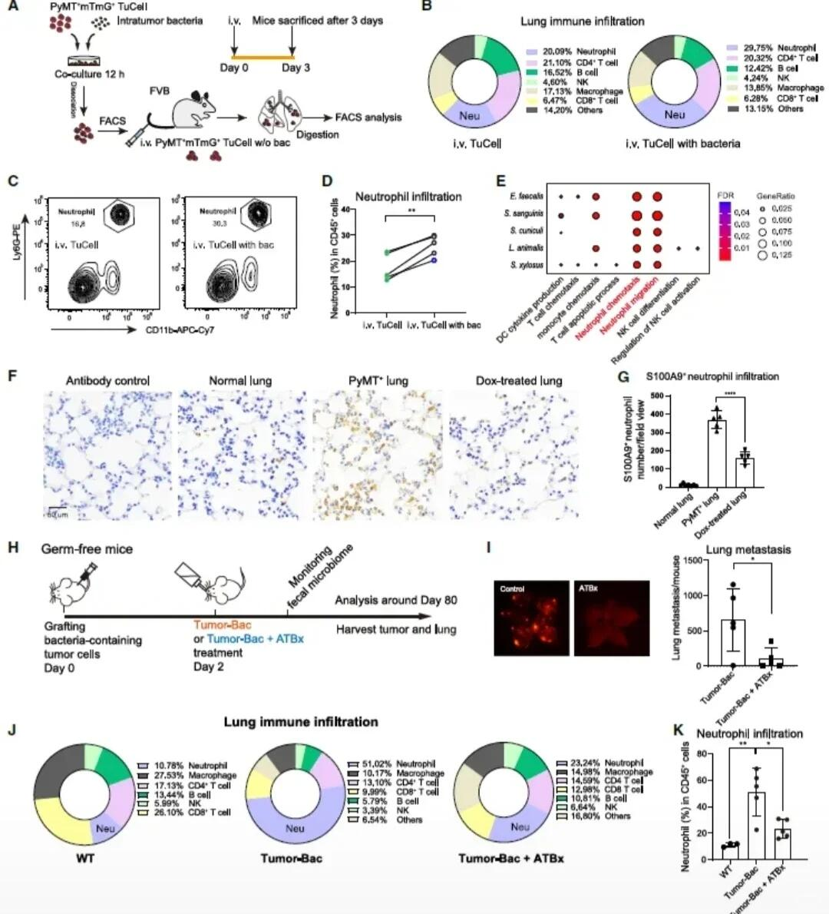
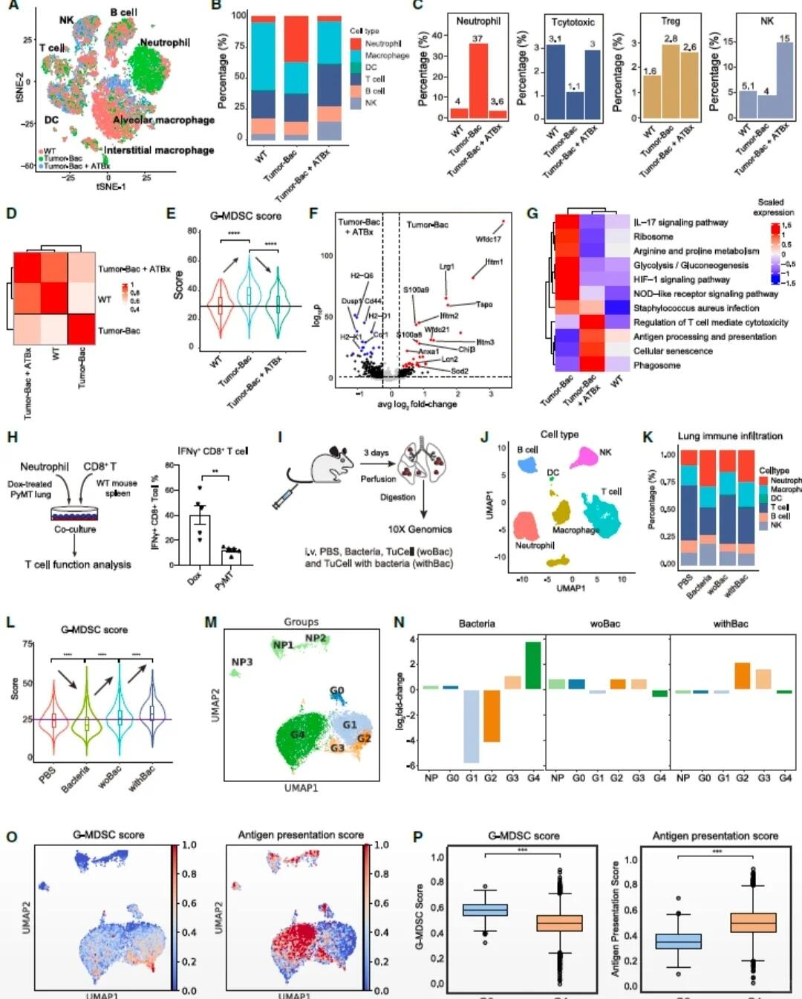
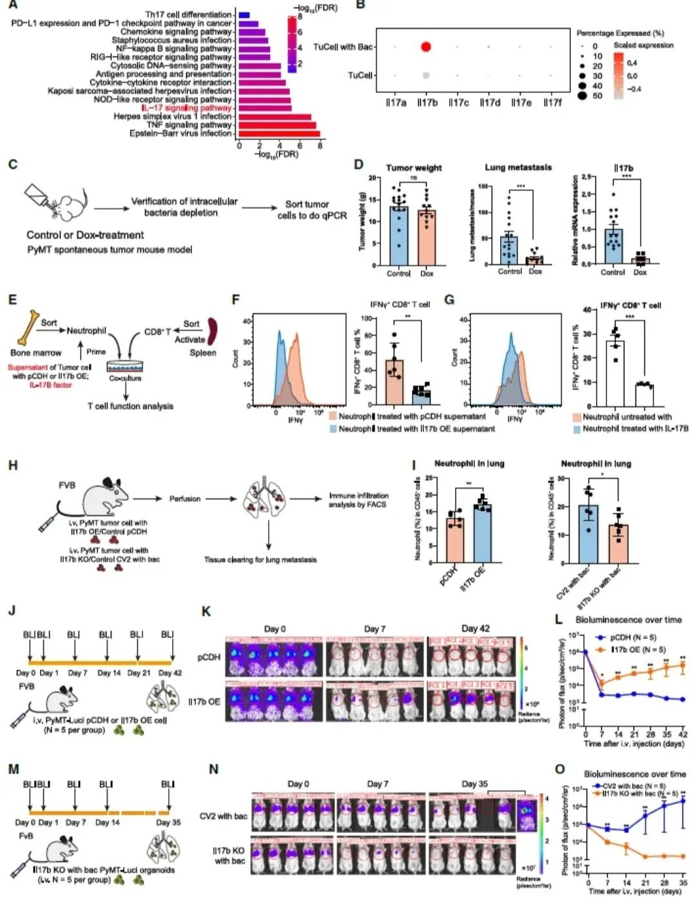
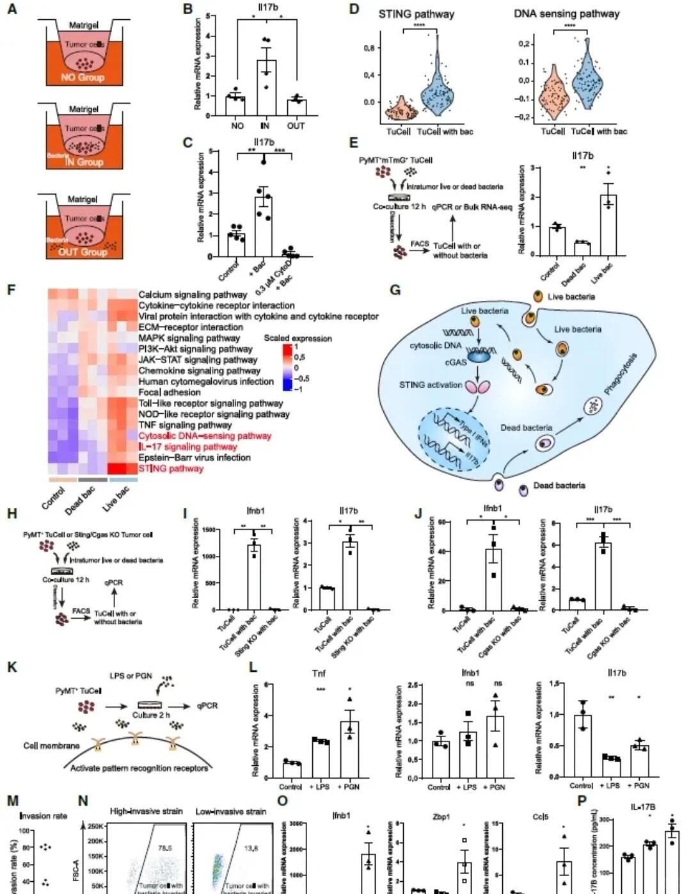
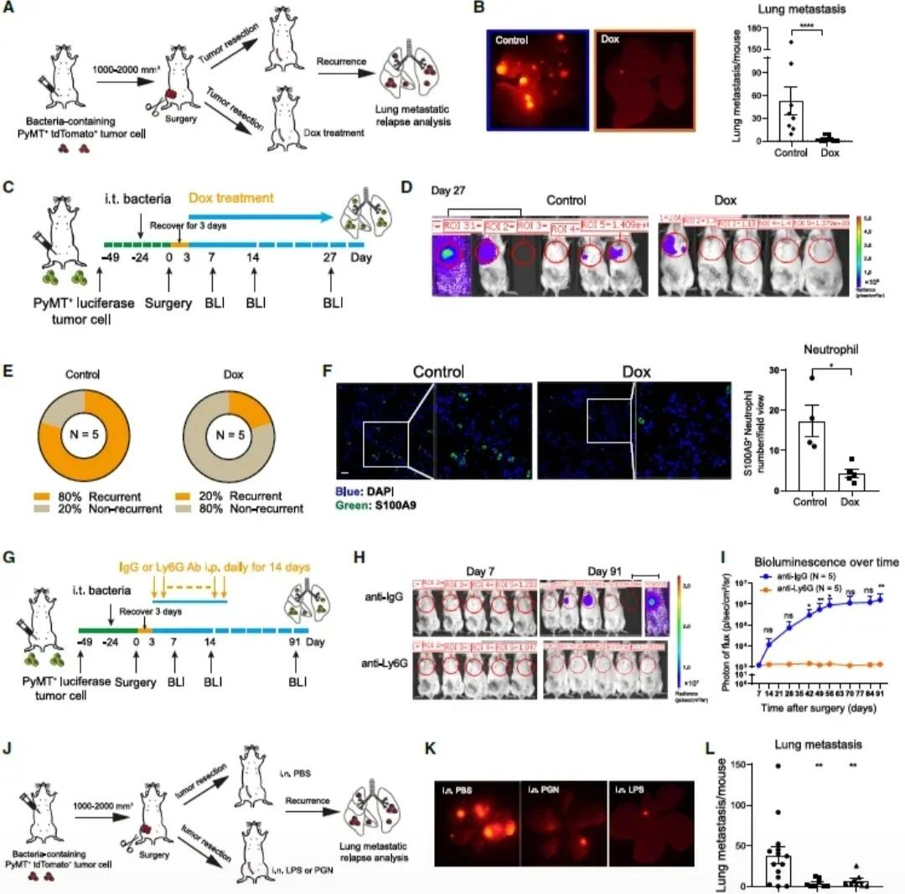
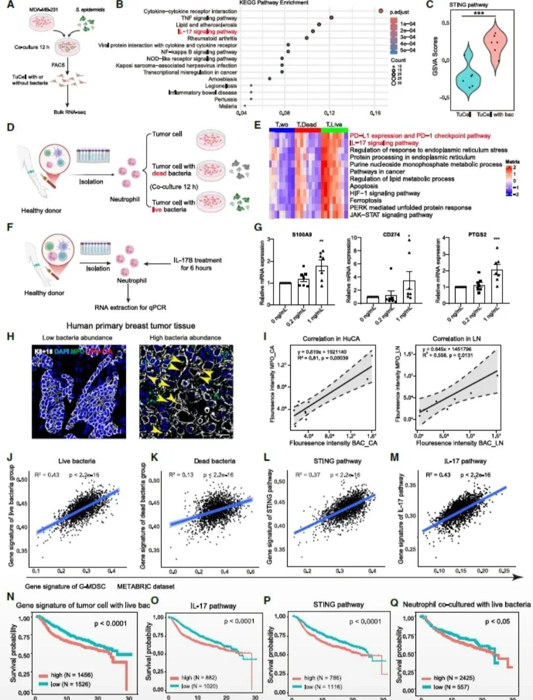

# 肿瘤胞内细菌：调控乳腺癌转移的免疫“开关



蔡尚团队在《Cell》发表的最新研究，揭示了肿瘤胞内细菌在乳腺癌转移中的双重作用机制，为癌症治疗提供了全新视角。
一、核心发现：胞内细菌是转移微环境的“免疫抑制者”
研究发现，乳腺癌细胞内的细菌通过cGAS-STING-IL-17b通路，将中性粒细胞“驯化”为免疫抑制状态：
- 胞内细菌释放的DNA激活cGAS-STING通路，诱导IL-17b表达。
- IL-17b进一步将中性粒细胞推向抑制表型，削弱T细胞、NK细胞等抗肿瘤免疫应答，形成利于肿瘤转移的微环境。
- 抗生素清除胞内细菌后，中性粒细胞恢复激活状态，抗肿瘤免疫被重新唤醒，显著抑制乳腺癌肺转移。
二、临床意义：细菌-免疫轴是潜在治疗靶点
- 机制转化：在乳腺癌患者样本中，肿瘤胞内细菌入侵、STING/IL-17通路激活与中性粒细胞抑制状态高度正相关，且这类患者的总体生存率显著更低。
- 治疗启示：抗生素清除胞内细菌可逆转免疫抑制，为转移性乳腺癌提供了“抗菌+免疫治疗”的联合策略新思路。
- 辩证思考：肿瘤胞内细菌并非单纯“促癌”，而是通过调控免疫微环境影响转移进程，这一发现打破了传统认知，为理解肿瘤-微生物-宿主免疫的复杂互作奠定了基础。
三、总结与展望
这项研究首次明确了肿瘤胞内细菌作为免疫调控开关的核心作用：它通过塑造免疫抑制微环境促进转移，而清除细菌则能激活抗肿瘤免疫。未来，靶向胞内细菌或其下游通路的干预手段，有望成为攻克转移性乳腺癌的新突破口。

```
#细胞和组织的适应与损伤# #医学实验# #科研学习# #感受态细胞转化# #生物信息学# #生信分析# #从细胞到奇点# #科研# #细胞#
```









