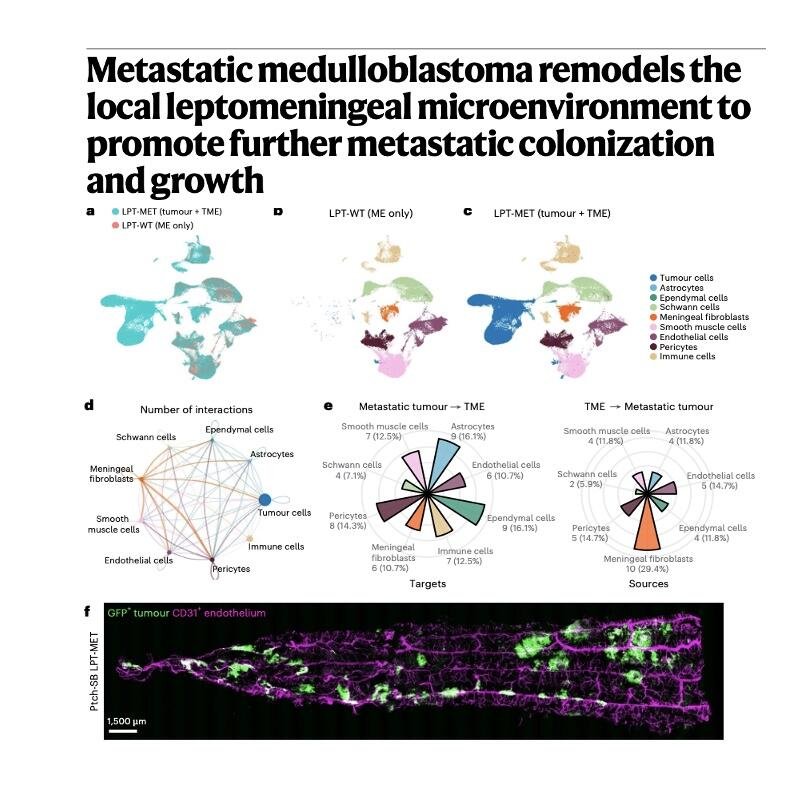
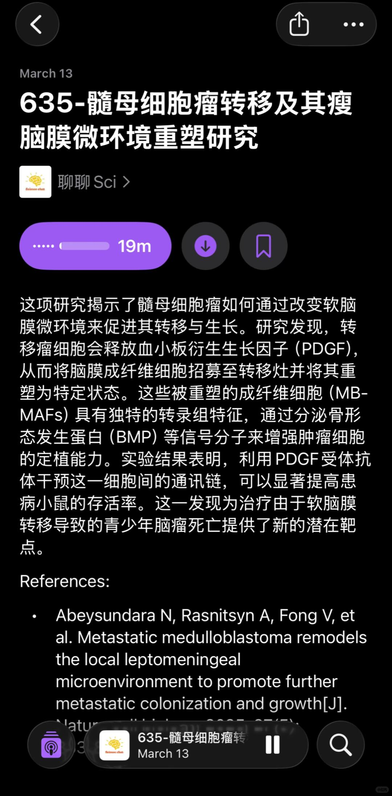
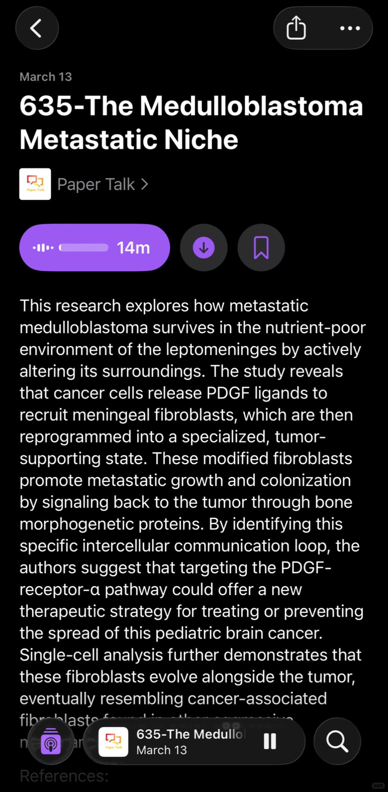

# 髓母细胞瘤转移及其瘦脑膜微环境重塑研究



🌋节省精力，去听播客🌋
🌋详细内容欢迎收听podcast：聊聊Sci🌋
🌋英文版podcast：Paper Talk🌋
这项研究揭示了髓母细胞瘤如何通过改变软脑膜微环境来促进其转移与生长。研究发现，转移瘤细胞会释放血小板衍生生长因子（PDGF），从而将脑膜成纤维细胞招募至转移灶并将其重塑为特定状态。这些被重塑的成纤维细胞（MB-MAFs）具有独特的转录组特征，通过分泌骨形态发生蛋白（BMP）等信号分子来增强肿瘤细胞的定植能力。实验结果表明，利用PDGF受体抗体干预这一细胞间的通讯链，可以显著提高患病小鼠的存活率。这一发现为治疗由于软脑膜转移导致的青少年脑瘤死亡提供了新的潜在靶点。
References:
Abeysundara N, Rasnitsyn A, Fong V, et al. Metastatic medulloblastoma remodels the local leptomeningeal microenvironment to promote further metastatic colonization and growth. Nature cell biology, 2025, 27(5): 863-874.

```
#研究生# #博士# #医生# #免疫# #肿瘤# #癌症# #sci# #大脑# #生信分析# #人工智能#
```




