# 做行走的图书馆，高知美学穿搭风格

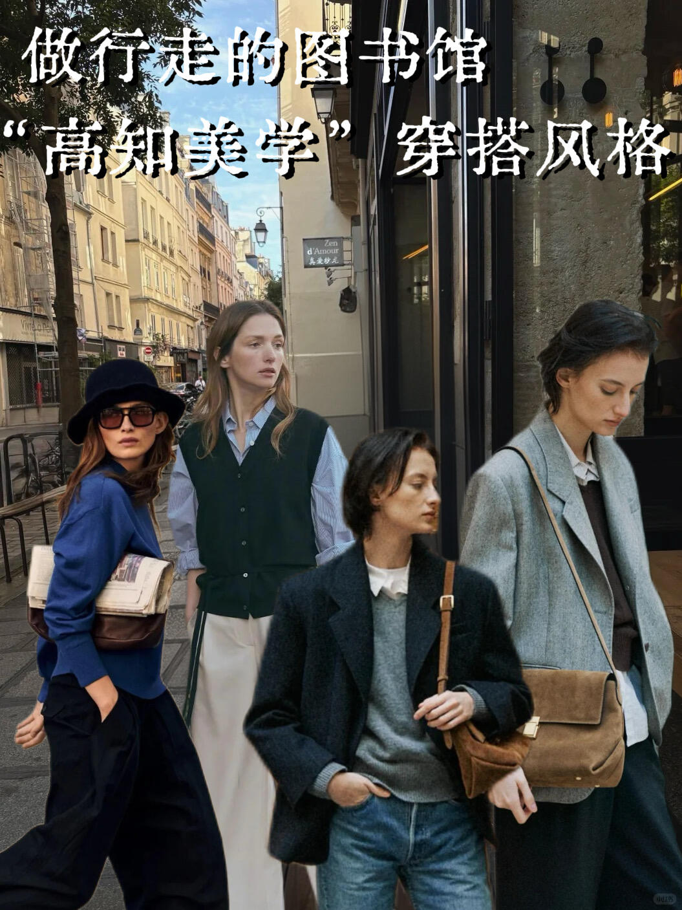

2026年的春天，时尚圈迎来了一股清流。它不喧哗、不张扬，却以沉静的力量席卷了秀场与街头——这便是“高知美学”。
像刚从图书馆走出来的研究生，带着一身的书卷气与清醒的智性美。它不是“看起来有钱”，而是“看起来有脑子”。那种沉静的、克制的、有深度的穿搭，正成为当下最具吸引力的风格语言。
什么是“高知美学”？它是对知识阶层穿搭气质的一种提炼——理性、克制、有质感，却不刻意炫耀。它不追求logo的显眼，而是追求剪裁的精准；不追求色彩的刺激，而是追求色调的和谐；不追求潮流的速度，而是追求经典的厚度。
这种风格的迷人之处在于：它让衣服服务于人的气质，而非抢夺人的光芒。 穿上它的人，看起来像是刚从图书馆走出来，或者正准备去参加一场读书会——安静、专注、有自己的精神世界。
➤构建知识分子衣橱的五大核心单品
1. 挺括的白衬衫
白衬衫是“高知美学”的灵魂单品。它不需要任何装饰，仅凭利落的剪裁和挺括的质感，就能传递出干净、理性的气质。
2. V领针织背心
这是去年最出圈的“高知美学”单品。2025年上海书展上，人民文学出版社推出的“鲁迅同款毛背心”火上热搜，相关话题阅读量突破2亿。
3. 直筒卡其裤
卡其裤是学院风的经典单品，在“高知美学”中扮演着“定海神针”的角色。它的中性色调和利落线条，能为任何上衣提供沉稳的基底。
4. 乐福鞋
一双皮质柔软、线条简约的乐福鞋，是“高知美学”不可或缺的收尾。它既有正式感，又不失舒适度；既能通勤，也能休闲。
5. 质感开衫
一件有分量的羊毛或羊绒开衫，是春秋季叠穿的关键。它的软糯质感与挺括的衬衫形成对比，为整体注入一丝温柔。

```
#高知穿搭##知识分子风# #穿搭bot#
```


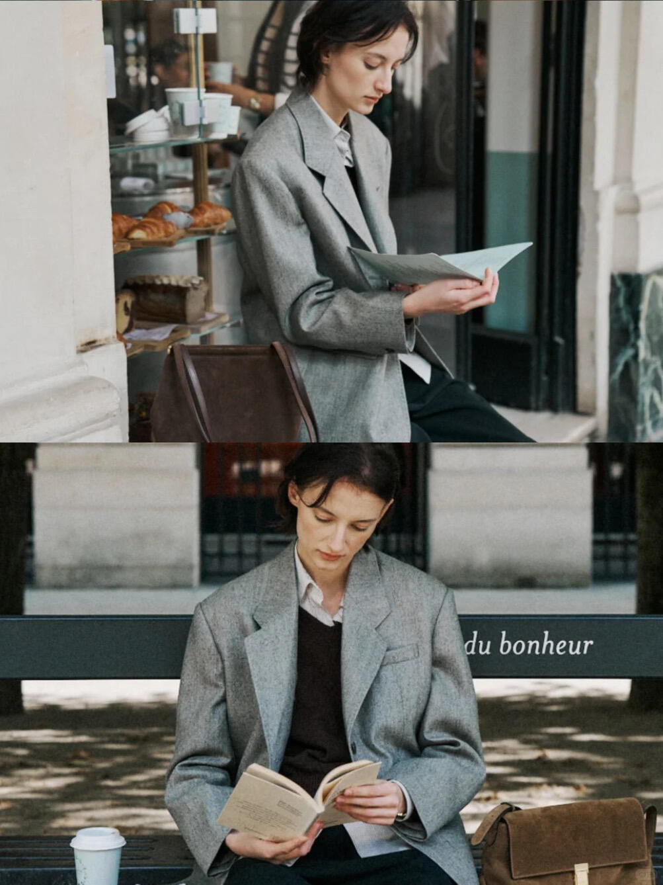
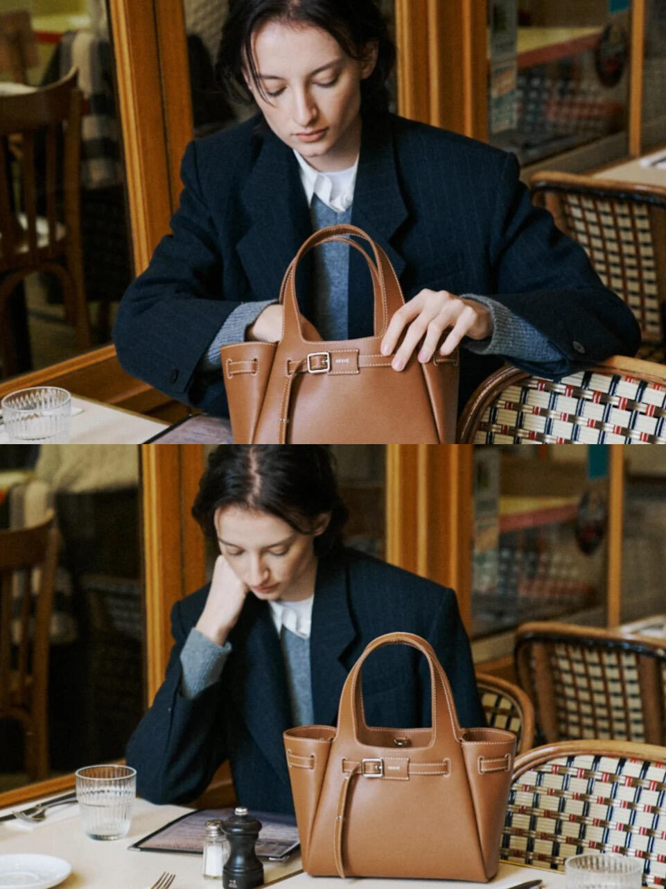
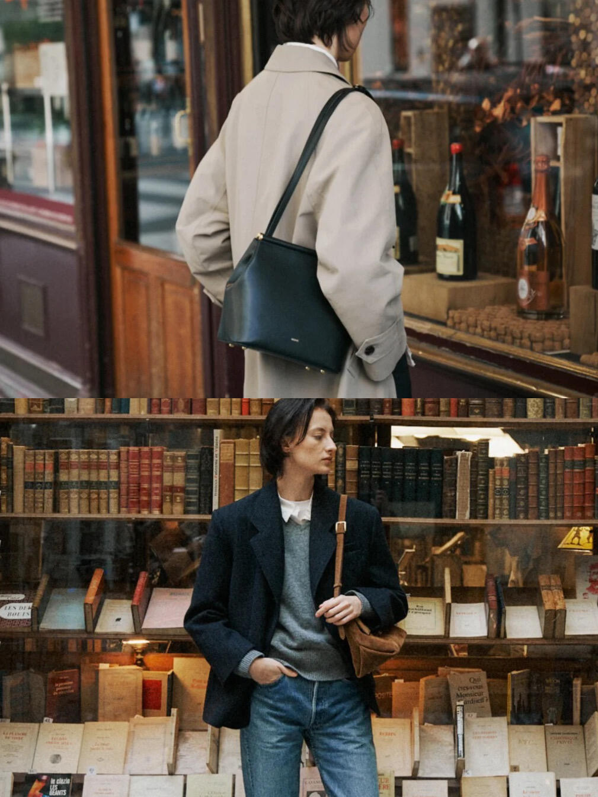
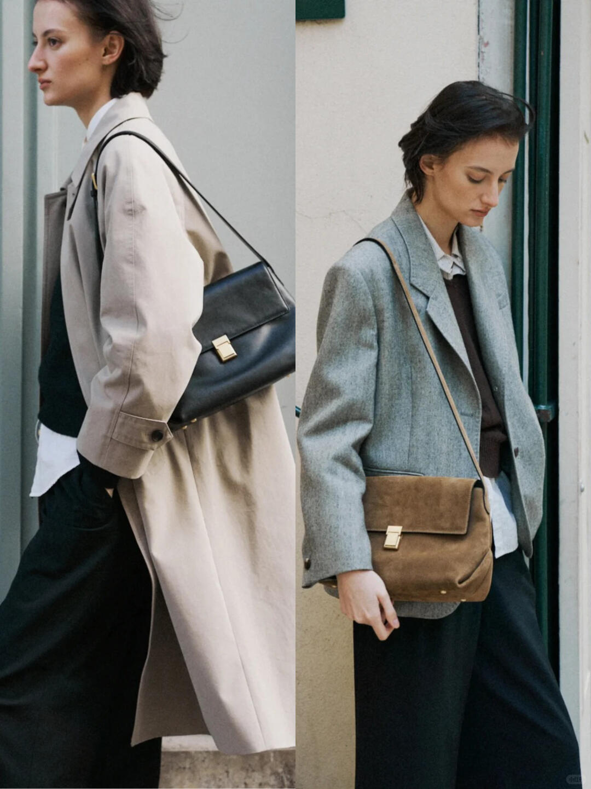
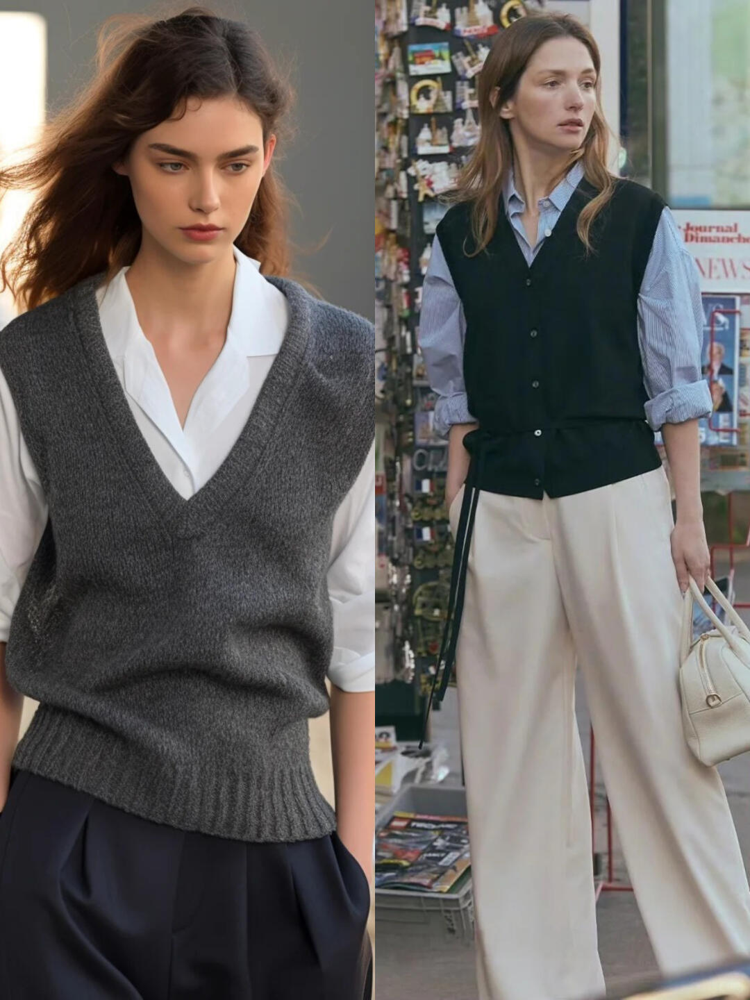
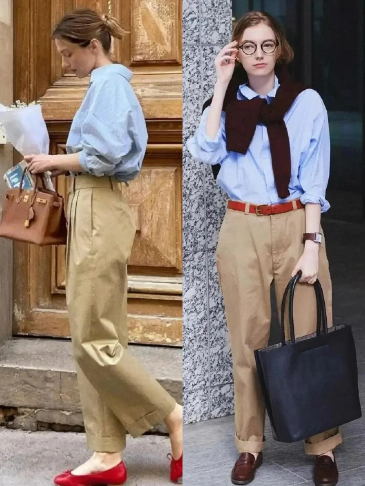
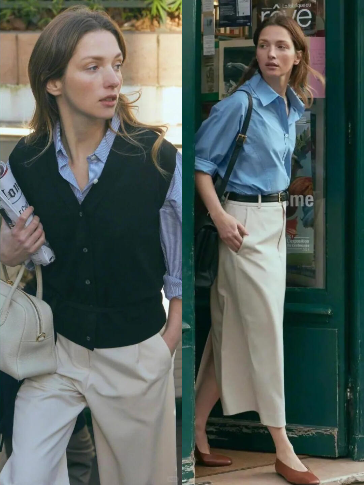
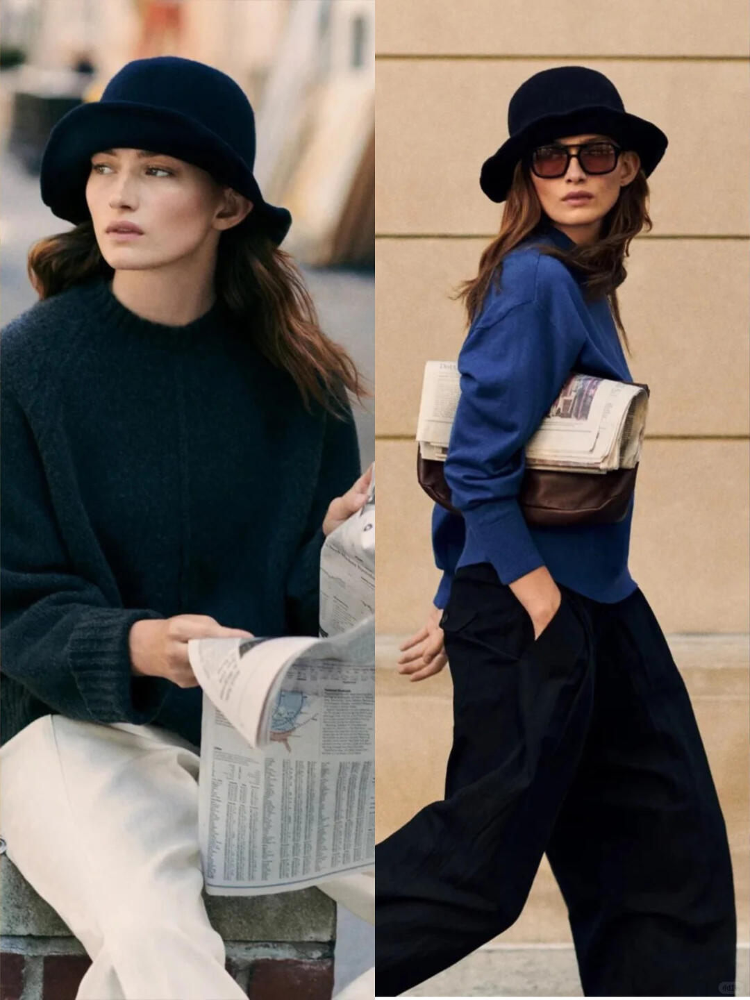

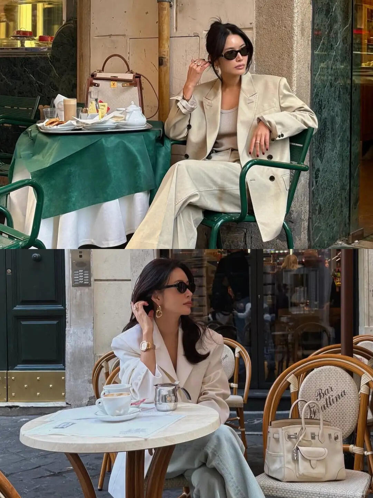
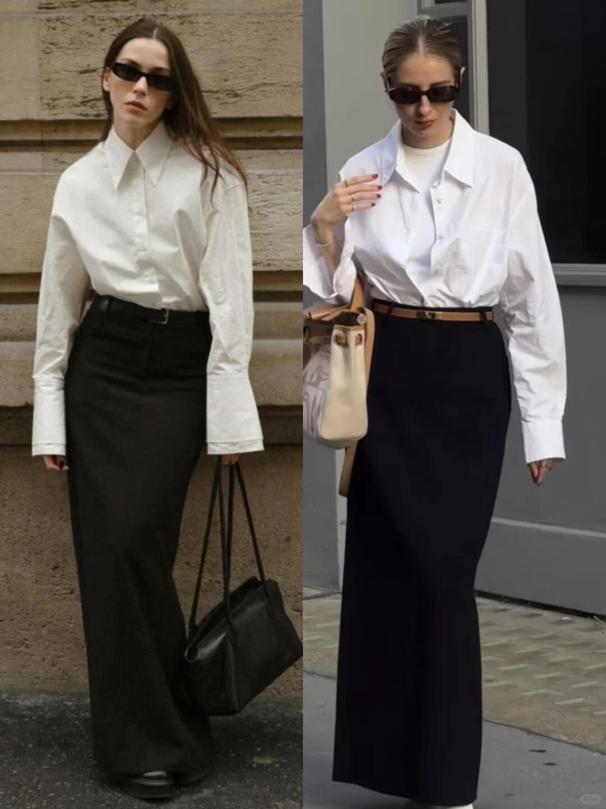
