# 在你灿烂的季节5｜李圣经｜时装设计师的穿搭

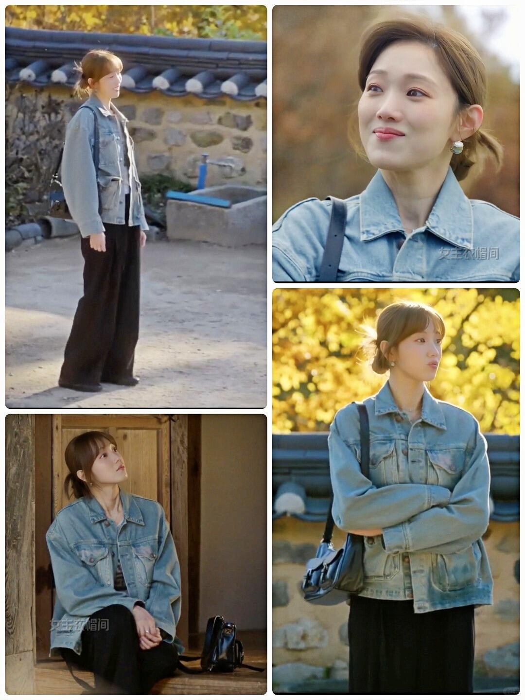

第5集里，宋河兰肉眼可见地变柔和、变放松了。从紧绷逐渐卸下防备，整个人温柔又真实。而她这一集的穿搭也不再只有利落的职场西装，多了很多针织、碎花、休闲夹克、居家感单品，颜色更柔和、线条更松弛。
	
💛李圣经：175cm/1990年
身份与人设：宋河兰，时尚工作室首席设计师。因早年父母双亡 + 七年前男友离世的过往经历，给自己裹上保护壳、害怕失去，刻意与人保持距离，直到遇见男主才慢慢解封内心。
	
宋河兰的穿搭以复古文艺 + 松弛通勤为核心，风格覆盖职场、日常、户外与居家全场景。麂皮叠穿大衣、工装夹克、格纹学院套装、灰色西装等造型利落有层次，配色柔和高级，版型突出腰线与身材比例，显设计师角色的审美与气质。
	
居家则用牛油果绿针织、婴儿蓝家居服、紫色碎花衬衫营造出温柔慵懒的氛围，整体造型兼顾精致感与舒适度。
	
素材来源：《在你灿烂的季节》

```
#在你灿烂的季节# #李圣经穿搭# #时装设计师的穿搭# #韩系职场穿搭# #leesungkyung# #kdramafashion# #时髦捕手#
```


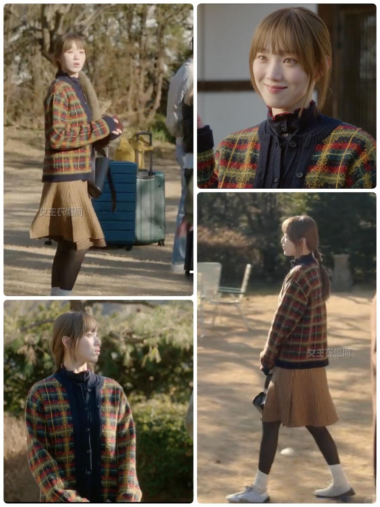
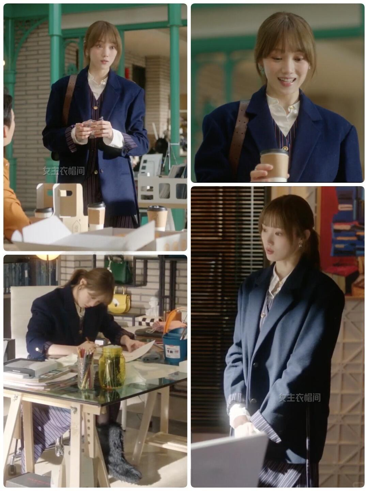
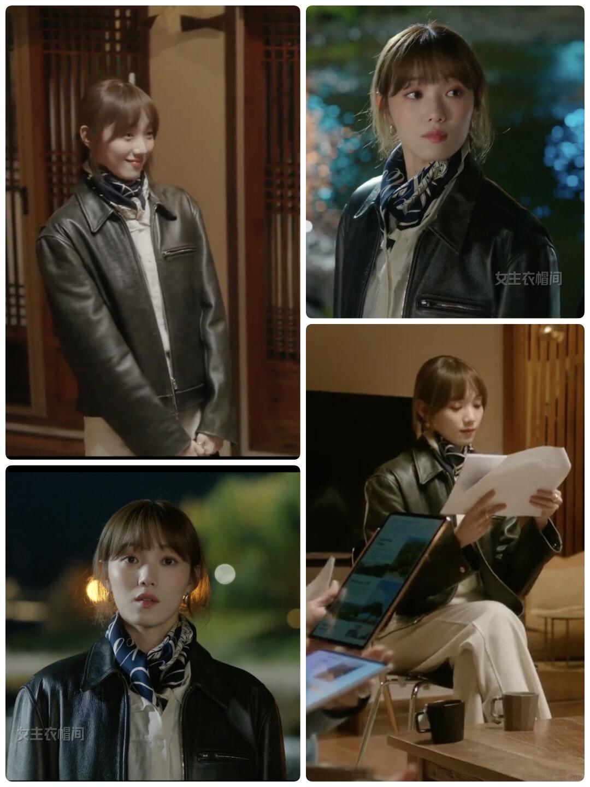
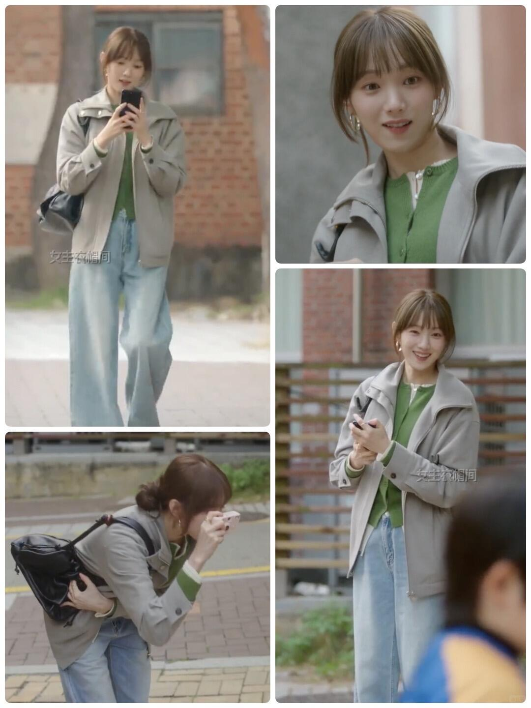
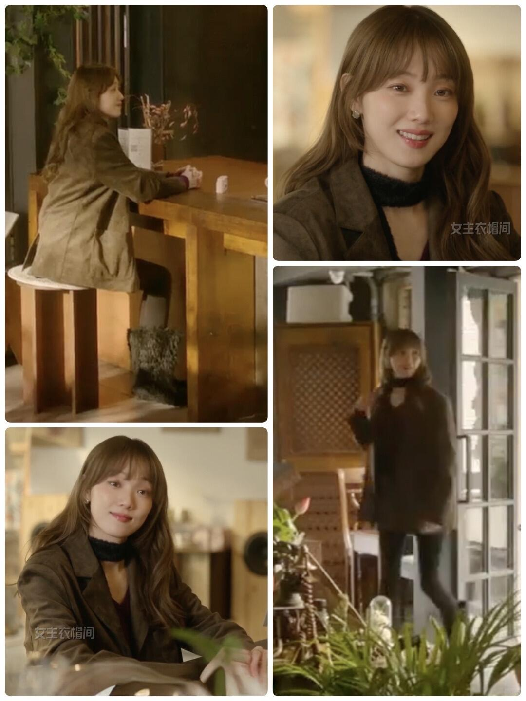
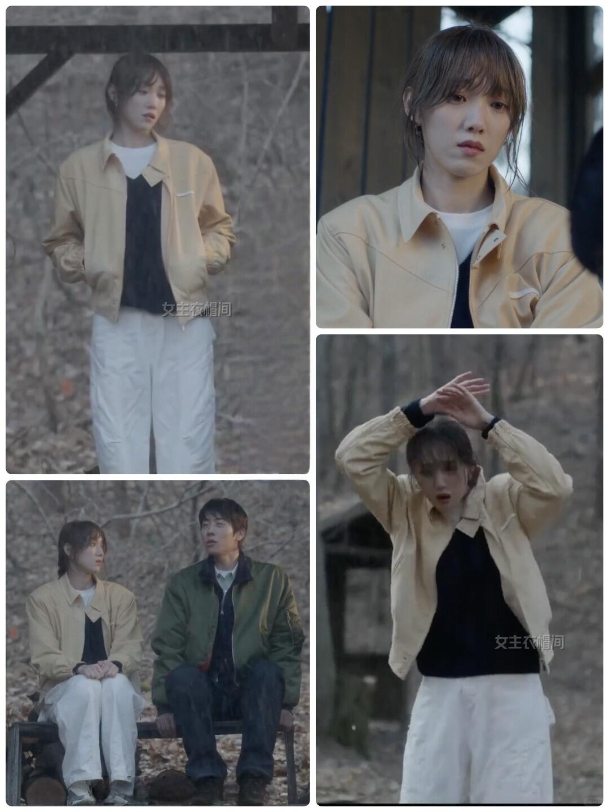
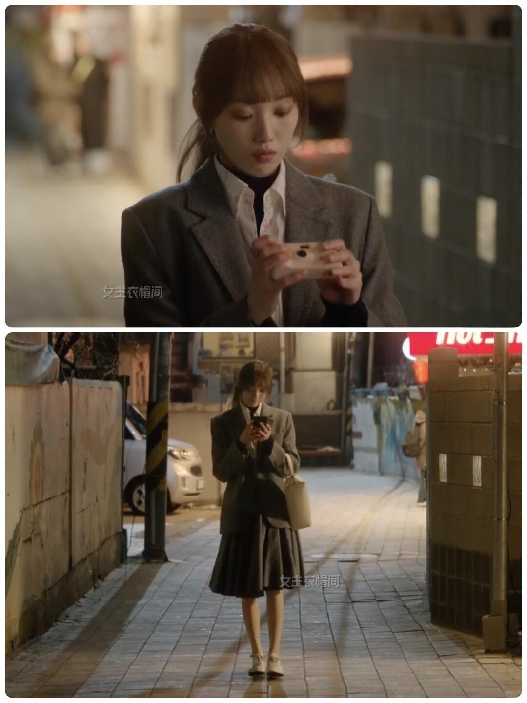
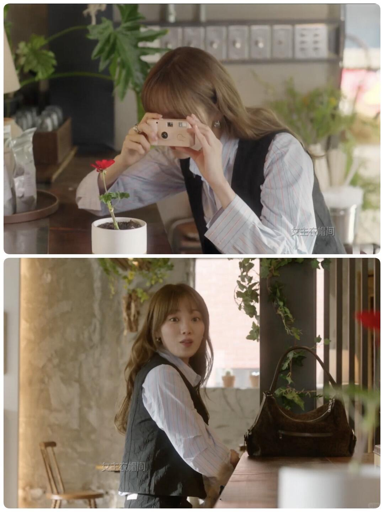
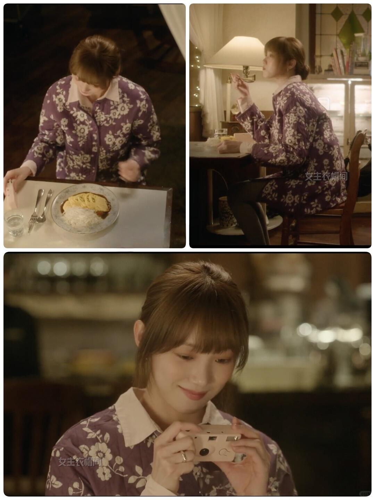
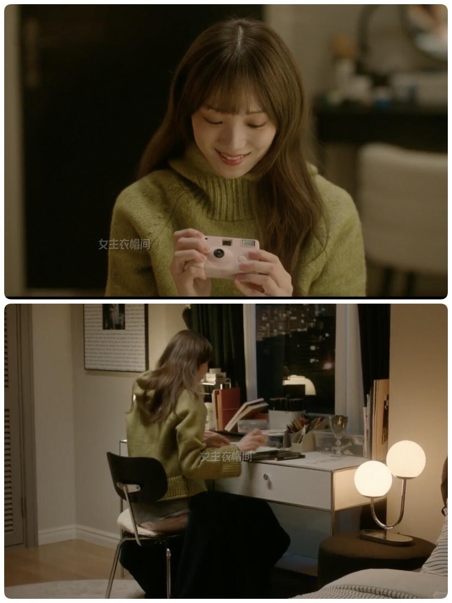
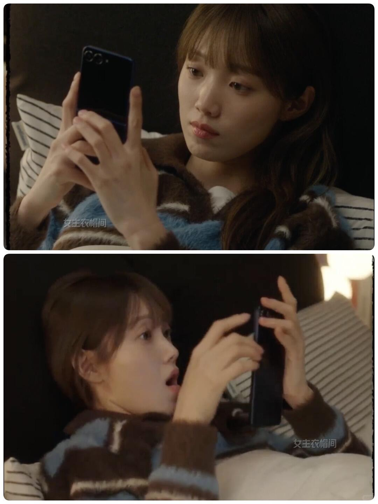
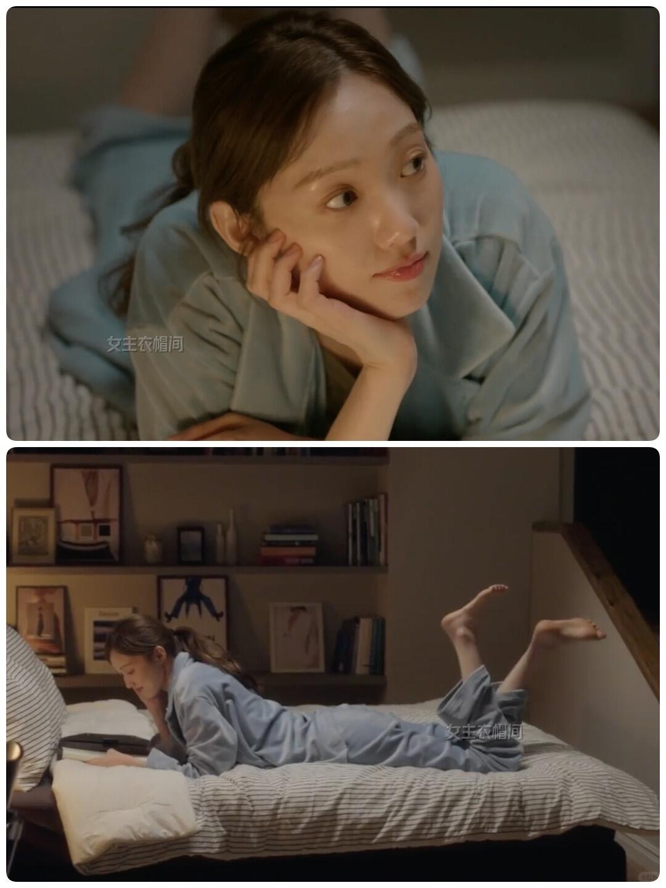
