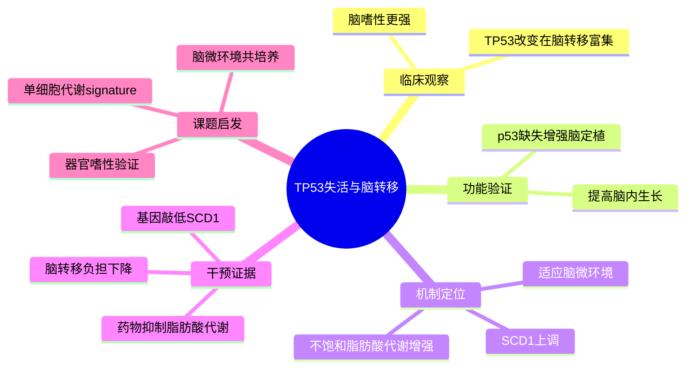

# p53-SCD1 脑转移

- 标题：p53 inactivation drives breast cancer metastasis to the brain through SCD1 upregulation and increased fatty acid metabolism
- 发表时间：2026-03-01
- 期刊：Nature Genetics
- PubMed：[PMID: 40066494](https://pubmed.ncbi.nlm.nih.gov/40066494/)
- DOI：[10.1038/s41588-025-02446-1](https://doi.org/10.1038/s41588-025-02446-1)
- 研究类型：机制研究 + 转化研究 + 多队列整合

## 研究问题
TP53 失活为什么特别容易推动乳腺癌脑转移？这一过程中是否存在可药物化的代谢脆弱性？

## 摘要式结论
作者将临床队列、细胞与动物模型、脂代谢实验连成一条线，提出一个相当清晰的机制链：`TP53 失活 -> SCD1 上调 -> 不饱和脂肪酸代谢增强 -> 脑微环境适应性提高 -> 脑转移负担增加`。更重要的是，这条链条具备干预抓手，SCD1 或脂肪酸合成抑制在模型中能明显压制脑转移生长。作为资源层面的对应证据，可与 [[文献精读/乳腺癌脑转移/脑转移基因组免疫谱_2025|脑转移基因组免疫谱]] 对照阅读，后者同样指出 `TP53` 是脑转移中的高频事件。

## 文章行文逻辑
1. 先从临床样本和公开队列出发，确认 TP53 改变在乳腺癌脑转移中富集，并与更强脑嗜性相关。
2. 再用基因工程细胞系和动物模型验证：p53 缺失本身足以提高脑定植和脑内生长能力。
3. 随后通过转录组、脂质代谢分析和脑微环境条件培养，定位到 SCD1 介导的不饱和脂肪酸代谢重编程。
4. 最后以遗传敲低和药物抑制收尾，证明 SCD1 不是伴随现象，而是功能性依赖点。

## 主要创新点
- 把“TP53 改变富集于脑转移”从相关性推进到可验证的代谢机制。
- 不是泛泛讲脂代谢，而是把关键节点压缩到 `SCD1` 这个更可操作的酶。
- 强调脑微环境选择压力与脂代谢适应之间的因果关系，比较贴近器官嗜性转移问题。

## 关键数据类型与是否可下载
- 临床基因组与转录组：部分可从文中关联公开队列与补充材料复用。
- RNA-seq：可下载，文中给出 `GSE245414`、`GSE281411`。
- 测序原始数据：可下载，文中给出 `PRJNA1246204`、`PRJNA1247024`。
- Source data：期刊页面可直接下载。
- 自建临床转移队列：涉及受控访问部分，复现时需区分公开与受限层级。

## 可借鉴的方法
- 脑转移偏好模型：心内注射或脑转移定植模型筛脑嗜性克隆。
- 脑微环境模拟：星形胶质细胞/脑环境条件培养基联合功能实验。
- 代谢验证：脂滴、不饱和脂肪酸、代谢通量与药物抑制要成套设计，避免只停留在转录层。
- 因果链闭环：临床富集 -> 功能增益/缺失 -> 机制定位 -> 药物回补，这个结构值得直接借鉴。

## 可借鉴的创新点
- 以“器官嗜性”作为筛选机制线索，而不是只做一般性转移比较。
- 把脑转移问题与脂质可塑性联结，为单细胞代谢状态分层提供明确方向。

## 与用户课题的潜在关联
- 如果你的课题涉及乳腺癌脑转移微环境，这篇文章提供了一个很强的候选轴：`TP53 状态-SCD1-脂代谢适应`。这条线和 [[文献精读/乳腺癌脑转移/脑转移基因组免疫谱_2025|脑转移基因组免疫谱]] 中的 `TP53` 高频事件可以拼成“队列富集 -> 机制解释”的两段式证据。
- 若已有单细胞数据，可直接看脑转移细胞群中 `SCD1/FASN/SREBF1` 模块是否上调，以及是否伴随星形胶质细胞反应信号。
- 若想做跨队列验证，可以把 TP53 改变与脑转移样本的脂代谢 signature 做关联分析，并优先用 [[公共数据集/多组学与bulk/乳腺癌转移多组学线索_2026-05-26|乳腺癌转移多组学线索]] 中的 `phs003673` 这类队列落地。

## 局限性
- 机制重心放在代谢轴，免疫微环境展开相对有限。
- 受控临床队列与模型系统之间仍存在物种和处理差异。
- SCD1 抑制在临床可转化性上仍需考虑血脑屏障、毒性和联合用药策略。

## 相关笔记
- 同基因与同器官证据：[[文献精读/乳腺癌脑转移/脑转移基因组免疫谱_2025|脑转移基因组免疫谱]]
- 同属脑转移微环境问题，但强调神经代谢支持：[[文献精读/肿瘤微环境与转移/神经线粒体转移_2025|神经线粒体转移]]
- 可用于队列验证的数据入口：[[公共数据集/多组学与bulk/乳腺癌转移多组学线索_2026-05-26|乳腺癌转移多组学线索]]
- 更宏观的器官特异性框架：[[文章思路/乳腺癌转移器官特异性免疫生态文章逻辑|乳腺癌转移器官特异性免疫生态文章逻辑]]

## 思维导图

