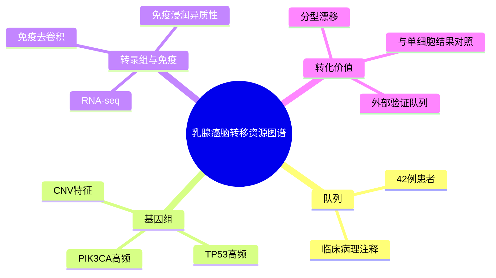

# 脑转移基因组免疫谱

- 标题：Genomic and immune profiling of breast cancer brain metastases
- 发表时间：2025-02-17
- 期刊：Acta Neuropathologica Communications
- PubMed：[PMID: 39976075](https://pubmed.ncbi.nlm.nih.gov/39976075/)
- DOI：[10.1186/s40478-025-01949-2](https://doi.org/10.1186/s40478-025-01949-2)
- 研究类型：临床队列分析 + WES/RNA-seq + 免疫去卷积

## 研究问题
乳腺癌脑转移在基因组改变、分型漂移和免疫生态位上有什么可重复的规律？这些规律能否解释预后差异并为后续验证提供资源？

## 摘要式结论
这篇文章价值不在机制深挖，而在于把脑转移样本的“可分析底图”补得比较完整：作者对 42 例患者脑转移样本做整合分析，发现 `TP53`、`PIK3CA` 等改变高频，部分病例存在原发灶到脑转移灶的分型变化，同时脑转移免疫浸润总体偏低但异质性显著。对做验证性课题的人来说，它更像一份高质量的队列资源说明书。和 [[文献精读/乳腺癌脑转移/p53-SCD1脑转移_2026|p53-SCD1 脑转移]] 放在一起看时，这篇文章提供的是 `TP53` 富集现象，后者提供的是 `TP53 -> SCD1` 的机制解释。

## 文章行文逻辑
1. 建立脑转移样本队列，明确临床病理背景。
2. 用 WES 描述脑转移常见驱动事件与拷贝数特征。
3. 用 RNA-seq 和免疫去卷积估计脑转移免疫生态位。
4. 把分子分型、免疫状态与临床结局放在一起讨论，形成资源型结论。

## 主要创新点
- 同时覆盖基因组和免疫层，而不是只做突变谱目录。
- 强调原发灶与脑转移灶的分型不一致问题，这对样本配对验证非常关键。
- 数据共享相对友好，适合作为外部验证队列入口。

## 关键数据类型与是否可下载
- WES + RNA-seq：受控开放，EGA 研究号为 `phs003673`。
- 临床注释：文章与补充材料可提取部分。
- 免疫浸润推断结果：可根据 RNA-seq 重新计算，复现门槛中等。

## 可借鉴的方法
- 原发灶/转移灶配对思路：即便样本不全，也要显式评估分型漂移。
- 免疫去卷积：适合先做资源层验证，再决定是否进单细胞。
- 临床分层：脑转移研究最好把分子亚型、治疗史、样本来源一起纳入模型。

## 可借鉴的创新点
- 将“脑转移是免疫冷肿瘤吗”从印象判断变成可量化、可分层的问题。
- 可把这篇文章当作外部校准集，用来检查你自己的 signature 是否在真实脑转移队列里成立，尤其适合拿去验证 [[文献精读/乳腺癌脑转移/p53-SCD1脑转移_2026|p53-SCD1 脑转移]] 里提出的脂代谢轴，或 [[文献精读/肿瘤微环境与转移/神经线粒体转移_2025|神经线粒体转移]] 里暗示的 OXPHOS/线粒体程序。

## 与用户课题的潜在关联
- 若你的主线是乳腺癌脑转移微环境，这篇文章适合做 cohort-level 验证底座。
- 可以直接验证：不同分型脑转移是否具有不同免疫浸润、脂代谢或神经互作特征。这一点分别对应 [[文献精读/乳腺癌脑转移/p53-SCD1脑转移_2026|p53-SCD1 脑转移]] 和 [[文献精读/肿瘤微环境与转移/神经线粒体转移_2025|神经线粒体转移]] 两条机制候选线。
- 如果后续拿到单细胞数据，这篇文章可提供 bulk/WES 参照框架。

## 局限性
- 队列规模对脑转移研究来说不错，但做亚型细分后统计功效仍有限。
- 免疫结论主要来自 bulk RNA 去卷积，缺少单细胞级别细胞状态解析。
- 机制层较薄，更适合“验证与分层”，不适合直接产出新机制。

## 相关笔记
- 共享 `TP53` 线索，且给出机制解释：[[文献精读/乳腺癌脑转移/p53-SCD1脑转移_2026|p53-SCD1 脑转移]]
- 共享脑转移微环境主题，但强调神经-代谢支持：[[文献精读/肿瘤微环境与转移/神经线粒体转移_2025|神经线粒体转移]]
- 对应的可下载/可申请队列入口：[[公共数据集/多组学与bulk/乳腺癌转移多组学线索_2026-05-26|乳腺癌转移多组学线索]]
- 更大的脑/肺/卵巢器官特异性框架：[[文章思路/乳腺癌转移器官特异性免疫生态文章逻辑|乳腺癌转移器官特异性免疫生态文章逻辑]]

## 思维导图

