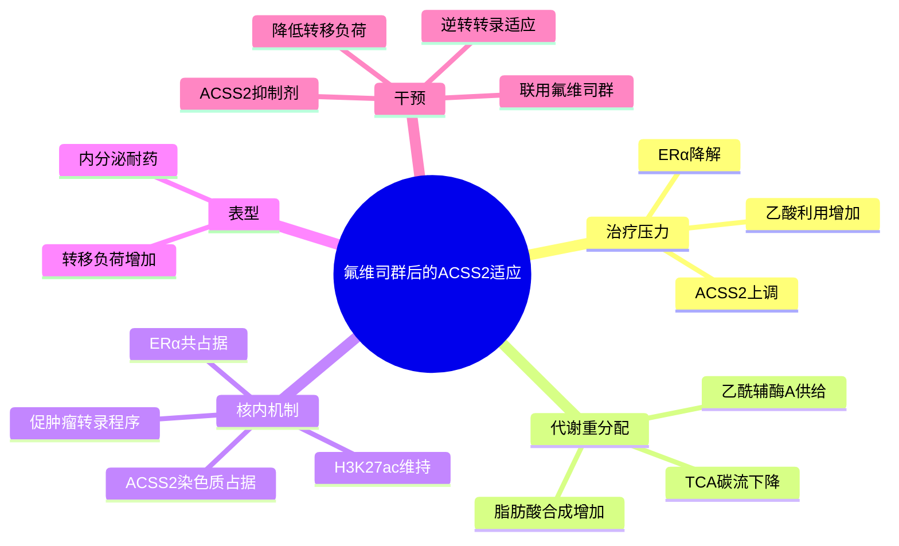

# ACSS2代谢表观遗传氟维司群耐药-2026

- 标题：ACSS2-mediated metabolic-epigenetic crosstalk drives Fulvestrant resistance and represents a novel therapeutic target
- 发表时间：2026-06-27（本轮新进入 PubMed 检索窗口）
- 期刊：npj Breast Cancer
- PubMed：[PMID 42365005](https://pubmed.ncbi.nlm.nih.gov/42365005/)
- DOI：[10.1038/s41523-026-00987-0](https://doi.org/10.1038/s41523-026-00987-0)
- 研究类型：ER+ 转移性乳腺癌机制与转化研究；临床结局队列、肝转移患者来源异种移植（PDX）、稳定同位素示踪、CUT&RUN、RNA-seq 与体内药理联合验证

## 研究问题

氟维司群清除 ERα 后，ER+ 转移性乳腺癌为何仍能形成可持续的代谢和染色质适应？ACSS2 是否把乙酸碳流与局部染色质乙酰化连接起来，并成为可药物化的耐药节点？

## 摘要式结论

作者在肝转移 PDX 和临床资料中发现脂质代谢与乙酰辅酶 A 生成增强。氟维司群诱导 ACSS2 表达并提高乙酸利用，使乙酸碳流从 TCA 循环偏向脂肪酸合成；同时，核内 ACSS2 在染色质上的占据增加，并与 ERα、H3K27ac 富集区域重叠，维持一批与肿瘤进展和代谢适应有关的转录程序。ACSS2 抑制剂与氟维司群联用可消除这些染色质占据和转录变化，并在耐药异种移植模型中降低转移负荷。核心不是“ACSS2 高表达”本身，而是 `乙酸利用 → 核内乙酰辅酶 A → H3K27ac/转录重编程 → 内分泌耐药与转移维持` 的因果链。

## 文章行文逻辑

1. 从 ER+ 转移性乳腺癌、尤其肝转移患者和 PDX 的临床问题出发，定位脂质/乙酰辅酶 A 代谢异常。
2. 用药物联用实验确认氟维司群与 ACSS2 抑制具有协同作用。
3. 通过稳定同位素示踪追踪乙酸去向，证明氟维司群改变乙酸在 TCA 循环和脂肪酸合成之间的分配。
4. 用细胞定位与 CUT&RUN 将代谢改变连接到核内 ACSS2、ERα 和 H3K27ac 的染色质共占据。
5. 用 RNA-seq 验证联用处理逆转氟维司群诱导的代谢和促肿瘤转录程序。
6. 在耐药异种移植模型中验证联合抑制可降低转移负荷，完成转化闭环。

## 主要创新点

- 将内分泌耐药从单一受体或信号通路问题推进到“碳源分配—核内代谢酶—增强子乙酰化”的跨层级机制。
- 同时测量乙酸碳流、染色质占据、H3K27ac 和转录输出，避免仅凭相关性推断代谢—表观遗传串联。
- 在肝转移 PDX 和耐药体内模型中验证联合用药，增强了器官转移与临床转化相关性。
- 与脑转移中的 ACSS2–SLC7A11/铁死亡轴形成器官和治疗情境对照：同一代谢酶可通过不同下游程序支持不同转移生态位。

## 关键数据类型与是否可下载

- 数据类型：临床结局资料、肝转移 PDX、稳定同位素示踪代谢流、CUT&RUN（ACSS2/ERα/H3K27ac）、RNA-seq、免疫荧光/免疫印迹及体内转移负荷。
- 可下载性：PubMed 摘要和期刊正文公开；本轮在 PubMed、Crossref 和可检索期刊元数据中未确认稳定的 GEO/SRA/MetaboLights accession。因此当前应把本文作为高质量机制与实验设计来源，不应声称已有可直接下载的原始组学队列。
- 可先利用本文公开图表和补充材料提取候选基因/位点；若后续出现 accession，再单独建立数据集记录并核对样本级设计。

## 可借鉴的方法

- 对代谢酶研究同时设置“代谢流—染色质—转录—表型”四层证据，而不是只做表达和敲低。
- 用同位素示踪区分乙酸进入 TCA 循环还是脂肪酸合成，避免将总乙酰辅酶 A 变化误当作具体通量变化。
- 对核内代谢酶做 CUT&RUN/ChIP 类定位，并与 H3K27ac、关键转录因子共占据整合，建立局部代谢供给模型。
- 在联合用药中同时报告协同效应、耐药模型和转移负荷，提升转化可信度。

## 可借鉴的创新点

- 在不同器官转移中比较 ACSS2 的“功能分流”：脑转移偏铁死亡保护，肝转移/治疗耐药偏乙酸碳流和染色质乙酰化。
- 将器官微环境可用碳源、治疗压力和增强子状态放进同一分析框架，寻找仅在特定器官或治疗阶段暴露的代谢脆弱点。
- 对已有单细胞/空间数据建立 `ACSS2-high + lipid synthesis + H3K27ac target` 复合程序，而不是用单基因 ACSS2 作为结论。

## 与用户课题的潜在关联

这篇文章适合作为“器官转移中的代谢适应具有情境依赖性”的直接证据。可在脑、肺、骨、卵巢转移数据中分别测试 ACSS2 与脂肪酸合成、氧化应激、铁死亡和 ER 转录程序的耦合强度；对 ER+ 样本还应按既往内分泌治疗分层，避免把治疗诱导状态误判为器官固有差异。与 [[ACSS2抑制铁死亡驱动脑转移-2026]] 联读时，重点应是“同一节点的下游机制是否随器官与治疗压力改变”。

## 局限性

- 主要因果证据来自细胞系、PDX 和异种移植模型，尚不足以证明所有 ER+ 患者或所有转移器官均依赖同一机制。
- 研究重点是氟维司群后的适应，不能直接外推到芳香化酶抑制剂、口服 SERD 或 CDK4/6 抑制剂后的全部耐药状态。
- 肝转移 PDX 增强了器官相关性，但并未系统比较脑、肺、骨、卵巢等不同器官的 ACSS2 依赖。
- 尚未确认公开原始组学 accession，当前复用受限于图表、补充材料和作者后续数据发布。

## 相关笔记

- [[ACSS2抑制铁死亡驱动脑转移-2026]]
- [[器官嗜性转移营养需求-2026]]
- [[AURORA多组学转移图谱-2023]]
- [[ER+内分泌治疗-P-Rex1-Rac1转移逃逸-2026]]
- [[ER阳性转移乳腺癌GSE124647-2026-06-29]]
