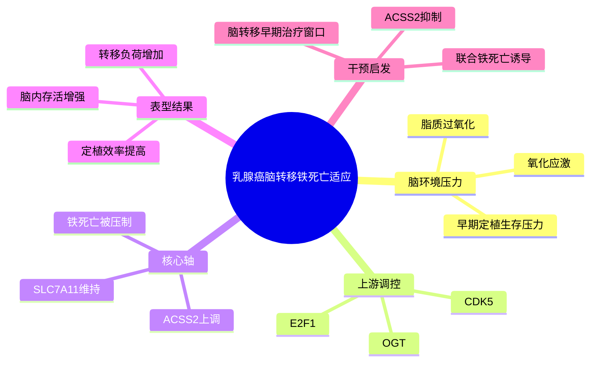

# ACSS2抑制铁死亡驱动脑转移-2026

- 标题：ACSS2 Suppresses Ferroptosis to Drive Breast Cancer Brain Metastasis
- 发表时间：2026-04-22
- 期刊：Cancer Research
- PubMed：[PMID 42017807](https://pubmed.ncbi.nlm.nih.gov/42017807/)
- DOI：[10.1158/0008-5472.CAN-24-3370](https://doi.org/10.1158/0008-5472.CAN-24-3370)
- 研究类型：机制与转化研究；整合患者样本、体内外功能实验、代谢/分子机制验证与药理干预

## 研究问题
乳腺癌细胞进入脑环境后，为什么能在高度氧化压和脂质应激下存活并完成早期定植？是否存在可药物化的代谢保护轴，专门帮助脑转移细胞逃避铁死亡？

## 摘要式结论
这篇文章把脑转移适应的关键矛盾落在“如何扛住铁死亡”上。作者提出并验证了一个 `OGT-CDK5-E2F1-ACSS2-SLC7A11` 轴：脑转移环境上调 `OGT`，进而激活 `CDK5/E2F1`，提升 `ACSS2` 表达；`ACSS2` 又维持 `SLC7A11`，压低铁死亡，帮助乳腺癌细胞在脑内存活、播散和长成转移灶。抑制 `ACSS2` 会增强铁死亡并削弱脑转移负荷，说明它不是单纯相关标志物，而是具备干预价值的脑转移脆弱点。

## 文章行文逻辑
1. 先从乳腺癌脑转移临床样本与模型切入，证明 `ACSS2` 在脑转移中高于原发灶/非脑环境，并与较差结局相关。
2. 再做功能闭环：敲低或抑制 `ACSS2` 后，脑转移定植、增殖和存活下降。
3. 接着把表型锚定到铁死亡：`ACSS2` 丢失后脂质过氧化和铁死亡相关损伤上升，而 `SLC7A11` 是关键下游节点。
4. 最后向上追溯调控来源，提出脑环境中的 `OGT-CDK5-E2F1` 信号驱动 `ACSS2` 转录，从而形成脑转移适应链条。

## 主要创新点
- 把脑转移适应从传统“增殖/侵袭”叙事推进到“代谢保护与铁死亡逃逸”层面。
- 不是只报告 `ACSS2` 高表达，而是把它接到可解释的上游调控链 `OGT-CDK5-E2F1` 和下游执行点 `SLC7A11` 上。
- 强调脑转移早期定植阶段的脆弱性，而不是仅分析晚期已成灶病灶。

## 关键数据类型与是否可下载
- 临床组织与表达关联：论文包含患者样本层面的表达/结局关联，适合做方向性参考。
- 功能实验：体内脑转移模型、体外干预、分子操作与铁死亡表型验证，原始实验数据主要依赖正文和补充材料复核。
- 公共可下载数据：本论文页面未直接显示稳定的 GEO/SRA 原始组学 accession；更适合作为机制假说来源，而不是直接的数据下载入口。

## 可借鉴的方法
- 把“脑转移适应”拆成可操作的死亡程序问题，再围绕该程序寻找上游调控和下游救援节点。
- 先做患者相关性与模型表达差异，再做基因操作和药理抑制的双重验证，形成较完整的因果链。
- 若后续分析用户已有脑转移队列，可直接加入 `ACSS2/SLC7A11` 模块分数，并与脂代谢、ROS、应激适应模块并列比较。

## 可借鉴的创新点
- 将代谢酶 `ACSS2` 作为“器官环境适应开关”而不只是一般代谢标志物。
- 将铁死亡脆弱性与脑转移早期定植窗口绑定，这种“阶段特异脆弱点”设计值得迁移到肺/骨等器官转移研究。

## 与用户课题的潜在关联
这篇文章非常适合补到用户的脑转移主线里。它和已有的 [[FGF2-NCAM1-FGFR1脑转移-2026]] 一起，分别代表两种不同层面的脑适应：前者更偏脑生态位信号输入，这篇更偏转移细胞自身的代谢防御。若后续整合脑转移单细胞或 bulk 队列，可优先测试：
- `ACSS2/SLC7A11` 高分是否对应更强的脑定植样程序。
- 该轴是否与 `FGFR1`、脂代谢、氧化应激或免疫冷环境共同出现。
- 是否能作为脑转移亚群分层或联合干预的候选轴。

## 局限性
- 机制链条很完整，但仍以模型和功能实验为主，患者多队列泛化程度有限。
- 公开原始组学入口不清晰，不适合直接作为本轮“可下载数据资源”主体。
- 文章聚焦脑转移，不能直接外推到肺、骨或卵巢转移。

## 相关笔记
- [[FGF2-NCAM1-FGFR1脑转移-2026]]
- [[乳腺癌脑转移单细胞图谱-2026]]
- [[乳腺癌脑转移配对RNA队列-2026-06-04]]
