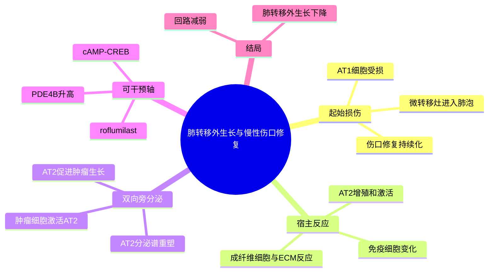

# AT2 伤口修复促进肺转移-2026

- 标题：Metastasis-Associated Wound Repair Promotes Reciprocal Lung Epithelium Activation and Breast Cancer Metastatic Outgrowth
- 发表时间：2026-03-10（在线）；2026-04-01（卷期）
- 期刊：Cancer Research Communications
- PubMed/DOI 链接：
  - PubMed：https://pubmed.ncbi.nlm.nih.gov/41937294/
  - DOI：https://doi.org/10.1158/2767-9764.CRC-25-0459
- 研究类型：乳腺癌肺转移机制研究；免疫完整小鼠模型 + 单细胞/整体转录组 + 共培养 + 药理干预 + 人体组织验证

## 选择理由

检索 2026-06-29 至 2026-06-30 新收录条目后，未见质量和课题相关性明显超过近期已记录研究的乳腺癌远处转移原创论文；新增结果主要为病例、影像预测、递药或一般治疗研究。本篇虽在 3 月在线发表，但尚未收入当前笔记库，且直接补充“肺实质细胞如何支持已建立转移灶外生长”这一缺口，并同时公开可复用的单细胞和 bulk RNA-seq 数据，因此按回退规则选入。

## 研究问题

肺转移外生长是否会把局部肺泡损伤转化为持续的伤口修复程序？其中数量丰富的 II 型肺泡上皮细胞（AT2）是被动旁观者，还是会与乳腺癌细胞形成促生长的双向旁分泌回路？这一回路能否用已有药物干预？

## 摘要式结论

乳腺癌微转移灶在肺泡内生长并损伤 AT1 细胞，诱发包括炎症、成纤维细胞/基质反应和 AT2 增殖在内的慢性伤口修复。随着转移负荷增加，AT2 的转录和分泌谱发生变化；肿瘤细胞可激活 AT2，AT2 分泌因子又促进乳腺癌细胞生长，形成双向旁分泌正反馈。部分 AT2 分泌程序受 `cAMP-CREB-PDE4` 轴调控。PDE4 抑制剂 roflumilast 可削弱共培养中的相互促进，并在小鼠中减少肺转移外生长。人肺组织验证显示，乳腺癌肺转移邻近 AT2 的 `PDE4B` 高于正常肺 AT2。

## 文章行文逻辑

1. 在自发和静脉注射肺转移模型中，按转移灶大小和总体负荷描绘肺内慢性伤口修复，确认 AT2 增殖、免疫/基质激活随外生长增强。
2. 对 Met-1 低负荷（注射后 1 周）和高负荷（3 周）肺组织做 scRNA-seq，定位不同宿主细胞群的阶段性变化，并聚焦 AT2 分泌程序。
3. 用人 iPSC 来源 iAT2 与乳腺癌细胞无接触共培养及 bulk RNA-seq，证明肿瘤细胞可重塑 AT2；再反向测试 AT2 分泌物对肿瘤生长的影响。
4. 将小鼠 AT2 与人 iAT2 的差异程序交叉，指向 `cAMP-CREB` 调控的分泌因子，并选择 PDE4 作为可药物化节点。
5. 用 roflumilast 完成体外和小鼠体内干预，最后在人正常肺与乳腺癌肺转移组织中检查 PDE4 亚型，建立转化关联。

## 主要创新点

- 将肺转移研究从“前转移生态位/早期定植”推进到“已建立病灶的外生长”，强调不同阶段的宿主程序不可混为一谈。
- 把 AT2 从肺损伤修复细胞重新定义为可被转移灶劫持的促肿瘤生态位细胞，并用双向实验验证互作，而非只做关联性表达分析。
- 将 AT2 分泌程序连接到可药物化的 `PDE4-CREB` 轴，并使用已获批 COPD 药物 roflumilast 提供再定位依据。
- 公开低/高转移负荷全肺单细胞数据和人 iAT2 共培养 bulk RNA-seq，便于区分宿主细胞类型与肿瘤诱导反应。

## 关键数据类型与是否可下载

- `GSE319843` / `PRJNA1425297`：Met-1 小鼠乳腺癌肺转移低负荷与高负荷全肺 scRNA-seq，各 1 只小鼠；最终分析 5,504 个细胞。原始 SRA、Cell Ranger 矩阵、H5、MTX 和 Loupe 文件可下载。
- `GSE294453` / `PRJNA1249481`：人 iPSC 来源 iAT2 单独培养、与 SUM159PT 无接触共培养、与 MDA-MB-453 无接触共培养，各 3 个重复，共 9 个 bulk RNA-seq 样本；原始 SRA 与 counts 文件可下载。
- 组织学/多重免疫荧光、细胞因子阵列、体外增殖和小鼠 roflumilast 干预数据主要在正文及补充材料中。
- 人体 IHC：正常肺 28 例、乳腺癌肺转移 17 例，用于比较 AT2、基质和转移灶中的 PDE4 亚型；未作为独立公共组学队列发布。

## 可借鉴的方法

- 用同一器官内“低负荷/高负荷”近似外生长阶段，再把单细胞差异与转移灶邻近区的空间组织学验证配对。
- 将宿主细胞通讯拆成两个方向：肿瘤对宿主细胞的重塑，以及宿主分泌物对肿瘤生长的反馈；无接触 Transwell 适合先验证旁分泌成分。
- 在跨物种数据中不直接合并细胞，而是交叉比较宿主细胞差异基因、分泌因子和通路，随后用药理节点做功能闭环。
- 分析肺转移时把 AT2/肺泡修复模块与巨噬细胞、中性粒细胞、CAF/ECM 模块并列，而不是只聚焦经典免疫细胞。

## 可借鉴的创新点

- 可在现有脑、肺、骨、卵巢转移数据中构建“器官实质细胞损伤—修复被劫持”模块：肺关注 AT1/AT2，脑关注星形胶质/小胶质，骨关注成骨/破骨谱系，卵巢关注间皮/基质细胞。
- 在 CellChat/NicheNet 分析中加入阶段方向：某条互作是早期定植所需，还是高负荷外生长后的反馈放大，避免把结果当作静态网络。
- `PDE4B-high AT2` 可作为肺转移邻近区候选状态，与 `CREB` 活性、分泌因子、增殖和病灶距离共同验证。

## 与用户课题的潜在关联

- 对乳腺癌肺转移最直接：为“肺泡上皮—肿瘤”提供可量化的宿主实质细胞轴，能补充现有巨噬细胞和中性粒细胞主线。
- 可将 `GSE319843` 中的 AT2 高负荷差异程序作为 signature，投射到其他小鼠肺转移 scRNA 数据，检查其与 `TREM2` 巨噬细胞、`LCN2` 中性粒细胞、ECM/CAF 及休眠再激活模块的关系。
- 对跨器官比较，可检验“组织损伤修复被肿瘤劫持”是否为共性机制，以及各器官由哪类实质细胞承担放大器角色。

## 局限性

- 核心 scRNA-seq 只有低负荷和高负荷各 1 只小鼠，时间点、负荷和个体差异完全混杂，不能据此做稳健的组间统计；应把结果视为候选生成数据。
- 静脉注射模型绕过原发灶逸出和自然播散，低负荷/高负荷也不是同一只动物的纵向追踪。
- 人 iAT2 共培养是简化模型，缺少免疫、血管和基质细胞；MDA-MB-453 的受体/分子分型在不同来源中存在差异，不宜把两个共培养细胞系笼统等同为同一 TNBC 亚型。
- roflumilast 是广谱 PDE4 抑制剂，体内效应不能完全归因于 AT2 或 PDE4B；其对免疫和其他肺细胞的作用需拆分。
- 人体证据主要是横断面 IHC，支持相关性和组织定位，但不能证明 `PDE4B-high AT2` 驱动转移外生长或预测治疗响应。

## 相关笔记

- [[肺泡巨噬细胞与肺转移时序-2024]]
- [[棕榈酸-中性粒细胞-LCN2肺转移前生态位-2026]]
- [[糖皮质激素-FAS转移播散免疫逃逸-2026]]
- [[MED4维持转移休眠-2026]]
- [[乳腺癌肺转移AT2伤口修复GSE319843-2026-06-30]]
