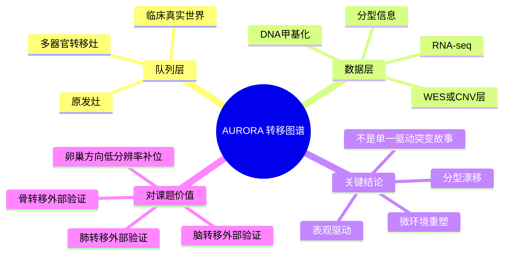

# AURORA多组学转移图谱-2023

- 标题：Multiomics in primary and metastatic breast tumors from the AURORA US network finds microenvironment and epigenetic drivers of metastasis
- 发表时间：2023
- 期刊：Nature Cancer
- PubMed：https://pubmed.ncbi.nlm.nih.gov/36585450/
- DOI：https://doi.org/10.1038/s43018-022-00491-x
- 研究类型：临床转化研究；多组学队列整合分析

## 选择理由
本轮继续回看了 2026-06-11 之后的检索窗口，没有遇到一篇同时满足“乳腺癌远处转移高度相关、机制或资源增量明显高于库内近两周已收录文章、并且能立刻支撑后续验证”的更强新文献。与其补一篇边际增益有限的新文章，不如把当前库里还缺的一篇高复用代表性研究补齐。AURORA 的价值不在单条新机制，而在它把原发灶与多器官转移灶放进同一套临床多组学框架里，适合作为脑/肺/骨/卵巢方向后续统一外部验证底座。

## 研究问题
乳腺癌在从原发灶走向多器官转移的过程中，哪些改变更像是稳定可复现的“转移级”特征：是肿瘤细胞内在基因组事件、表观组重塑，还是微环境与免疫生态位的系统性变化？这些改变能否被公开队列支持后续再分析和外部验证？

## 摘要式结论
这篇文章最值得重视的结论，不是再证明“转移灶与原发灶不同”，而是把这种不同拆成了可再分析的层次。作者在 AURORA US Network 中整合了原发与转移乳腺癌的多平台数据，提示转移并非单纯由某个新增驱动突变解释，而更像“分型漂移 + 微环境重塑 + 表观与转录程序再组织”的组合过程。对用户课题最有价值的部分，是它把脑、肺、骨、卵巢等器官相关样本都放进了同一临床框架，允许后续把近几天积累的器官特异机制假设投回一个统一 bulk 多组学底盘里做方向性验证。

## 文章行文逻辑
1. 先建立 AURORA 队列，强调这是原发灶与多器官转移灶并存的临床真实世界资源。
2. 再比较原发与转移在分型、拷贝数、突变和转录层面的异同，说明“转移态”并不只是原发态的简单复制。
3. 接着把微环境与表观层变化并入分析，提出 metastasis-associated programs 不只发生在肿瘤细胞内。
4. 最后把这些分子层变化放回临床转化语境，说明哪些资源可以公开复用、哪些结果适合作为后续器官特异验证起点。

## 主要创新点
- 把乳腺癌转移写成“多组学状态迁移”而不是单一器官个案，适合做跨器官比较。
- 同时保留原发灶与转移灶信息，便于研究分型漂移和治疗后重编程。
- 强调微环境与表观层变化在转移中的地位，为后续把免疫、基质和代谢假设投回 bulk 队列提供了入口。

## 关键数据类型与是否可下载
- RNA-seq：公开可下，GEO `GSE193103`
- 原始测序：SRA `SRP353654`
- BioProject：`PRJNA794830`
- 论文层面还整合了 DNA copy number、体细胞突变、DNA 甲基化和 PAM50 等信息
- 可下载性判断：适合做公开 bulk 多组学验证，但不是单细胞，也不是每一层都像 GEO 表达矩阵那样即下即用

## 可借鉴的方法
- 把“原发 vs 转移”比较升级成“原发 vs 多器官转移 + 分型/治疗背景分层”的分析框架。
- 先用公开 bulk 多组学资源做大方向验证，再把命中的程序下沉到单细胞或空间数据做细胞状态解析。
- 对样本做器官、分型、治疗史三层分层，避免把脑/肺/骨/卵巢差异粗暴合并。

## 可借鉴的创新点
- 不急于寻找一个万能驱动基因，而是先识别哪些转移程序跨平台、跨器官稳定出现。
- 在单细胞资源仍不均衡时，用一个多器官公开临床多组学底座承接多条机制假设，提高验证效率。

## 与用户课题的潜在关联
- 脑转移：可与 [[脑转移基因组免疫谱_2025]]、[[p53-SCD1脑转移_2026]] 联动，先看 `TP53`、脂代谢和免疫冷状态是否在更大临床队列中保留方向性。
- 肺转移：可回投 [[棕榈酸中性粒细胞肺转移-2026]]、[[CHI3L1中性粒细胞肺转移-2026]]、[[糖皮质激素-FAS转移播散免疫逃逸-2026]] 中的免疫排斥与早期播散假设。
- 骨转移：可作为 [[骨转移SAMENT生态位标记-2026]] 的外部 bulk 验证层，尤其适合先看免疫和基质程序。
- 卵巢转移：在高质量公开单细胞仍稀缺的情况下，AURORA 可作为低分辨率但多器官一致的补位资源。

## 局限性
- 这是 bulk/多组学临床队列，不提供单细胞级细胞状态解析。
- 器官间样本量并不均衡，卵巢和骨相关位点更适合方向性验证，不适合强统计结论。
- 文章强在资源和框架，不强在某一条可直接照搬的新机制。

## 相关笔记
- [[乳腺癌AURORA多器官转移多组学-2026-06-10]]
- [[脑转移基因组免疫谱_2025]]
- [[器官嗜性转移营养需求-2026]]
- [[前转移生态位形成与干预综述-2024]]
