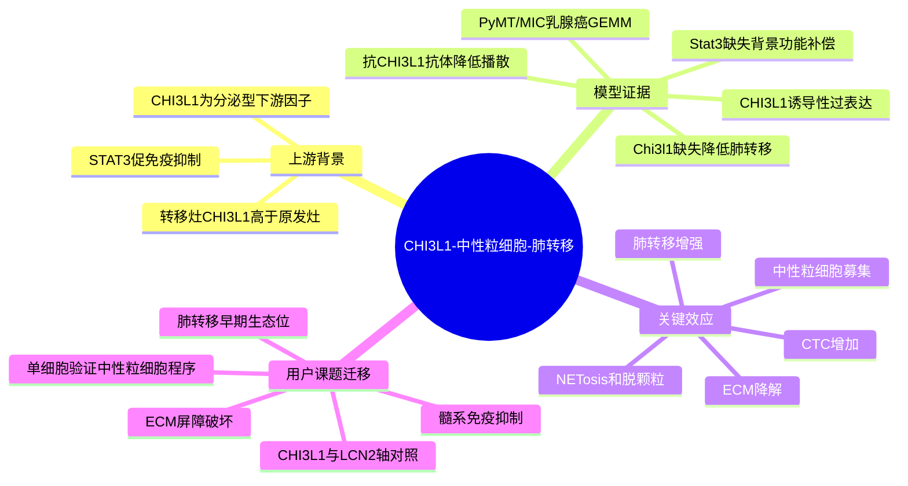

# CHI3L1-中性粒细胞轴驱动乳腺癌免疫抑制与肺转移（2026）

## 基本信息

- 标题：The CHI3L1-neutrophil axis drives immune suppression and breast cancer metastatic dissemination
- 发表时间：2026-02-03 online；JCI Insight 2026;11(6):e199307
- 期刊：JCI Insight
- PubMed/DOI：[PMID: 41632530](https://pubmed.ncbi.nlm.nih.gov/41632530/)；[DOI: 10.1172/jci.insight.199307](https://doi.org/10.1172/jci.insight.199307)
- 研究类型：机制研究；乳腺癌 GEMM、遗传敲除、抗体干预、免疫组化/免疫荧光、流式、肺转移定量与患者组织验证。

## 研究问题

乳腺癌中 STAT3 相关免疫抑制与转移长期被观察到，但其下游具体可分泌因子如何把原发灶免疫抑制、ECM 破坏、CTC 增加和肺转移串联起来仍不清楚。本文聚焦 CHI3L1/YKL-40：它是否足以驱动免疫抑制和肺转移？其关键效应细胞是否为中性粒细胞？该轴是否可被遗传或抗体方式阻断？

## 摘要式结论

作者建立乳腺上皮诱导性 CHI3L1 过表达 PyMT/MIC 小鼠模型，证明 CHI3L1 可在 STAT3 缺失背景下部分恢复肿瘤发生和肺转移能力。机制上，CHI3L1 招募并激活中性粒细胞，促使 NETosis/脱颗粒相关蛋白酶参与 ECM 降解，使肿瘤细胞更易进入循环并形成肺转移。Chi3l1 缺失或抗 CHI3L1 中和抗体均降低中性粒细胞浸润、改善 ECM 完整性并减少转移扩散。患者组织中，CHI3L1 与 p-STAT3 正相关，且匹配转移灶的 CHI3L1 高于原发灶，支持其作为转移风险标志物和治疗靶点。

## 文章行文逻辑

1. 从 STAT3 促免疫抑制和转移的既有模型出发，提出 CHI3L1 可能是关键分泌型效应因子。
2. 构建 CHI3L1 诱导性过表达模型，观察肿瘤起始、免疫浸润、肺转移和 CTC 改变。
3. 在 STAT3 缺失背景下测试 CHI3L1 是否具有功能补偿作用。
4. 将表型拆解到中性粒细胞募集、NETosis/脱颗粒、ECM 降解和肿瘤细胞播散。
5. 通过 Chi3l1 遗传缺失和抗 CHI3L1 抗体验证可干预性。
6. 用 ER+、HER2+ 组织芯片和匹配原发-转移样本连接到人类乳腺癌。

## 主要创新点

- 把 CHI3L1 从“肿瘤免疫抑制相关因子”推进为“乳腺癌转移播散的可干预分泌轴”。
- 将 STAT3、CHI3L1、中性粒细胞、ECM 降解、CTC 增加和肺转移放入同一因果链。
- 同时使用过表达、Stat3 缺失背景补偿、Chi3l1 缺失和抗体中和，机制闭环相对完整。
- 人类组织层面验证 CHI3L1-pSTAT3 相关性和转移灶富集，提高了模型结果的转化可信度。

## 关键数据类型与是否可下载

- 数据类型：小鼠 GEMM 表型、肺转移 H&E/免疫荧光、流式免疫分型、ECM 染色、CTC 流式、患者组织芯片与匹配原发/转移 IHC。
- 可下载性：论文数据可在正文、补充材料和 Supporting Data Values 中获得；作者明确说明未产生测序数据，也没有原创代码。
- 注意：因此本文适合作为机制假设来源，不适合作为可直接复分析的转录组数据源。

## 可借鉴的方法

- 用“过表达足够性 + 缺失必要性 + 抗体干预可逆性”的设计评估分泌因子在转移中的作用。
- 对转移机制不要只看肺结节终点，可加入 CTC、ECM 完整性、中性粒细胞状态和 NETosis/脱颗粒指标，拆分播散链条。
- 患者验证可采用两层：组织芯片评估 CHI3L1-pSTAT3 跨亚型相关性，匹配原发/转移样本评估转移灶富集。

## 可借鉴的创新点

- 在用户课题中，可把 CHI3L1 作为“肿瘤细胞/巨噬细胞分泌因子 -> 中性粒细胞 ECM 重塑 -> 肺转移播散”的候选轴。
- 可与 2026 年棕榈酸-LCN2 肺转移生态位文章形成互补：前者强调血管内皮代谢信号驱动中性粒细胞，本文强调肿瘤上皮 CHI3L1 驱动中性粒细胞与 ECM 降解。
- 可作为单细胞数据挖掘的 marker 组合：CHI3L1、STAT3/pSTAT3 proxy、S100A8/A9、MPO、ELANE、MMP9、CTSG、CXCR2 相关中性粒细胞程序和 ECM 降解基因。

## 与用户课题的潜在关联

- 乳腺癌肺转移：直接相关，尤其适合解释肺转移早期播散、免疫抑制和 ECM 屏障破坏。
- 肿瘤免疫：可与 T 细胞排斥、中性粒细胞免疫抑制、NETosis 和髓系生态位结合分析。
- 公共数据验证：本文没有测序数据，建议在肺转移 scRNA 数据中测试 CHI3L1 高表达样本是否伴随中性粒细胞 ECM 降解程序和 T 细胞排斥；可优先用 `GSE231915` 做小鼠时空生态位验证，再寻找人源肺转移队列补充。

## 局限性

- 主要证据来自小鼠 GEMM 和组织学/流式实验；人类验证偏组织相关性，缺少人源单细胞或空间组学直接支持。
- 中性粒细胞具体效应分子尚未完全拆开；NE、MMP9、CTSG 等是合理候选，但因果权重仍需更细干预。
- CHI3L1 抗体或抑制剂尚未进入乳腺癌转移临床验证，转化路径仍处早期。
- 没有产生可下载测序数据，限制了复分析深度。

## 思维导图

## 相关笔记

- [[棕榈酸中性粒细胞肺转移-2026]]
- [[乳腺癌肺转移TREM2巨噬细胞单细胞-2026-05-31]]
