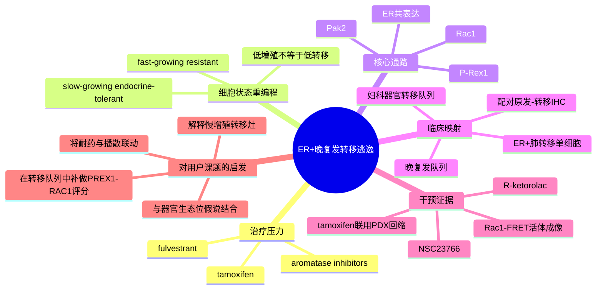

# ER+内分泌治疗-P-Rex1-Rac1转移逃逸-2026

- 标题：Endocrine therapy reprogramming of breast cancer facilitates metastatic escape via upregulation of P-Rex1/Rac1 signalling
- 发表时间：2026-05-11
- 期刊：Nature Communications
- PubMed：[PMID 42115169](https://pubmed.ncbi.nlm.nih.gov/42115169/)
- DOI：[10.1038/s41467-026-70683-x](https://doi.org/10.1038/s41467-026-70683-x)
- 研究类型：机制与转化研究；整合耐药细胞模型、单细胞转录组、活体 Rac1-FRET 成像、患者转移样本、回顾性临床队列与 PDX 干预

## 研究问题
ER+ 乳腺癌中相当一部分复发发生在长期内分泌治疗 5-10 年后。此类“晚复发/慢增殖”病灶是否并非单纯静息，而是在治疗压力下被重编程为一种低增殖但更易播散和定植的转移状态？其中是否存在可药物化的核心轴？

## 摘要式结论
这篇文章的核心贡献，不是再讲一遍“内分泌耐药”，而是把“晚期复发”具体化成一种可被单细胞与功能实验捕捉的细胞状态。作者发现，内分泌治疗后出现的 slow-growing endocrine-tolerant 细胞虽然原位增殖慢，但更容易形成转移，并在单细胞层面上调 `P-Rex1/Rac1` 通路。这个轴在 ER+ 转移灶、特别是治疗后的晚复发背景中保持活跃；用 `NSC23766` 或 `R-ketorolac` 抑制 Rac1，可降低耐药细胞生存/迁移，并在耐药 ER+ PDX 中与 tamoxifen 联用降低肿瘤负担。对用户课题最有价值的一点是：它提供了一个“治疗诱导重编程 -> 慢增殖转移逃逸 -> 可干预 Rac1 轴”的框架，可用于解释某些转移灶为何并不高增殖，却依然持续播散。

## 文章行文逻辑
1. 先建立并分离内分泌治疗后的两类细胞状态：slow-growing endocrine-tolerant 与 fast-growing resistant，证明前者原位长得慢，但更具转移潜力。
2. 再用 scRNA-seq 和伪时序描述治疗后的状态重编程，识别 `P-Rex1/Rac1` 作为 endocrine-tolerant 细胞的核心上调通路，而不是传统高增殖标记。
3. 随后把这一轴投射到临床：分析原发灶、转移灶、晚复发队列及一例 ER+ 肺转移单细胞样本，证明 `PREX1` 更贴近晚复发 ER+ 生物学而非单纯增殖。
4. 最后做功能闭环：活体 Rac1-FRET 成像 + Rac1 抑制剂 + 耐药 PDX，证明该轴不仅是相关信号，还具有可干预性。

## 主要创新点
- 把 ER+ 乳腺癌“晚复发”从抽象临床现象拆解为一种治疗诱导的、低增殖但高播散潜力的细胞状态。
- 用单细胞层面证明 `PREX1` 与 `ESR1` 共存，而不是与高增殖 `MKI67` 同步，提示晚复发风险可能来自“慢而能活、慢而能迁”的细胞群。
- 用活体 Rac1-FRET 成像把信号活性直接放回肿瘤微环境中观测，而不是只停留在转录组推断。
- 在耐药 ER+ PDX 中证明 Rac1 抑制剂与 tamoxifen 联用可诱导肿瘤回缩，具有明确的转化牵引力。

## 关键数据类型与是否可下载
- 细胞模型 scRNA-seq：可下载；GEO `GSE306192`，含 MCF-7、fulvestrant 处理、17-beta estradiol 释放、以及 fulvestrant-resistant 衍生株的单细胞数据与 `Seurat` 对象。
- 患者转移灶 scRNA-seq：受限下载；EGA `EGAS00001008353`，涉及 ER+ 肺转移及邻近正常肺样本，需 DAC 申请。
- 临床关联数据：来自 CPTAC、公开表达队列、KM plotter/UALCAN/cBioPortal 重分析，可复核但不属于单一原始队列打包下载。
- PDX 与动物功能数据：随文与补充材料可提取主要结果，但原始成像/实验全量数据需按论文 data availability 路径逐项整理。

## 可借鉴的方法
- 将“耐药”拆成至少两类状态来做单细胞分析，而不是把所有 surviving cells 合并成一个 resistant group。
- 在单细胞中优先寻找“晚复发/低增殖”相关模块，而非默认使用 `MKI67`、cell-cycle score 作为风险替代指标。
- 可迁移的流程是：处理前后模型构建 -> scRNA-seq/伪时序 -> 候选通路定位 -> 临床样本映射 -> 活体功能验证。
- 若用户后续分析脑/肺/骨/卵巢转移，可额外加入 `PREX1/RAC1/PAK2` 模块打分，并与增殖、EMT、免疫排斥、基质重塑模块并行比较。

## 可借鉴的创新点
- “治疗诱导的慢增殖转移态”这个概念本身值得迁移到器官转移研究中，尤其适合解释临床上间隔多年才出现的转移灶。
- 将单细胞发现直接挂钩到可用小分子而不是停留在 marker 层面，适合用户后续筛选“可验证、可干预”的转移轴。
- 使用一例治疗后 ER+ 肺转移单细胞样本去验证模型发现，虽然样本量不大，但这个“模型 -> 人样本”闭环值得模仿。

## 与用户课题的潜在关联
这篇文章不是器官特异转移专文，但非常适合补齐用户课题里“治疗史/耐药史如何塑造转移生态位”的维度。若后续整合脑、肺、骨、卵巢转移数据，建议把 `PREX1-RAC1` 看作“治疗后播散适应”候选轴，而不是默认它是所有器官共享的终末机制。它尤其适合与已有的 [[糖皮质激素-FAS转移播散免疫逃逸-2026]]、[[器官嗜性转移营养需求-2026]] 联合阅读：前者讲早期免疫清除逃逸，后者讲器官代谢生态位，而本文补上“长期治疗压力驱动的慢增殖转移逃逸”这一层。

## 局限性
- 主体机制仍以细胞模型和动物/PDX 体系为主，不能直接等同于患者多器官转移全景。
- 人源单细胞验证很关键，但规模有限；肺转移 scRNA 部分主要是一例治疗后样本，适合做方向验证，不适合做频率结论。
- 文章重点是晚复发 ER+ 生物学，不应被误读为脑/肺/骨/卵巢器官嗜性的直接解释。
- `NSC23766`、`R-ketorolac` 的体内结果有转化启发，但距离临床可用方案仍有距离，尤其要注意剂量、脱靶与真实患者联合治疗窗口。

## 相关笔记
- [[糖皮质激素-FAS转移播散免疫逃逸-2026]]
- [[器官嗜性转移营养需求-2026]]
- [[乳腺癌肺播散GR-FAS单细胞数据-2026-06-01]]
