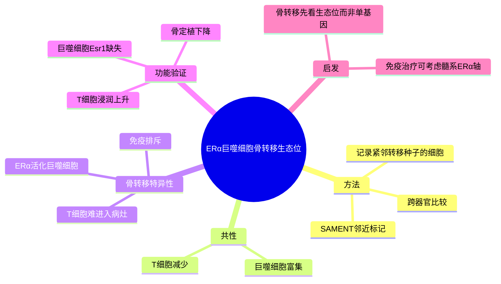

# ERα巨噬细胞骨转移生态位-2026

- 标题：Unbiased niche labeling maps immune-excluded niche in bone metastasis
- 发表时间：2026-04-28（online ahead of print）
- 期刊：Cell
- PubMed：[PMID: 42054994](https://pubmed.ncbi.nlm.nih.gov/42054994/)
- DOI：[10.1016/j.cell.2026.04.009](https://doi.org/10.1016/j.cell.2026.04.009)
- 研究类型：机制研究 + 方法学论文（转移生态位原位标记）

## 研究问题
转移灶早期“紧邻肿瘤细胞”的微环境细胞到底是谁；这些生态位细胞在不同器官是否共享共性，又是否存在器官特异的免疫排斥机制，尤其在骨转移中谁在阻止 T 细胞进入病灶。

## 摘要式结论
这篇文章最重要的贡献不是又描述了一次“骨转移免疫抑制”，而是用新方法把“谁真正贴着转移种子”这件事直接记录下来。作者开发 SAMENT（sortase A-based microenvironment niche tagging）对与转移癌细胞直接接触或紧邻的微环境细胞做无偏标记，发现跨器官转移生态位存在共同模式：巨噬细胞富集、T 细胞减少；但骨转移中最突出的器官特异特征是 ERα 活化的巨噬细胞。进一步删除巨噬细胞中的 `Esr1` 后，T 细胞浸润上升、骨定植受损，说明骨转移的免疫排斥不是泛化的“髓系高”而已，而是可以收敛到 `ERα+ macrophage -> T cell exclusion -> bone colonization` 这一条更可验证、也更可药理干预的轴。

## 文章行文逻辑
1. 先提出经典 bulk / 常规单细胞分析难以准确界定“转移种子周围第一圈细胞”。
2. 开发 SAMENT，对转移过程中与癌细胞相邻的微环境细胞做邻近标记。
3. 跨多个癌种模型与靶器官比较，提炼转移生态位的共性与器官差异。
4. 在骨转移里锁定 `ERα+` 巨噬细胞这一特殊亚群，并把它和 T 细胞排斥联系起来。
5. 通过巨噬细胞特异 `Esr1` 干预证明其对骨定植具有功能性，而不是旁观者现象。
6. 再回到人样本，确认 `ERα+` 巨噬细胞并非小鼠模型特产，而在多癌种人骨转移中可见。

## 主要创新点
- 不是从已有 marker 反推生态位，而是先做无偏邻近标记，再定义生态位。
- 把“转移生态位”从概念层推进到可操作的实验框架，尤其适合研究早期定植阶段。
- 提出骨转移中 `ERα+` 巨噬细胞这一器官特异免疫排斥节点，连接了内分泌信号、巨噬细胞状态和免疫冷微环境。

## 关键数据类型与是否可下载
- 邻近标记后的 scRNA-seq：可下载。文章页面明确给出 GEO accession：`GSE263383`、`GSE296725`。
- 处理后的单细胞对象与图像/分析资源：可下载。Zenodo 记录：[17314997](https://zenodo.org/records/17314997)。
- 人骨转移验证数据：有公开验证，但摘要层面未给出完整样本明细；正式复现前需要下载补充表逐项核对。

## 可借鉴的方法
### SAMENT 方法流程
1. 让转移癌细胞携带可用于邻近标记的 sortase A 系统。
2. 在体内转移过程中，对与癌细胞直接接触或极近邻的宿主细胞表面进行选择性标记。
3. 分选被标记的 niche cells，再做 scRNA-seq 或后续表型分析。
4. 在不同器官、不同模型间比较“第一圈生态位”的细胞组成与状态。

### 关键参数/实现层面的启发
- 核心不在于泛泛做单细胞，而在于先定义“采哪一圈细胞”。
- 方法更适合回答早期定植、免疫排斥、微环境接触依赖互作，而不是终末大体积病灶平均状态。
- 若迁移到用户课题，可把它视为“实验采样设计原则”：优先分离紧邻转移灶边界的细胞，而非整块组织平均。

### 适用场景
- 器官嗜性转移生态位解析。
- 研究肿瘤细胞与髓系/基质细胞的近距离互作。
- 想解释“为什么同样有髓系细胞，骨、脑、肺三处结局不同”的场景。

### 输入输出
- 输入：带邻近标记能力的肿瘤模型、目标器官转移样本、后续流式/单细胞测序体系。
- 输出：真正邻近 metastatic seed 的宿主细胞图谱、器官特异生态位程序、可功能验证的候选轴。

### 复现或迁移注意事项
- 这是实验门槛较高的方法，不是直接下载数据即可原样复现的纯计算流程。
- 公开数据可用于 signature 迁移，但“邻近关系”这一层信息在普通 GEO 队列里容易丢失。
- 若只做二次分析，建议把 `ERα+ macrophage`、T cell exclusion、fatty-acid / estrogen-response 程序作为可转移的最小单元，而不是机械复刻全部实验体系。

## 可借鉴的创新点
- 先定义微环境空间关系，再定义细胞状态。
- 把免疫排斥具体化为“哪一类髓系细胞在物理与功能上挡住了 T 细胞”。
- 将骨转移研究与内分泌信号重新接轨，这对 ER 阳性乳腺癌课题尤其有价值。

## 与用户课题的潜在关联
- 对乳腺癌骨转移，这是本轮最值得优先吸收的新文献之一，因为它同时覆盖了器官嗜性、免疫微环境和方法学创新。
- 若用户后续做脑/肺/骨跨器官比较，这篇文章提供了很好的框架：先问每个器官是否都存在“巨噬细胞富集 + T 细胞排斥”的共性，再问各器官是由什么特异亚群实现的。
- 若用户关注 ER 阳性亚型或脂代谢/激素信号，这篇文章把 `ERα` 从肿瘤细胞扩展到宿主巨噬细胞，值得专门验证。

## 局限性
- 文章强调的是邻近生态位，不等于整个骨转移病灶所有细胞状态。
- 机制目前最强的证据集中在骨转移；对脑、肺等器官是否存在同等强度的对应轴，还需外推验证。
- 公开摘要无法完整给出所有样本构成和批次信息，真正下载前仍需核对补充材料。

## 相关笔记
- [[脑转移TRM与TLS景观-2026]]
- [[棕榈酸-中性粒细胞-LCN2肺转移前生态位-2026]]
- [[感觉神经-CAF免疫排斥-2026]]
