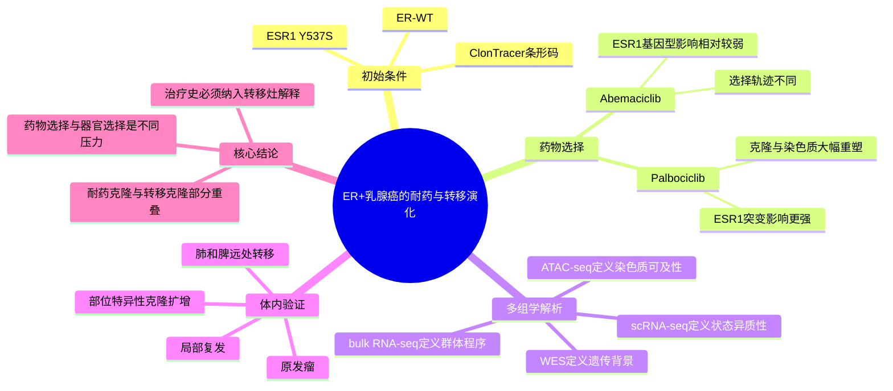

# ESR1 突变与 CDK4/6 抑制剂塑造耐药克隆演化（2026）

- **原标题**：ESR1 mutations and CDK4/6 inhibitor choice shape clonal selection and adaptive cell states during acquired resistance
- **发表时间**：2026-06-27（在线发表）
- **期刊**：Genome Medicine
- **PubMed**：[PMID: 42365380](https://pubmed.ncbi.nlm.nih.gov/42365380/)
- **DOI**：[10.1186/s13073-026-01690-2](https://doi.org/10.1186/s13073-026-01690-2)
- **研究类型**：临床样本验证 + 同基因背景细胞模型 + 高复杂度 DNA 条形码谱系追踪 + WES、bulk RNA-seq、ATAC-seq、scRNA-seq + 小鼠原位移植和远处转移追踪

## 研究问题

在 ER+ 乳腺癌获得性 CDK4/6 抑制剂耐药过程中，`ESR1 Y537S` 突变是否改变克隆选择和细胞状态？不同 CDK4/6 抑制剂——palbociclib 与 abemaciclib——是否施加相同的进化压力？耐药克隆与具有远处转移定植能力的克隆是否重叠？

## 摘要式结论

耐药并不是单一终末状态，而是药物、基因型和时间共同塑造的进化轨迹。`ESR1` 突变在临床 CDK4/6 抑制剂耐药肿瘤中富集，并可在配对活检中扩增至接近克隆性；在模型中，palbociclib 与 abemaciclib 选择出明显不同的克隆和转录状态。`ESR1 Y537S` 对 palbociclib 耐药的克隆和表观遗传演化影响更强，而对 abemaciclib 选择的影响较弱。体内条形码追踪进一步显示，远处转移呈部位特异性克隆扩增，转移克隆与药物耐受克隆只有部分重叠。因此，“耐药能力”与“转移定植能力”相关但不能互相替代。

## 文章行文逻辑

1. 从临床耐药样本出发，确认 `ESR1` 突变在 CDK4/6 抑制剂治疗后富集，并在部分配对样本中出现高癌细胞分数扩增。
2. 构建同基因背景 MCF7 模型：ER-WT 与诱导表达 `ESR1 Y537S`，通过 ClonTracer 高复杂度条形码标记初始细胞群。
3. 分别长期递增 palbociclib 或 abemaciclib，设置独立进化重复和同步 vehicle 对照，纵向观察条形码收缩与克隆扩增。
4. 用 WES、bulk RNA-seq 与 ATAC-seq拆分遗传变异、转录适应和染色质重塑；用 scRNA-seq 解析耐药群体内部的细胞状态可塑性。
5. 将条形码模型带入乳腺原位移植，比较早期原发瘤、局部复发、肺/脾远处转移与体外耐药群体的克隆构成。
6. 得出关键判断：抑制剂不能被视为同质药物，`ESR1` 状态也不仅是静态预测标志物；两者共同决定可被选择的克隆和适应状态。

## 主要创新点

- 把“基因型 × 具体 CDK4/6 抑制剂 × 时间”放入同一可追踪进化框架，而不是只比较耐药终点。
- 同时连接 DNA 条形码、遗传变异、染色质开放、群体转录和单细胞状态，能区分克隆选择与非遗传可塑性。
- 直接比较体外耐药克隆与体内远处转移克隆，证明二者只有部分重叠，避免把治疗耐药程序简单等同于转移器官嗜性程序。
- 补充材料显示 `ESR1 Y537S` 条件下 palbociclib 耐药伴随更广泛的差异开放染色质区域；不同药物富集的转录因子模体也不同，提示表观遗传绕行路径具有药物特异性。

## 关键数据类型与是否可下载

- **临床肿瘤/配对活检**：用于评估 `ESR1` 变异癌细胞分数和治疗后克隆扩增；患者特征公开于 Supplementary Table S1。
- **ClonTracer 条形码纵向数据**：3 个独立进化重复，覆盖 ER-WT/`ESR1 Y537S`、palbociclib/abemaciclib 及 vehicle 对照；处理后条形码表公开于 Supplementary Table S3。
- **WES、bulk RNA-seq、ATAC-seq、scRNA-seq**：论文和补充材料明确使用；处理后 RNA、WES 和注释 ATAC 结果分别在 Supplementary Tables S5-S7。
- **体内条形码数据**：原位瘤、局部复发、肺和脾远处转移的条形码比较可在 Supplementary Table S3 和补充图中复核。
- **当前开放程度**：出版社提供 8 个可直接下载的补充文件；截至 2026-06-29，PubMed 和出版社页面未显示 GEO/SRA/EGA 原始测序 accession。现阶段适合复用处理结果和方法设计，不应声称原始 FASTQ 已公开。

## 可借鉴的方法

- 用高复杂度 DNA 条形码和多个独立进化重复，区分预存耐药克隆扩增、随机漂移与可重复选择。
- 在多个时间点计算条形码分布的 Jensen-Shannon divergence，而不是只看耐药终点的优势克隆。
- 将 scRNA-seq 状态分析按细胞周期分层，减少增殖差异对通路解释的混淆。
- 联合 ATAC-seq 与 RNA-seq：先找差异开放区域及富集模体，再检验开放增强是否与邻近基因上调一致。
- 体外药物选择与体内器官定植使用同一条形码词典，可直接量化两个选择压力下克隆的重叠程度。

## 可借鉴的创新点

- 在用户课题中，可把 PT、不同器官 MT 以及治疗前后样本视为不同“生态选择器”，比较细胞状态相似并不等于克隆来源相同。
- 对 `ESR1`、`RB1`、`CCNE1/2`、`CDK2`、`YAP/TEAD`、`NF-κB/AP-1` 等模块，建议同时分析表达、染色质/调控活性和克隆背景，而非只做差异表达。
- 设计跨器官验证时，应加入治疗史和具体 CDK4/6 抑制剂作为分层变量；把所有 CDK4/6 抑制剂暴露合并可能掩盖真实演化差异。

## 与用户课题的潜在关联

- 用户的 PT/MT 及多器官转移比较可借用这篇文章的核心框架：**器官选择、药物选择和基因型选择是相互作用但不等价的压力**。
- 若脑、肺、骨或卵巢转移样本来自接受过 CDK4/6 抑制剂的 ER+ 患者，需要优先检查 `ESR1` 状态及具体用药；否则可能把治疗诱导状态误判为器官嗜性状态。
- 可建立两组 signature：一组描述 CDK4/6 耐药/细胞周期旁路，另一组描述器官定植；只有两组同时升高时才提出“耐药-转移双适应克隆”假设。
- 与现有单细胞转移数据联用时，可比较同一患者不同转移灶是否共享耐药状态，同时保留器官特异的基质和免疫适应。

## 局限性

- 主要机制实验基于 MCF7 同基因细胞系和免疫缺陷小鼠，不能完整模拟患者转移灶中的免疫与基质选择。
- `ESR1 Y537S` 不能代表全部 `ESR1` 热点变异，也不能外推至 TNBC/HER2+ 乳腺癌。
- 体内可分析的远处转移部位和动物数量有限，肺/脾的部位特异性结论仍需更大队列及人源样本验证。
- palbociclib 与 abemaciclib 的药理差异可能来自靶点谱、暴露或细胞毒性差异；本文证明轨迹不同，但不能单独给出临床换药顺序。
- 原始测序 accession 尚未公开，限制了从 FASTQ 层面对 scRNA、ATAC 与 WES 的独立复算。

## 相关笔记

- [[CDK4-6治疗免疫重塑转移ER+乳腺癌-2026]]
- [[Abemaciclib免疫重塑单细胞-2026]]
- [[ER+内分泌治疗-P-Rex1-Rac1转移逃逸-2026]]
- [[ESR1-CDK4-6耐药克隆追踪多组学-2026-06-29]]

