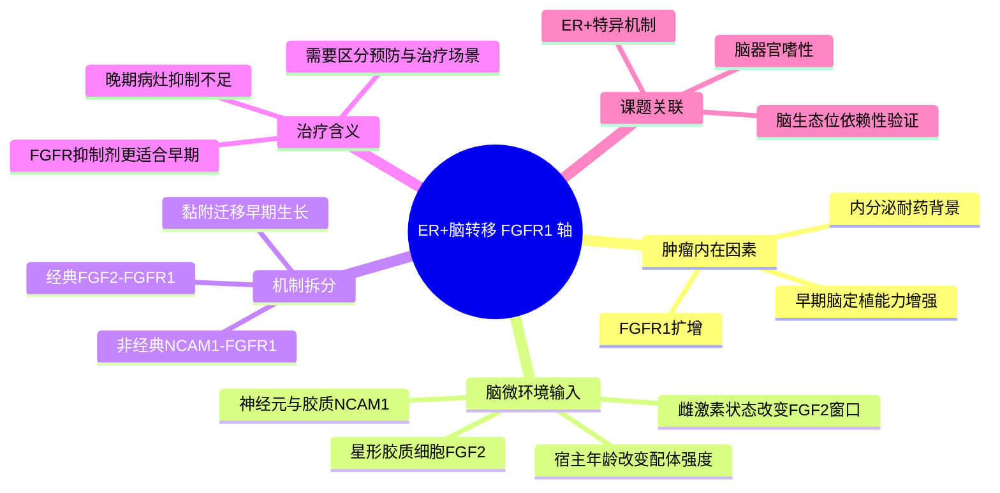

# FGF2-NCAM1-FGFR1脑转移-2026

## 基本信息

- 标题：Brain FGF2 and NCAM1 contribute to FGFR1-dependent progression of estrogen receptor-positive breast cancer brain metastases
- 发表时间：2026-05-28
- 期刊：Nature Communications
- PubMed：https://pubmed.ncbi.nlm.nih.gov/40666846/
- DOI：https://doi.org/10.1038/s41467-026-73726-5
- 研究类型：机制研究；ER+ 乳腺癌脑转移模型 + 人组织资源 + 药理干预

## 研究问题

ER+ 乳腺癌脑转移长期比 HER2+ 和 TNBC 脑转移研究不足。作者要回答的是：`FGFR1` 扩增为何会推动 ER+ 乳腺癌在脑内早期定植；这一过程更依赖肿瘤细胞内在 FGFR1，还是依赖脑微环境中的配体和黏附分子；宿主年龄和雌激素状态是否会改变这条轴的作用窗口。

## 摘要式结论

这篇文章的核心结论很清楚：ER+ 脑转移不是单靠肿瘤细胞自带的 `FGFR1` 扩增就能解释，而是依赖脑内两类宿主信号共同“点火”。年轻、雌激素存在的脑环境里，星形胶质细胞来源 `FGF2` 通过经典 `FGF2-FGFR1` 通路促进定植；无论年轻还是老年脑环境，神经/胶质来源 `NCAM1` 都可通过非经典 `NCAM1-FGFR1` 互作增强肿瘤细胞黏附、迁移和早期生长。药理学上，FDA 已批准的 FGFR 抑制剂能拦截“早期定植”，但对晚期脑转移控制有限，提示这条轴更像预防性或极早期干预窗口，而不是晚期统一解法。

## 文章行文逻辑

1. 从临床背景切入：ER+ 脑转移占比不低，但机制与治疗窗口不清。
2. 用年轻与老年宿主模型比较 `FGFR1` 扩增 ER+ 细胞的脑定植能力，证明年龄不是简单背景变量。
3. 把经典配体轴和非经典黏附轴拆开：星形胶质细胞 `FGF2` 负责配体驱动，神经/胶质 `NCAM1` 负责黏附和迁移促进。
4. 再引入雌激素状态，说明年轻脑环境中的 `FGF2` 依赖性更强，而老年/去雌激素脑环境中这部分信号下降。
5. 最后做药物验证，说明 FGFR 抑制更适用于“脑转移早期阻断”，而不是既成病灶晚期逆转。

## 思维导图

## 主要创新点

- 把 ER+ 脑转移从“FGFR1 是个耐药基因”推进到“FGFR1 也是脑定植整合器”的层面。
- 同时给出经典配体依赖和非经典黏附依赖两条支路，而不是只停留在单一路径。
- 直接把宿主年龄和雌激素状态纳入脑转移机制框架，对绝经前后、内分泌环境差异很有启发。
- 药理结果强调时间窗口，避免把 FGFR 抑制剂简单包装成所有阶段都有效的脑转移疗法。

## 关键数据类型与是否可下载

- 体内脑转移定植与药物干预数据：论文正文、补充数据和 source data 可获取。
- 人组织资源与组织层面验证：文章致谢中提到脑肿瘤生物样本库支持，但页面未直接给出可复用原始测序 accession。
- 补充材料：Nature 页面可直接下载 `Supplementary Dataset 1-5` 和 `Source Data`。
- 当前可见限制：本轮未确认到 GEO/SRA 级别的原始转录组 accession，因此更适合先复用其机制链和补充表，而不是直接作为大规模公开测序重分析入口。

## 可借鉴的方法

- 年轻/老年宿主并行设计：适合迁移到“器官生态位是否受年龄影响”的转移课题。
- 把配体驱动和黏附驱动拆开验证，而不是把所有微环境作用都归入单一生长因子通路。
- 用“早期定植”和“晚期病灶”区分药物作用阶段，这一点很适合转移研究设计。
- 若用户后续分析公开脑转移队列，可优先构建 `FGFR1 amplification / FGF2 response / NCAM1 adhesion` 三个模块分开检验。

## 可借鉴的创新点

- 不把脑微环境视作单纯抑制或促进背景，而是拆成不同宿主细胞来源的可操作信号。
- 把年龄和激素状态前移到机制层，而不是只作为临床分层协变量。
- 强调“预防性阻断窗口”这一转化思路，适合高脑转移风险亚群的前瞻设计。

## 与用户课题的潜在关联

- 若课题比较脑/肺/骨/卵巢器官嗜性，可把这篇文章作为“脑环境特异输入”范式，与肺转移中的血管-中性粒细胞轴、骨转移中的骨细胞/巨噬细胞轴对照。
- 对 ER+ 转移方向尤其有价值，因为近期已有多篇脑转移笔记偏重 TNBC 或混合亚型，这篇补上了 ER+ 特异生态位逻辑。
- 若用户后续做脑转移公开数据验证，可先检查 `FGFR1` 扩增或高表达肿瘤细胞是否邻近 `NCAM1` 高表达神经/胶质区，再看 `FGF2` 相关信号是否受患者年龄或绝经状态影响。

## 局限性

- 以模型和机制验证为主，临床患者级公开多组学入口仍不够明确。
- FGFR 抑制剂主要对早期定植有效，不能直接外推为已建立脑转移病灶的普遍治疗策略。
- 文章聚焦 ER+ 脑转移，不能直接推到 TNBC/HER2+。
- 本轮仅确认了补充数据和 source data 页面，未确认稳定原始测序 accession。

## 选择理由

这是本轮检到的最新一批高质量相关文章里最值得落笔的一篇：`2026-05-28` 刚上线，期刊层级高，问题聚焦用户课题中的脑转移器官嗜性与微环境适应，而且明确补足了既有笔记中较少覆盖的 `ER+` 脑转移方向。

## 相关笔记

- [[脑转移免疫生态分型]]
- [[脑转移TAM-MTC单细胞图谱-2026]]
- [[乳腺癌脑转移单细胞与脑生态位数据-2026-05-30]]
- [[乳腺癌免疫学综述-2026]]
