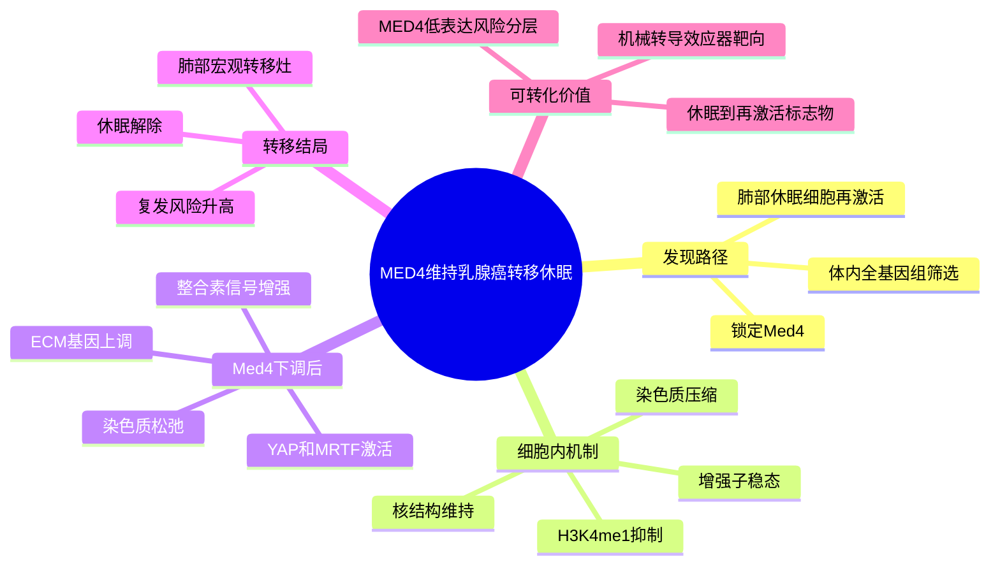

# MED4维持转移休眠-2026

- 标题：Mediator subunit MED4 enforces metastatic dormancy in breast cancer
- 发表时间：2026-06-22
- 期刊：Nature Cell Biology
- PubMed/DOI 链接：
  - PubMed：https://pubmed.ncbi.nlm.nih.gov/42332201/
  - DOI：https://doi.org/10.1038/s41556-026-01984-y
- 研究类型：新近机制研究；小鼠乳腺癌肺转移休眠/再激活模型 + 全基因组体内筛选 + RNA-seq/ATAC-seq/组蛋白 ChIP-seq + 临床队列关联分析

## 选择理由
这是本轮检索中最值得优先写入的最新高质量文献。文章 2026-06-22 在线发表，主题直接落在乳腺癌转移休眠与再激活，且已有 GEO 数据入口可核实。相较继续补经典研究，它更适合当前课题中“播散细胞如何在远端器官保持休眠，又如何转入宏观转移灶”的机制主线。

## 研究问题
乳腺癌患者远处复发常来自长期潜伏的播散肿瘤细胞。文章追问：哪些肿瘤细胞内在因子维持转移休眠？这些因子如何把染色质状态、增强子活性、ECM/整合素信号和力学转导连接到肺部转移再激活？

## 摘要式结论
作者通过小鼠体内遗传筛选识别出 Mediator 复合体亚基 `MED4/Med4` 是一个肿瘤细胞内在的转移休眠守门因子。`Med4` 下调会使休眠乳腺癌细胞从静默状态转向肺部宏观转移生长。机制上，`Med4` 缺失并不是简单地削弱转录，而是改变核大小和三维染色质压缩状态，重塑增强子景观，促进 ECM、整合素和信号分子表达，进一步激活 YAP/MRTF 相关机械转导。临床层面，转移性乳腺癌患者可见 `MED4` 基因缺失或低表达，并与更差预后相关。

## 文章行文逻辑
1. 从乳腺癌长期远处复发问题切入，把研究对象聚焦到休眠播散细胞的再激活开关。
2. 通过体内全基因组筛选寻找可解除休眠、促进转移 outgrowth 的肿瘤细胞内在因子，锁定 `Med4`。
3. 用乳腺癌肺转移模型验证：`Med4` 下调可唤醒休眠细胞并推动宏观转移灶形成。
4. 进一步用转录组、ATAC-seq 和组蛋白 ChIP-seq 解释 `Med4` 如何维持染色质压缩和增强子稳态。
5. 最后把表观状态变化连接到 ECM/整合素机械转导、YAP/MRTF 激活和临床复发风险。

## 主要创新点
- 把 Mediator 复合体亚基 `MED4` 从“常规转录调控组分”推进到“转移休眠守门因子”的角色。
- 提出 `MED4` 通过维持染色质压缩和增强子稳态限制转移再激活，而不是单纯作为转录激活因子发挥作用。
- 将休眠解除与 ECM/整合素/YAP-MRTF 机械转导串成一条机制链，适合与现有肺转移微环境、休眠和免疫逃逸笔记联动。
- 提供 `MED4` 缺失/低表达作为复发高风险分层标志物的思路。

## 关键数据类型与是否可下载
- 可下载数据已在 GEO 核实：
  - `GSE255278`：SuperSeries，包含 mouse `Med4` 扰动相关 RNA-seq、ATAC-seq 子系列，共 27 个样本；BioProject `PRJNA1074333`。
  - `GSE275130`：mouse `shMed4` 组蛋白 ChIP-seq，36 个样本，覆盖 `H3K4me1`、`H3K4me3`、`H3K9me3`、`H3K27Ac`、`H3K79me2` 和 input；BioProject `PRJNA1149660`。
- 这些数据属于鼠源模型表观组/转录组，不是人源单细胞或空间组学；适合机制验证和 signature 构建，不适合直接当作患者组织队列使用。

## 可借鉴的方法
- 用体内遗传筛选直接找“休眠解除”因子，而不是只比较终末大转移灶。
- 对候选因子做多层验证：转移表型、RNA 表达、染色质可及性、组蛋白修饰、核形态和力学转导一起闭环。
- 在公共数据分析中可把 `MED4-low`、ECM/整合素模块、YAP/MRTF 活性和增殖/休眠状态分开建模，再回投到不同器官转移数据。

## 可借鉴的创新点
- 对用户课题中的器官嗜性转移，可以增加一层“休眠维持能力”维度：同一个肿瘤细胞程序是否在脑、肺、骨、卵巢中以不同速度进入再激活？
- 与现有 `WNT-low/DKK1-high`、`GR-FAS`、血管周围生态位和肺前转移生态位笔记合并后，可形成“休眠维持 -> 免疫/力学压力 -> 转移再激活”的阶段性框架。
- 对 CellChat/NicheNet 类分析，不能只看配体-受体强弱；还应引入肿瘤细胞内在表观状态和机械转导活性作为解释变量。

## 与用户课题的潜在关联
- 对乳腺癌肺转移最直接：文章模型和结论都围绕休眠乳腺癌细胞在肺部再激活。
- 对脑转移、骨转移、卵巢转移也有迁移价值：可测试不同器官转移灶中 `MED4` 低表达、ECM/整合素模块和 YAP/MRTF 活性是否具有器官特异性。
- 对 Figure 解释和机制叙述有帮助：如果某些细胞互作只在转移灶增强，可进一步追问它们是促进定植、休眠解除，还是宏观 outgrowth 后的继发结果。

## 局限性
- 关键可下载组学数据以鼠源模型为主，不能直接替代人源远处转移单细胞或空间队列。
- `MED4` 完全缺失和部分降低可能产生不同生物学后果，临床解释时应区分 deletion、haploinsufficiency 和低表达。
- 文章核心是肺部转移休眠/再激活；外推到脑、骨、卵巢前需要在器官特异数据中重新验证。

## 相关笔记
- [[WNT自分泌抑制转移休眠-2016]]
- [[血管周围生态位调控转移休眠-2013]]
- [[前转移生态位发现代表性研究-2005]]
- [[乳腺癌肺转移休眠免疫微环境GSE261385-2026-06-19]]
- [[乳腺癌MED4休眠表观转录组GSE255278-GSE275130-2026-06-26]]
