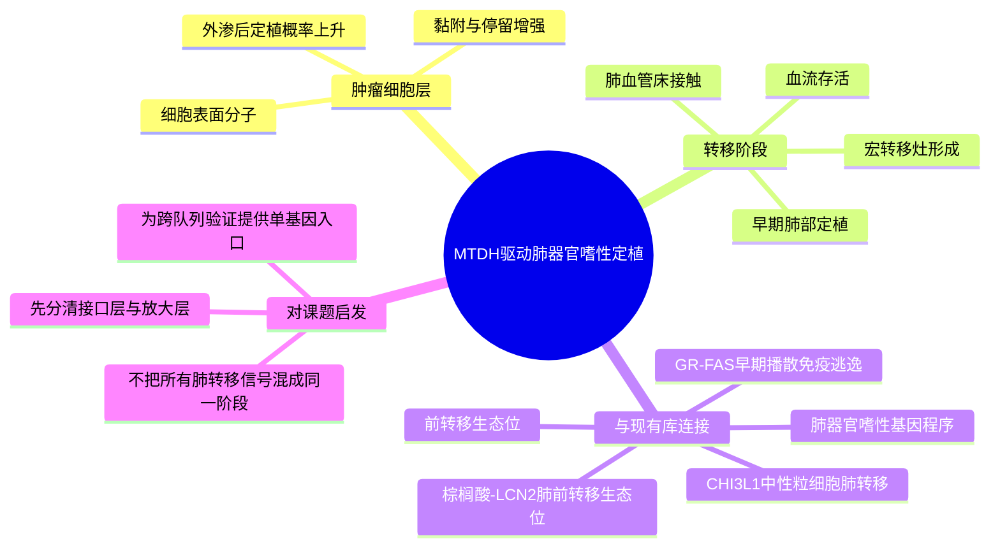

# MTDH介导肺器官嗜性定植-2004

- 标题：Metadherin, a cell surface protein in breast tumors that mediates lung metastasis
- 发表时间：2004-04
- 期刊：Cancer Cell
- PubMed/DOI 链接：
  - PubMed 检索：https://pubmed.ncbi.nlm.nih.gov/?term=Metadherin%2C+a+cell+surface+protein+in+breast+tumors+that+mediates+lung+metastasis
  - Cancer Cell 检索：https://www.cell.com/search?searchText=Metadherin%2C%20a%20cell%20surface%20protein%20in%20breast%20tumors%20that%20mediates%20lung%20metastasis
- 研究类型：代表性机制原始研究；乳腺癌肺器官嗜性筛选 + 功能回补 + 临床相关性验证

## 选择理由
截至 2026-06-25，我重新检查了 2026-06-23 之后可稳定检索到的最新窗口，没有发现一篇明显强于近期已入库条目的新乳腺癌远处转移原始研究。继续硬追“最新”只会重复已有 2026 主题，因此这次按 fallback 规则补 active vault 中仍缺失、但对当前课题复用价值很高的一层：**肿瘤细胞表面分子如何把“肺偏好播散”转成真正的肺部黏附、外渗与定植优势**。这篇工作正好位于现有“肺器官嗜性基因程序”“肺前转移生态位”“肺免疫抑制放大”几层之间。

## 研究问题
乳腺癌细胞为什么会对肺转移表现出稳定偏好？这种偏好仅仅来自全局侵袭性增强，还是存在更直接的“肿瘤细胞表面接口”帮助其与肺微环境发生选择性黏附和定植？

## 摘要式结论
本文将 `MTDH/AEG-1` 提升为乳腺癌肺转移中的关键细胞表面分子。作者的核心逻辑不是“MTDH 高所以更恶”，而是指出：`MTDH` 参与了一个更具体的步骤，即**让可播散肿瘤细胞更容易与肺血管床/肺实质发生有效接触并完成定植**。因此，肺器官嗜性并不只是一套转录程序，也可以落实为可干预的细胞表面接口。对当前课题最有价值的启发是：很多后续看到的肺转移免疫或中性粒细胞信号，可能发生在 `MTDH` 所代表的“先黏住、先留下来”之后。

## 文章行文逻辑
1. 先从与肺转移相关的功能筛选切入，寻找能增强乳腺癌细胞肺转移能力的候选分子。
2. 再把候选基因收敛到 `MTDH`，并证明其表达与肺转移倾向而非单纯增殖优势更相关。
3. 接着通过 gain/loss-of-function 验证，测试 `MTDH` 是否真的改变肺部定植与转移负荷。
4. 最后将实验结果与患者样本表达联系起来，把“功能分子”上推到“临床可解释的肺转移接口”。

## 主要创新点
- 把肺器官嗜性从“抽象偏好”压缩到更具体的细胞表面分子层。
- 提供了一个可串联后续肺微环境研究的阶段性接口：`黏附/停留 -> 定植 -> 生态位放大`。
- 为后来的“肺转移不是泛侵袭，而是器官特异界面匹配”提供了早期原始证据。

## 关键数据类型与是否可下载
- 核心证据来自功能筛选、体内肺转移模型、分子干预和患者样本表达关联。
- 本文本身更适合作为机制骨架，而不是直接依赖其公共原始数据做二次分析。
- 当前 active vault 中更现实的验证入口仍是公开队列，如 `GSE46141`、`GSE110590` 以及已有肺转移单细胞/免疫微环境资源。

## 可借鉴的方法
- 不把“肺转移增强”直接等同于增殖增强，而是把验证终点拆成更贴近阶段的问题：黏附、早期定植、后续外生长。
- 先从具有方向性的候选分子入手，再回到患者样本看其临床分布，适合当前课题做“机制-队列”双层验证。
- 后续做公开数据验证时，可优先测试 `MTDH` 与肺位点相关 ECM、应激和免疫抑制程序是否同向出现，而不是只比较单基因高低。

## 可借鉴的创新点
- 文章强调“器官嗜性可以体现为细胞表面接口”，这对整理脑/肺/骨/卵巢不同器官位点的阶段差异很有帮助。
- 它适合与现有肺转移免疫笔记组成因果顺序：`接口建立` 在前，`免疫塑形和中性粒细胞放大` 在后。
- 对 CellChat / NicheNet 类分析也有提醒价值：如果只盯配体-受体，可能会漏掉这类更接近物理界面的早期决定因素。

## 与用户课题的潜在关联
- 这篇文章为当前库中的肺转移线索补上了“最早定植接口”层，能把 `GR-FAS`、`CHI3L1`、`LCN2`、`TREM2` 等后续生态位或免疫事件接回到更上游的肺器官嗜性问题。
- 若后续要做跨器官比较，`MTDH` 是一个很好的起点：先在 `GSE110590` 的肺、脑、骨、卵巢样本中看其方向性，再结合肺特异笔记判断它更像普遍转移程序还是肺偏好接口。
- 对卵巢等公开单细胞仍稀缺的位点，也可把它当作“对照接口层”，帮助区分哪些是器官共性，哪些是肺特异。

## 局限性
- 这是 2004 年的代表性研究，不是最新论文；本次纳入是因为 2026-06-23 到 2026-06-25 的最新窗口没有出现更强新条目。
- 文章更强于提出早期肺定植接口，不足以单独解释后期肺转移灶内复杂免疫生态。
- 若直接拿公开 bulk 队列做验证，能支持的是方向性和阶段性判断，不能替代真正的时空或单细胞机制解析。

## 相关笔记
- [[肺器官嗜性基因程序代表性研究-2005]]
- [[棕榈酸中性粒细胞肺转移-2026]]
- [[CHI3L1中性粒细胞肺转移-2026]]
- [[糖皮质激素-FAS转移播散免疫逃逸-2026]]
- [[乳腺癌肺转移TREM2巨噬细胞单细胞-2026-05-31]]
- [[乳腺癌肺转移休眠免疫微环境GSE261385-2026-06-19]]
