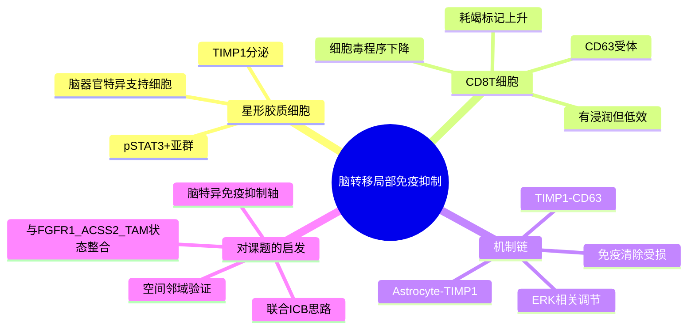

# TIMP1星形胶质细胞脑转移免疫抑制-2025

## 标题
TIMP1 Mediates Astrocyte-Dependent Local Immunosuppression in Brain Metastasis Acting on Infiltrating CD8+ T Cells

## 发表时间
2025-01-13

## 期刊
Cancer Discovery

## PubMed / DOI
- PubMed: https://pubmed.ncbi.nlm.nih.gov/39354883/
- DOI: https://doi.org/10.1158/2159-8290.CD-24-0134
- 期刊页面: https://aacrjournals.org/cancerdiscovery/article/15/1/179/750859

## 研究类型
机制研究；脑转移免疫微环境；以星形胶质细胞-CD8 T 细胞互作为核心的跨模型研究，含小鼠模型与人脑转移样本验证

## 本次选择理由
本轮继续检索了 2026-06-06 到 2026-06-08 可见的新近 PubMed 命中，没有发现一篇同时满足“与乳腺癌远处转移高度相关、机制增量明显强于最近已记 2026 条目、且公开资源线索清晰”的更强新文。相比补一篇信号偏弱的新文，这篇 `Cancer Discovery 2025` 原始研究更值得补位：它把脑转移免疫抑制从“泛脑生态位”进一步收敛到可操作的 `pSTAT3+ astrocyte -> TIMP1 -> CD63+ CD8 T cell` 轴，既能和已有脑转移笔记衔接，也能直接指导后续对脑转移 T 细胞耗竭、免疫分型和 ICB 联合策略的验证。

## 研究问题
脑转移灶中，哪些局部脑常驻细胞在决定 CD8 T 细胞是否真的具备抗肿瘤活性？为何一部分脑转移即便存在 T 细胞浸润，仍然难以从免疫治疗中获益？

## 摘要式结论
- 不是所有“有 T 细胞”的脑转移都处于真正可清除状态，脑内局部星形胶质细胞可主动塑造免疫抑制位点。
- 作者鉴定出一群与转移相关的 `pSTAT3+` 星形胶质细胞，其分泌的 `TIMP1` 作用于 `CD63+ CD8 T` 细胞，削弱细胞毒程序并上调耗竭相关特征。
- 这一轴线不是单纯伴随现象；遗传学和药理学干预提示，抑制该局部免疫抑制可增强脑转移中的免疫控制。
- 对临床转化最有价值的一点是：它提示“脑转移免疫治疗失败”未必只因 T 细胞缺失，也可能因脑特异支持细胞把已进入病灶的 T 细胞变成低效状态。

## 文章行文逻辑
1. 先提出临床矛盾：脑转移患者对免疫治疗反应高度异质，尤其有症状病灶获益有限。
2. 用单细胞和组织层面的分析拆分脑转移相关星形胶质细胞异质性，寻找可能的免疫调节群体。
3. 从候选分子中锁定 `STAT3` 依赖的 `TIMP1`，并把它与 `CD8 T` 细胞表面的 `CD63` 联系起来。
4. 结合体外功能实验、小鼠脑转移模型和人脑转移样本，证明这条轴线会压低 CD8 T 细胞效应功能。
5. 最后把结论推进到治疗层面：局部免疫抑制解除与 ICB 联合，可能比单独放大系统性免疫更接近脑转移真实场景。

## 主要创新点
- 把脑转移免疫抑制的关键执行者从泛化“脑微环境”具体化为可分层的星形胶质细胞亚群。
- 给出一条相对闭环的脑局部抑制通路：`pSTAT3+ astrocyte -> TIMP1 -> CD63+ CD8 T cell -> ERK/效应程序下降 -> 脑转移免疫逃逸`。
- 强调脑转移中“有浸润但无效”的 CD8 T 细胞状态，适合与后续单细胞/空间数据中的耗竭、邻域和血管周定位分析对接。
- 对 ICB 联合策略提供了脑特异微环境切入点，而不是简单复用体外周围实体瘤逻辑。

## 关键数据类型与是否可下载
- 文章主体包含单细胞层面的脑转移相关细胞状态解析、组织多重成像和功能验证。
- 从公开可见摘要与页面可确认：研究使用了人脑转移样本以及小鼠脑转移模型。
- 目前本次检索未确认到该论文主页上清晰挂出的、可直接一键下载的完整原始单细胞 accession；更适合作为机制锚点文献使用。
- 若后续要追原始数据，优先回看补充材料、AACR 页面附录和作者资源页，而不是先假定已有 GEO/SRA。

## 可借鉴的方法
- 先用单细胞拆星形胶质细胞状态，再用配体-受体和功能实验把候选抑制轴锁死，这种“状态发现 -> 轴线收敛 -> 功能验证”的路径很适合迁移到乳腺癌脑转移课题。
- 适合复用的分析框架不是只看 T 细胞比例，而是同时看：
  - 星形胶质细胞状态
  - `TIMP1/CD63` 轴表达
  - CD8 细胞毒与耗竭平衡
  - 病灶空间邻近关系
- 如果后续做公开数据验证，可把 `TIMP1-high astrocyte`、`CD63-high CD8`、`CXCL13/CD39` 型潜在肿瘤反应 T 细胞作为三个并行模块，而不是只做单基因相关。

## 可借鉴的创新点
- 把“脑转移免疫抑制”从免疫细胞内部程序，扩展到脑常驻支持细胞对免疫细胞的再编程。
- 可围绕“局部抑制解除是否比系统性激活更关键”来组织用户后续脑转移假设。
- 对空间组学尤其友好，因为它天然要求看星形胶质细胞、血管和 CD8 T 细胞的邻域结构。

## 与用户课题的潜在关联
- 与已有脑转移笔记中的 `FGF2-NCAM1-FGFR1`、`ACSS2`、`TAM/MTC` 线索互补：前者偏脑定植和代谢适应，这篇偏脑内免疫失活。
- 若用户后续比较脑、肺、骨、卵巢转移的免疫生态位，这篇可作为“脑器官特异免疫抑制模板”，帮助判断哪些轴线是脑特有，哪些是跨器官共性。
- 对公开数据验证可形成两个具体问题：
  - 脑转移样本中是否存在 `TIMP1-high astrocyte` 与低细胞毒 CD8 状态共现？
  - 这条轴线是否主要出现在免疫浸润相对较高但疗效不佳的脑转移亚群？

## 局限性
- 不是乳腺癌专属研究，脑转移患者样本包含多种原发癌；乳腺癌结论需要在乳腺癌子集里谨慎落地。
- 人样本量从公开摘要可见并不大，乳腺癌脑转移只是其中一部分，更适合做方向性机制支持，不宜直接做强统计泛化。
- 本轮未确认稳定开放的原始组学 accession，因此短期内更像“机制母文献”而不是“现成下载入口”。

## 思维导图

## 相关笔记
- [[FGF2-NCAM1-FGFR1脑转移-2026]]
- [[脑转移TAM-MTC单细胞图谱-2026]]
- [[脑转移免疫生态分型-2026]]
- [[乳腺癌脑转移单细胞与脑生态位数据-2026-05-30]]
- [[脑转移多组学空间图谱-2026-06-06]]
