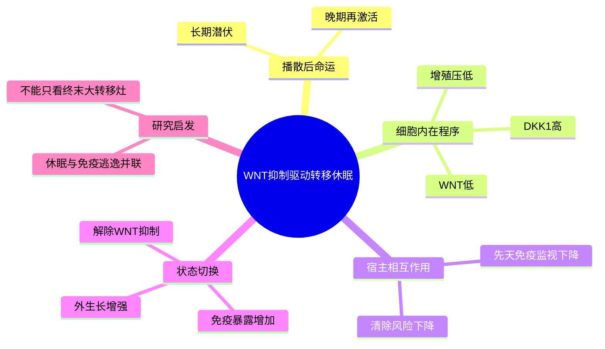

# WNT自分泌抑制转移休眠-2016

- 标题：Metastatic Latency and Immune Evasion through Autocrine Inhibition of WNT
- 发表时间：2016-03-24
- 期刊：Cell
- PubMed/DOI 链接：
  - PubMed 检索：https://pubmed.ncbi.nlm.nih.gov/?term=Metastatic+Latency+and+Immune+Evasion+through+Autocrine+Inhibition+of+WNT
  - Cell 检索：https://www.cell.com/search?searchText=Metastatic%20Latency%20and%20Immune%20Evasion%20through%20Autocrine%20Inhibition%20of%20WNT
- 研究类型：代表性机制原始研究；乳腺癌播散细胞休眠模型 + 转录组/功能扰动 + 免疫清除验证

## 选择理由
截至 2026-06-23，我重新检查了 `2026-06-21` 之后的检索窗口，没有看到一篇明显强于近几日已入库条目的新乳腺癌远处转移原始研究。继续硬追“最新”只会得到边际很小的新内容，因此这次按 fallback 规则补一篇当前主动 vault 里仍缺失、但复用价值很高的代表性原始研究。它补上的不是一般性的“转移会休眠”常识，而是一个非常可迁移的骨架：**播散细胞如何通过自分泌抑制 WNT，在保持低增殖的同时降低被先天免疫系统清除的风险。**

## 研究问题
远处播散后的乳腺癌细胞为什么能在多年内保持潜伏而不被清除？这种“休眠”仅仅是低增殖状态，还是同时伴随一套主动的免疫逃逸程序？其中 `WNT-low / DKK1-high` 轴是否构成可操纵的关键开关？

## 摘要式结论
这篇文章的核心贡献，是把“转移休眠”从单纯的细胞周期慢状态，推进为**休眠状态与免疫逃逸状态耦合**的机制模型。作者指出，潜伏播散细胞通过自分泌方式抑制 `WNT` 信号，维持低增殖、低可见度的状态；其中 `DKK1` 是关键节点。`DKK1` 高的潜伏细胞更能逃避免疫清除，尤其是先天免疫监视；而当 `WNT` 被重新释放、细胞进入扩增时，虽然更容易形成转移灶，但也更暴露于免疫系统。对当前课题最有价值的不是某一个 marker，而是这条逻辑：**休眠不是“静止等待”，而是一种带有宿主适应含义的生存策略。**

## 文章行文逻辑
1. 先从体内播散后长期不成灶的乳腺癌细胞群入手，界定“latent metastasis-initiating cells”。
2. 再比较潜伏细胞与更易外生长细胞的转录状态，提出 `WNT-low / DKK1-high` 作为关键差异轴。
3. 接着通过功能操纵验证：改变 `DKK1` / `WNT` 状态会改变细胞休眠和后续转移成灶能力。
4. 最后把细胞内在状态与宿主免疫连接起来，说明潜伏状态并非单纯减速，而是同时减少被先天免疫识别和清除的机会。

## 主要创新点
- 把转移休眠与免疫逃逸放到同一个因果框架里，而不是分成“低增殖”和“免疫”两套互不相干的解释。
- 提出潜伏播散细胞并非被动残存，而是存在主动维持的 `WNT-low` 生存程序。
- 将 `DKK1` 这样的可测分子节点嵌入“休眠维持 -> 再激活风险 -> 免疫可见度变化”的连续模型。

## 关键数据类型与是否可下载
- 核心证据来自体内播散/休眠模型、分选后的表达谱和功能干预实验。
- 与本文关联、可直接复用的公开表达资源是 `GSE43566`，包含残留病灶、肺播散细胞和肺转移灶的分阶段表达数据。
- 这篇文章本身更适合作为机制框架与实验设计模板，而不是单靠其公开数据完成全部验证。

## 可借鉴的方法
- 不把“有没有转移灶”当作唯一终点，而是显式拆成“残留病灶 -> 肺 DTC -> 宏转移灶”三个阶段。
- 先定义潜伏状态，再追问其免疫含义；而不是只在终末肿瘤里比较免疫抑制强弱。
- 后续若做单细胞或 bulk 验证，可先围绕 `WNT`、`DKK1`、增殖压低和先天免疫暴露度构建小而稳的模块，再做跨器官回投。

## 可借鉴的创新点
- 对肺转移，可以把这篇文章与现有 `GR-FAS`、`CHI3L1`、`LCN2`、`GSE261385` 串成“早期播散存活/休眠维持/再激活”的连续链条。
- 对脑、骨、卵巢转移，可借它提出一个更严格的问题：不同器官的休眠是否共享 `WNT-low` 逻辑，还是存在器官特异的休眠维持轴。
- 如果后续做 CellChat/NicheNet，需要提前承认：休眠阶段很多关键信号可能首先体现为状态切换与免疫可见度变化，而不一定表现为强烈的经典配体-受体差异。

## 与用户课题的潜在关联
- 这篇文章非常适合给当前库中的“器官嗜性 -> 前转移生态位 -> 早期播散 -> 宏转移灶扩增”主线补上中间缺失的“潜伏窗口”。
- 对肺转移尤其直接，因为现有主动库里已有多条肺微环境和免疫逃逸笔记，但缺一篇足够经典、能把“休眠”和“先天免疫”绑定起来的原始研究。
- 对卵巢转移这类公开单细胞仍稀缺的方向，它也提供了一个很实用的思路：先用低门槛 bulk/阶段队列验证休眠样模块，再决定是否值得深挖器官特异机制。

## 局限性
- 这是高价值代表作，但并非近期新文；本次纳入是因为最新窗口缺少更强新条目。
- 研究强调的是潜伏播散细胞与先天免疫的关系，不能直接外推到所有器官、所有分型和所有再激活路径。
- 公开数据层以模型和 bulk 为主，更适合做阶段性方向验证，不足以单独支撑复杂细胞生态解释。

## 相关笔记
- [[转移休眠与再激活综述-2013]]
- [[乳腺癌休眠模型综述-2021]]
- [[前转移生态位发现代表性研究-2005]]
- [[糖皮质激素-FAS转移播散免疫逃逸-2026]]
- [[乳腺癌肺转移休眠免疫微环境GSE261385-2026-06-19]]
- [[乳腺癌残留病灶与肺DTC表达队列GSE43566-2026-06-23]]
