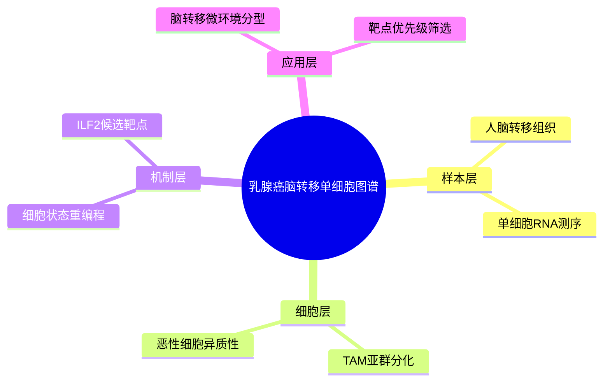

# 乳腺癌脑转移单细胞图谱

- 发表时间：2026-04-25
- 期刊：Acta Neuropathologica Communications
- PubMed：[PMID: 42034645](https://pubmed.ncbi.nlm.nih.gov/42034645/)
- DOI：[10.1186/s40478-026-02054-z](https://doi.org/10.1186/s40478-026-02054-z)
- 研究类型：人脑转移样本单细胞转录组分析 + 机制靶点提名

## 研究问题
乳腺癌脑转移灶内，肿瘤细胞与肿瘤相关巨噬细胞是否存在可重复识别的亚群结构，这些结构能否指向新的治疗靶点。

## 摘要式结论
作者对乳腺癌脑转移样本进行了单细胞 RNA 测序，分离出多个肿瘤细胞和巨噬细胞亚群。核心信息不是“脑转移组织里有免疫细胞”这种常识，而是指出脑转移灶内部存在相对稳定的 TAM 状态和恶性细胞程序，并将 ILF2 提名为潜在治疗靶点。对课题最直接的价值在于：它提供了脑转移场景下“肿瘤细胞程序 + 免疫髓系程序”联合分析的实际模板。

## 文章行文逻辑
1. 先说明乳腺癌脑转移预后差，治疗依赖有限。
2. 用 scRNA-seq 拆解脑转移病灶的细胞组成。
3. 聚焦 TAM 与恶性细胞亚群，比较其转录状态。
4. 从差异基因与网络分析中上提候选驱动因子。
5. 将 ILF2 作为后续功能验证切入点。

## 主要创新点
- 直接在乳腺癌脑转移人样本中解析 TAM 与肿瘤细胞共存结构，而不是沿用原发灶结论。
- 把描述性单细胞图谱推进到候选靶点提名。
- 为脑转移研究提供了较贴题的细胞状态参考框架。

## 关键数据类型与是否可下载
- 单细胞转录组：可下载，文中对应 GEO 线索为 [GSE213066](https://www.ncbi.nlm.nih.gov/geo/query/acc.cgi?acc=GSE213066)。
- 临床注释：通常为去标识化的基础信息，可随 GEO 补充材料获得，粒度有限。
- 原始 fastq：需看 SRA 是否同步开放；若未同步，通常先能拿到矩阵级数据。

## 可借鉴的方法
- 脑转移样本优先做髓系细胞和恶性细胞双主线分析，而非平均化处理全部细胞群。
- 可复用的分析流程：质控 -> 聚类注释 -> 恶性细胞推断 -> TAM 亚群拆分 -> 差异基因/通路分析 -> 候选靶点上提。
- 若用户后续做跨队列验证，可将本文 TAM 标记基因集迁移到其他脑转移 scRNA 或 bulk 去打分。

## 可借鉴的创新点
- 用脑转移病灶而非原发灶定义免疫状态。
- 把“图谱文章”做成“图谱 + 靶点提名”的两段式结构，利于后续实验承接。

## 与用户课题的潜在关联
- 若课题关注乳腺癌脑转移微环境，这篇文章可直接提供 TAM 分型起点。
- 若课题想做器官嗜性比较，可把其脑转移肿瘤细胞程序与肺/骨转移队列对照。
- 若课题准备构建“脑转移风险程序”或“免疫抑制模块”，本文适合作为训练或外部验证参考。

## 局限性
- 单细胞图谱类研究常见问题是样本量有限，患者间差异可能被技术批次放大。
- 如果功能验证主要集中在 ILF2，其他亚群发现的证据链会相对偏弱。
- TAM 注释高度依赖分析参数和参考标记，跨队列复现时要重新校准。
