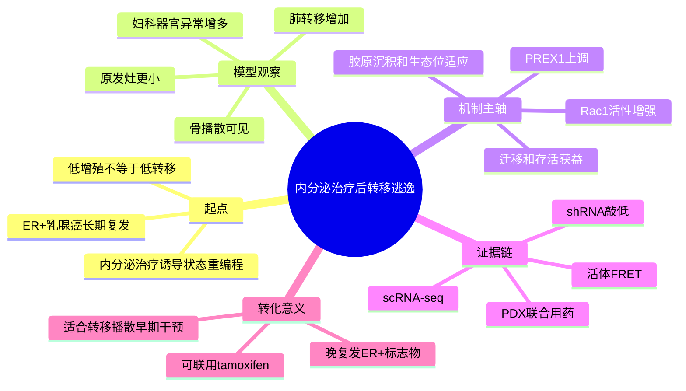

# 内分泌治疗-P-Rex1-Rac1转移逃逸-2026

## 基本信息

- 标题：Endocrine therapy reprogramming of breast cancer facilitates metastatic escape via upregulation of P-Rex1/Rac1 signalling
- 发表时间：2026-05-11
- 期刊：Nature Communications
- PubMed：https://pubmed.ncbi.nlm.nih.gov/42115169/
- DOI：https://doi.org/10.1038/s41467-026-70683-x
- 研究类型：机制研究；ER+ 乳腺癌内分泌治疗耐受模型 + 单细胞转录组 + 临床队列 + 活体成像 + PDX 药理验证

## 研究问题

ER+ 乳腺癌在接受内分泌治疗后常出现晚期复发与低增殖转移灶。作者想回答的是：内分泌治疗是否不仅筛选出“耐药”细胞，还主动重编程出更擅长播散和定植的转移状态；这一状态的关键驱动是否是 `P-Rex1/Rac1` 迁移信号，而不是传统上更受关注的高增殖程序。

## 摘要式结论

这篇文章的核心价值在于把“内分泌治疗后慢生长”从一个被动耐药表型，推进为一个主动的转移逃逸状态。作者构建的 endocrine tolerant ER+ 细胞在原位乳腺内形成较小原发灶，却更容易出现肺、骨及妇科器官相关播散；单细胞分析提示这一状态上调 `PREX1` 并牵引 `Rac1` 迁移/存活程序。临床上，`P-Rex1` 在 ER+ 晚复发与妇科转移队列中保持较高表达；功能上，`NSC23766` 或 `R-ketorolac` 抑制 Rac1 轴后，可降低迁移、压低体内 Rac1 活性，并在耐内分泌 PDX 中与 tamoxifen 联用产生更强抑瘤效应。对用户课题而言，这提供了一个“治疗诱导转移生态位适应”的可迁移范式。

## 文章行文逻辑

1. 先从临床现象切入：ER+ 乳腺癌会在多年后以低增殖、难处理的方式复发，单看 Ki67 不能解释转移风险。
2. 建立内分泌耐受模型，证明 endocrine tolerant 细胞虽然原发灶小，但更易形成多器官播散。
3. 用 scRNA-seq 比较 parental、fast-growing resistant、endocrine tolerant 三类状态，定位到 `PREX1/RAC1` 相关迁移轴。
4. 通过蛋白、shRNA、伤口愈合和活体 FRET 成像，把 `P-Rex1` 从“相关标志物”推进为“功能性驱动因子”。
5. 再把机制外推到临床：妇科转移队列与耐药 PDX 中 `P-Rex1` 持续高表达，并提示可药物化干预窗口。

## 思维导图

## 主要创新点

- 不把内分泌治疗后的慢生长群体视为单纯“残留细胞”，而是定义为具有更强转移潜力的重编程状态。
- 把 `P-Rex1/Rac1` 从既往 ER 相关迁移因子，推进到“晚复发/转移逃逸”主轴。
- 用活体 `Rac1-FRET` 成像直接观察耐药背景下体内 Rac1 活性，方法学上很强。
- 给出药物化方向：`R-ketorolac` 这类 Rac1 通路抑制思路有再定位价值。

## 关键数据类型与是否可下载

- 细胞系 endocrine treatment / resistant 状态的 scRNA-seq：可下载，GEO `GSE306192`，含原始 SRA 与处理后 Seurat 对象。
- 患者肺部样本 scRNA-seq：原始数据为受限访问，EGA `EGAS00001008353`；对应处理后数据可在 `GSE306192` 获取。
- 文中复用的公开数据：`GSE43566`、`GSE176078` 可直接获取。
- 其余图表 source data、补充表和方法学细节可直接下载。

## 可借鉴的方法

- 以“治疗诱导状态”而非“静态分型”来做转移研究，适合迁移到 ER+ 脑/肺/骨转移问题。
- 把单细胞状态发现、体内活性成像和 PDX 联合药物验证串成闭环，这个证据结构值得模仿。
- 在单细胞分析中同时比较 parental、短期药物刺激和长期耐受衍生株，有助于区分即时反应与稳定重编程。
- 若后续复现，可优先构建 `PREX1-high / RAC1-active / low-proliferation` 三维状态坐标，而不是只做差异基因列表。

## 可借鉴的创新点

- 将“晚复发”解释为治疗塑造的迁移能力，而非单纯 dormancy。
- 用妇科转移/晚复发临床队列去承接模型机制，避免机制与临床脱节。
- 把可药物化的小 GTPase 迁移轴与标准内分泌治疗联用，而非替代。

## 与用户课题的潜在关联

- 这篇文章最适合作为 `ER+ 转移播散` 的机制模板，尤其适合与脑转移、肺转移或卵巢/妇科相关播散做类比。
- 用户若要解释“低增殖但高播散”的转移样本，这篇文献提供了优先检验的 `PREX1/RAC1` 候选轴。
- 对公共数据复用而言，可在已有脑转移、肺转移或多器官转移队列中检查 `PREX1` 是否富集于低增殖但高迁移的肿瘤细胞群。
- 对方法迁移而言，可以把本文的状态框架与已有免疫微环境笔记结合，检验 `PREX1-high` 状态是否伴随 T cell 排斥、ECM 重塑或巨噬细胞偏移。

## 局限性

- 研究主轴是 ER+ 内分泌耐受与多器官播散，不是专门聚焦某一远处器官转移生态位。
- 患者单细胞部分目前主要通过受限 EGA 获取，公开可直接重分析的患者级原始数据仍有限。
- 妇科器官相关发现对用户“卵巢转移”有启发，但这里包含的是妇科相关播散/异常，不应直接等同于纯临床卵巢转移队列。
- 药物验证重点在耐药 PDX 与 Rac1 活性，不足以直接证明不同器官微环境中同一轴的因果强度完全一致。

## 选择理由

本轮检索到的新文献里，这篇最值得单独落笔：一是时间新，`2026-05-11` 在线发表；二是期刊层级与证据链都足够强；三是它把“内分泌治疗后转移逃逸”这个与用户课题高度相关、且此前笔记覆盖不足的方向补上了。

## 相关笔记

- [[FGF2-NCAM1-FGFR1脑转移-2026]]
- [[CHI3L1中性粒细胞肺转移-2026]]
- [[TNBC癌症干细胞外泌体免疫逃逸-2026]]
- [[乳腺癌多器官配对转移RNA队列-2026-06-02]]
