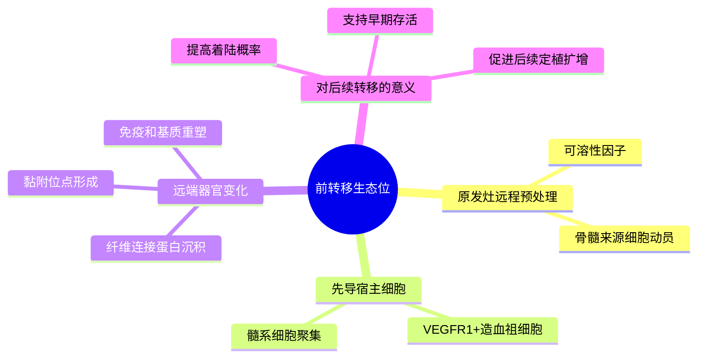

# 前转移生态位发现代表性研究-2005

- 标题：VEGFR1-positive haematopoietic bone marrow progenitors initiate the pre-metastatic niche
- 发表时间：2005-12
- 期刊：Nature
- PubMed/DOI 链接：
  - PubMed 检索：https://pubmed.ncbi.nlm.nih.gov/?term=VEGFR1-positive+haematopoietic+bone+marrow+progenitors+initiate+the+pre-metastatic+niche
  - Nature 检索：https://www.nature.com/search?q=VEGFR1-positive%20haematopoietic%20bone%20marrow%20progenitors%20initiate%20the%20pre-metastatic%20niche
- 研究类型：经典机制原始研究；小鼠转移模型 + 远端器官先导位点成像/免疫染色 + 骨髓来源细胞追踪 + 功能阻断

## 选择理由
截至 2026-06-19 再次重查最近检索窗口后，仍未看到一篇明显强于库内近几日条目的新近乳腺癌远处转移原始研究。继续追最新只会得到边际增量很小的结果，因此这轮按 fallback 规则补一篇仍然高度可复用的 founding study。它的价值不是再给出一个器官特异 marker，而是把“转移前远端器官已被原发灶预处理”正式立起来，正好能为当前库里脑、肺、骨、卵巢的器官嗜性、免疫排斥和早期定植笔记提供更上游的共同坐标系。

## 研究问题
在肿瘤细胞真正到达之前，远端器官是否已经被原发灶信号预先改造，形成一个更有利于未来播散细胞着陆、生存和扩增的“前转移生态位”？如果存在，这个生态位由哪些宿主细胞率先建立？

## 摘要式结论
这篇文章最重要的贡献，是把转移研究的观察时点前移到了“肿瘤细胞抵达之前”。作者提出并验证：原发瘤可先驱动 `VEGFR1+` 骨髓来源造血祖细胞向未来易转移器官聚集，这些细胞在远端器官形成纤维连接蛋白富集、髓系细胞聚集和局部可黏附的先导位点，从而提高后续肿瘤细胞定植概率。对用户课题最有价值的点，不是把所有器官都解释成同一种 niche，而是接受这个时间顺序框架：很多看似“转移灶特征”的免疫或基质改变，可能在真正出现可见转移灶之前就已开始。

## 文章行文逻辑
1. 先观察远端器官，在尚未出现显著转移灶时就能检测到特定骨髓来源细胞聚集。
2. 再把这些细胞与未来转移高发器官中的纤维连接蛋白沉积、局部微环境改变联系起来。
3. 接着证明这些位点不是旁观现象，而是肿瘤细胞后续更容易停留和定植的位置。
4. 最后通过阻断 `VEGFR1` 相关过程削弱前转移生态位形成和后续转移负荷，建立因果链。

## 主要创新点
- 把“转移位点准备”从推测推进为可观察、可阻断的宿主过程。
- 将宿主骨髓来源细胞而非肿瘤细胞本身，放到远端器官改造的起始位置。
- 提出前转移生态位这一高复用概念，为后续器官嗜性、免疫微环境和空间组学研究提供统一上游框架。

## 关键数据类型与是否可下载
- 核心证据来自小鼠体内模型、免疫染色、宿主细胞追踪和功能阻断。
- 这篇文章更适合作为概念与实验设计骨架，而不是直接提供现代可复用的大规模公开组学数据入口。
- 若要在公开数据中回投这一框架，优先找“远端器官早期、宿主细胞富集、免疫/基质重塑”而不是只看成熟转移灶。

## 可借鉴的方法
- 采样时间前移：不要只取成熟转移灶，也要取未见病灶或微小病灶阶段的远端器官。
- 把肿瘤问题拆成“远程预处理 -> 着陆 -> 定植扩增”三个阶段分别验证。
- 分析公共数据时优先问宿主细胞和基质变化是否先于肿瘤细胞扩增出现。

## 可借鉴的创新点
- 对脑、肺、骨、卵巢转移都可以先问：哪个宿主细胞群在肿瘤抵达前已被教育，而不是一开始就盯着终末转移灶中的肿瘤内在程序。
- 后续单细胞、空间和 CellChat 分析可以用“前转移生态位层”单独建模，避免把早期铺路者和晚期维持者混在一起。
- 这篇文献与当前库里的中性粒细胞、巨噬细胞、星形胶质细胞和 ECM 笔记兼容，适合做跨器官上游整合。

## 与用户课题的潜在关联
- 肺转移：可以把已记录的 `CHI3L1`、`LCN2`、肺泡巨噬细胞时序和 `GR-FAS` 早期播散免疫逃逸重新排列到“前转移准备 -> DTC 生存 -> 宏转移扩增”链条中。
- 脑转移：提醒不要只研究 BBB 穿越后的肿瘤细胞，也要追问脑血管周围、髓系和胶质细胞是否在更早阶段已被重编程。
- 骨转移：与 `SAMENT` 和骨 niche 巨噬细胞线索相连，帮助区分“谁先铺路”和“谁在已成灶后维持免疫抑制”。
- 卵巢转移：在公开单细胞仍稀缺时，这个框架可指导优先接受哪些低分辨率验证数据，尤其是宿主微环境读出。

## 局限性
- 时期较早，缺少单细胞、空间转录组和高分辨率免疫分层。
- 机制框架强调宿主先导事件，但不能替代后续器官内扩增、免疫编辑和治疗压力相关机制。
- 并非乳腺癌专属研究结论，应用到具体器官位点时仍需结合乳腺癌背景和器官差异二次验证。

## 相关笔记
- [[前转移生态位形成与干预综述-2024]]
- [[趋化因子受体器官嗜性播散代表性研究-2001]]
- [[脑转移血脑屏障穿越代表性研究-2009]]
- [[肺器官嗜性基因程序代表性研究-2005]]
- [[骨转移多基因程序代表性研究-2003]]
- [[乳腺癌肺转移休眠免疫微环境GSE261385-2026-06-19]]
