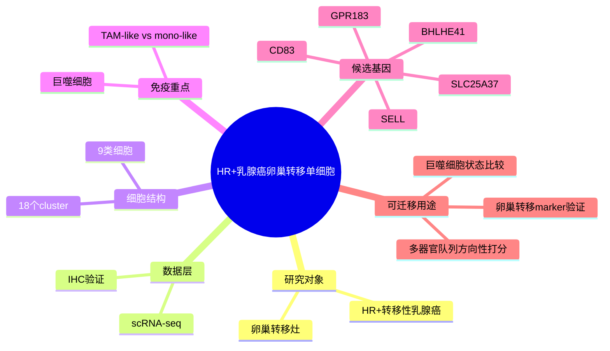

# 卵巢转移免疫单细胞
- 发表时间：2026-05-08
- 期刊：Human Cell
- PubMed：[PMID: 42101520](https://pubmed.ncbi.nlm.nih.gov/42101520/)
- DOI：[10.1007/s13577-026-01384-2](https://doi.org/10.1007/s13577-026-01384-2)
- PMCID：`PMC13156106`
- 研究类型：HR+ 转移性乳腺癌卵巢转移单细胞转录组 + IHC 验证

## 研究问题
HR+ 转移性乳腺癌在卵巢转移灶中是否存在可描述的免疫微环境结构，尤其是巨噬细胞相关状态，能否为后续机制验证和标志物筛选提供起点？

## 摘要式结论
这篇文章的价值不在于建立一个大队列，而在于补上“乳腺癌卵巢转移单细胞”这个长期稀缺位点。作者用 scRNA-seq 描述了卵巢转移场景下的 9 类细胞、18 个簇，并把分析重心放在巨噬细胞分化与功能状态上，最终提出 `GPR183 / BHLHE41 / CD83 / SLC25A37 / SELL` 这 5 个与巨噬细胞功能相关的候选基因。对用户课题最直接的意义，是它提供了一个可迁移的“卵巢转移免疫状态字典”雏形，哪怕样本量很小，仍可用于后续 bulk 或多器官队列的方向性验证。

## 文章行文逻辑
1. 先指出乳腺癌死亡主要由转移驱动，而 HR+ 远处转移尤其缺少位点特异性的免疫图谱。
2. 以卵巢转移为重点，用单细胞转录组拆解肿瘤组织的细胞组成。
3. 在免疫细胞中进一步聚焦巨噬细胞，区分 TAM-like 与 mono-like 状态并做 marker 分析。
4. 结合统计筛选，收敛到 5 个与巨噬细胞功能相关的候选基因。
5. 用 10 例卵巢转移临床样本做 IHC 验证，支持其中部分标志物在肿瘤与邻近组织中的差异表达。

## 主要创新点
- 不是泛泛讨论转移性乳腺癌，而是直接把位点锁定到稀缺的卵巢转移。
- 用单细胞数据把卵巢转移中的巨噬细胞状态单独拎出来，而不是停留在总体免疫浸润描述。
- 给出了可落地的候选基因组合，便于后续在公开 bulk 或空间队列中做外部验证。

## 关键数据类型与是否可下载
- 单细胞转录组：论文明确使用了 scRNA-seq，PubMed/PMCID 已确认其分析对象与核心结果。
- IHC：10 例卵巢转移患者样本用于体内验证。
- 可下载性判断：截至 2026-06-09，定向检索 `PMID 42101520 / PMC13156106` 及 `GEO/SRA/accession`，尚未确认稳定公开的原始数据 accession；当前更适合作为“已发表、待 accession 落地”的数据线索，而非可立即批量下载的数据源。

## 可借鉴的方法
- 对稀缺转移位点，可以先做“位点特异单细胞图谱 + 重点免疫群细分 + 候选 marker 收敛”的轻量级流程，而不是追求全谱系大样本。
- 从单细胞聚类之后，不直接停在 cell type annotation，而是继续沿着“功能相关免疫细胞 -> 候选基因筛选 -> 组织层验证”往下走。
- 如果后续用户要做公共队列复用，可把这 5 个基因分成“肿瘤侧高表达”和“邻近组织侧高表达”两个方向来打分，而不是只看单基因。

## 可借鉴的创新点
- 把难以扩样的卵巢转移做成“单细胞发现 + 小队列验证”的证据链，而不是因为样本少就完全放弃位点研究。
- 以巨噬细胞功能状态为锚点组织全文，有利于后续直接迁移到免疫微环境假设构建。

## 与用户课题的潜在关联
- 这是当前最接近“乳腺癌卵巢转移单细胞公开研究”主题的直接文献之一，能补用户课题在卵巢位点上的知识缺口。
- 若用户后续要比较脑、肺、骨、卵巢四个位点的免疫生态，这篇文章可作为卵巢侧的起始状态参考，而不是继续把卵巢完全外推自其他器官。
- 若要围绕 TAM/TREM2-like、免疫抑制或器官特异性巨噬细胞程序构建假设，这篇文章提供了一个可与现有脑转移、骨转移笔记并列比较的入口。

## 局限性
- 样本量明显偏小，单细胞部分更像“位点探索”而不是稳健队列结论。
- 目前尚未确认公开 raw-data accession，复现成本仍偏高。
- 文章聚焦 HR+，不应直接外推到 TNBC 或 HER2+ 卵巢转移。
- 候选基因更适合做方向性验证，不适合在当前阶段被当作稳定临床标志物。

## 选择理由
这轮没有检到明显强于既有 2026 记录的新顶刊乳腺癌远处转移原始研究，但这篇文章直接命中了当前最稀缺的“卵巢转移单细胞”空白，因此优先级高于再补一篇泛位点或低增量的新文。

## 相关笔记
- [[乳腺癌卵巢转移公开数据线索-2026-06-08]]
- [[HTAN乳腺癌转移多模态单细胞图谱-2026-06-07]]
- [[器官嗜性转移营养需求-2026]]
- [[乳腺癌转移器官嗜性巨噬细胞综述-2025]]
