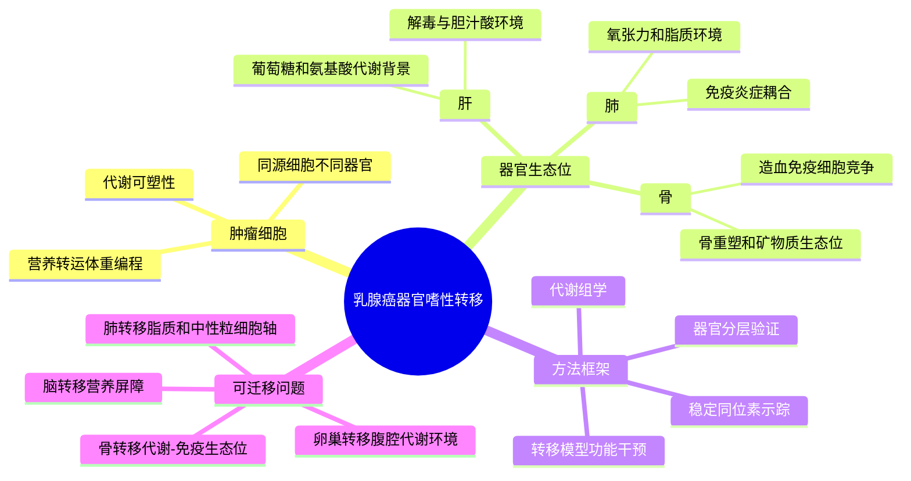

# 器官嗜性转移营养需求-2026

- 标题：Nutrient requirements of organ-specific metastasis in breast cancer
- 发表时间：2026-01-07
- 期刊：Nature
- PubMed：[41501456](https://pubmed.ncbi.nlm.nih.gov/41501456/)
- DOI：[10.1038/s41586-025-09898-9](https://doi.org/10.1038/s41586-025-09898-9)
- 研究类型：乳腺癌器官嗜性转移机制研究；结合小鼠转移模型、稳定同位素示踪、代谢组学、营养依赖筛选与功能干预

## 研究问题
同一种乳腺癌细胞到达不同器官后，是否沿用相同的代谢程序完成定植和扩增？还是会被肺、肝、骨等局部营养生态位重新塑形，形成器官特异性的营养依赖？

## 摘要式结论
文章把“器官嗜性转移”从经典的趋化、黏附和免疫逃逸问题推进到代谢生态位层面：转移细胞在不同器官内面对的可用营养、转运通路和代谢瓶颈并不相同，因此会形成器官特异性的营养需求。对用户课题最有价值的是，它提供了一个可迁移框架：在脑、肺、骨、卵巢等转移灶中，不能只比较免疫细胞比例或配体-受体轴，也应把局部代谢底物、转运体表达和营养竞争纳入微环境解释。

## 文章行文逻辑
1. 先以乳腺癌转移模型建立不同器官转移灶，证明同源肿瘤细胞在不同器官内表现出不同的代谢状态。
2. 再用代谢组学和示踪实验拆分“肿瘤细胞内在需求”和“器官微环境供给”之间的关系。
3. 接着通过候选营养通路干预，寻找特定器官转移灶扩增所依赖的代谢弱点。
4. 最后把器官特异性营养依赖与转移治疗窗口联系起来，提示代谢干预需要按转移部位分层，而不是用统一的抗转移策略。

## 主要创新点
- 将器官嗜性转移解释为“局部营养生态位选择 + 肿瘤代谢适应”的结果，而不只是一组转移相关基因或免疫抑制状态。
- 强调同一乳腺癌谱系在不同器官转移灶中的可干预弱点可能不同，支持按转移部位设计验证队列。
- 使用代谢示踪把营养利用从相关性表达推进到功能性通量层面，避免只凭转运体或酶的转录水平下结论。

## 关键数据类型与是否可下载
- 小鼠乳腺癌器官转移模型：用于比较不同器官转移灶的营养依赖；原始动物模型数据通常需要依赖论文补充材料和作者共享。
- 代谢组学与稳定同位素示踪：可用于复核器官特异性代谢通路；论文 data availability 明确给出 MetaboLights `MTBLS13151`、`MTBLS13152`、`MTBLS13164`、`MTBLS13165`。
- 转录或候选通路数据：适合提取营养转运体、代谢酶和器官生态位相关 signature，但本轮未把它记录为患者单细胞 accession。

## 可借鉴的方法
- 对每个转移器官分别做 pathway scoring，而不是把所有转移灶合并为“metastasis vs primary”。
- 在单细胞数据中先区分恶性细胞和微环境细胞，再分别计算营养转运、代谢酶、缺氧、脂质摄取、氨基酸代谢等模块。
- 若有空间转录组，可把代谢 signature 与血管、免疫排斥、CAF、骨重塑或坏死区域的邻近关系联动分析。
- 对候选通路优先做“器官内验证”：同一个 signature 在脑、肺、骨、卵巢转移中可能方向一致，也可能代表完全不同的局部限制。

## 可借鉴的创新点
- 用户课题可把“器官嗜性”拆成三个层次：到达器官、被局部生态位许可、在特定营养条件下扩增。
- 对脑转移，可重点关注血脑屏障限制下的葡萄糖、脂质、氨基酸利用；对肺转移，可与已有 [[棕榈酸-中性粒细胞-LCN2肺转移前生态位-2026]] 交叉；对骨转移，可把代谢需求与骨髓免疫和骨重塑模块连接。
- 在 CellChat 或配体-受体分析之外，可增加“营养配体/代谢物-转运体/受体”层面的解释，例如脂肪酸、乳酸、氨基酸、铁代谢相关信号。

## 与用户课题的潜在关联
这篇文章适合作为用户课题的机制框架文献：如果后续整合乳腺癌脑、肺、骨、卵巢转移单细胞或空间数据，可将免疫微环境差异与代谢生态位差异并行建模。它尤其提醒不要把某个器官中的转移机制直接外推到所有器官；同一个免疫排斥表型背后可能由不同营养瓶颈驱动。

## 局限性
- 文章核心证据更偏模型和代谢功能验证，不能替代患者来源的多器官转移单细胞队列。
- 不同转移器官的结论需要在患者数据中复核，尤其是脑和卵巢这类公开高分辨率数据稀缺的部位。
- 代谢组学和示踪数据与常规 scRNA-seq 的整合存在尺度差异，不能简单用一个基因集分数代表真实代谢通量。

## 相关笔记
- [[棕榈酸-中性粒细胞-LCN2肺转移前生态位-2026]]
- [[转移灶3D形态发生蓝图-2026]]
- [[乳腺癌转移单细胞线索-2026-05-26]]
