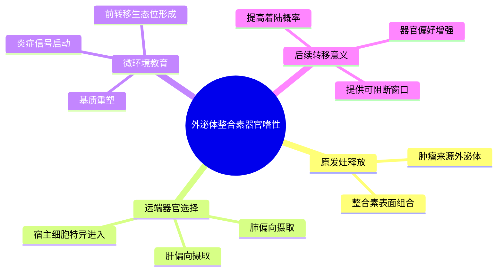

# 外泌体整合素器官嗜性转移-2015

- 标题：Tumour exosome integrins determine organotropic metastasis
- 发表时间：2015-11
- 期刊：Nature
- PubMed/DOI 链接：
  - PubMed 检索：https://pubmed.ncbi.nlm.nih.gov/?term=Tumour+exosome+integrins+determine+organotropic+metastasis
  - Nature 检索：https://www.nature.com/search?q=Tumour%20exosome%20integrins%20determine%20organotropic%20metastasis
  - DOI：https://doi.org/10.1038/nature15756
- 研究类型：代表性机制原始研究；外泌体蛋白质组学 + 体内器官嗜性转移模型 + 体外细胞摄取/教育实验 + 功能阻断

## 选择理由
截至 2026-06-22，再次复查最近检索窗口后，仍未看到一篇明显强于库内近几日条目的新近乳腺癌远处转移原始研究。继续硬追“最新”只会带来边际增量很小的内容，因此这轮按 fallback 规则补一篇仍然高度可复用、且当前主动 vault 中尚未正式建档的代表性原始研究。它正好把现有的 `CXCR4/CCR7` 器官归巢、前转移生态位、肺/脑/骨器官程序和休眠框架再往前推进一层：**原发灶如何通过可运输的囊泡货物先给远端器官“写入偏好”**。

## 研究问题
肿瘤来源外泌体是否不仅仅是伴随现象，而是真正携带决定器官嗜性的分子信息？如果是，哪些外泌体表面整合素更偏向肺、肝等目标器官，并通过哪些宿主细胞与微环境反应促进后续转移定植？

## 摘要式结论
这篇文章最关键的贡献，是把“外泌体参与转移”推进成了“外泌体表面整合素决定器官偏向”的可测试机制。作者提出并验证：不同肿瘤来源外泌体携带不同整合素组合，其中偏肺的整合素谱更易被肺成纤维细胞/上皮相关细胞摄取，偏肝的整合素谱更易进入肝 Kupffer 细胞环境；这种选择性摄取会触发炎症与基质重塑程序，为后续肿瘤细胞定植创造条件。对用户课题最有价值的点，不是记住某一个整合素，而是接受一个高复用分析范式：**器官嗜性不只存在于肿瘤细胞本体，也可被预先编码在可流动的囊泡表面拓扑里**。

## 文章行文逻辑
1. 先比较不同器官偏向肿瘤模型的外泌体整合素谱，提出“整合素组合可能携带器官指向信息”。
2. 再追踪这些外泌体在体内的富集与摄取位置，证明其确实优先进入特定器官和宿主细胞群。
3. 接着把外泌体摄取与局部炎症、基质重塑和前转移生态位建立联系起来。
4. 最后通过干预外泌体整合素削弱器官定向摄取与后续转移负荷，建立因果链。

## 主要创新点
- 把“外泌体与转移相关”推进为“外泌体表面整合素组合决定器官偏向”的具体机制。
- 将器官嗜性从肿瘤细胞内在基因程序扩展到可流动的细胞外囊泡层。
- 通过宿主细胞摄取定位，把外泌体信号与前转移生态位建立连接，而不是停留在相关性描述。

## 关键数据类型与是否可下载
- 核心证据来自外泌体蛋白质组、体内示踪、宿主细胞摄取实验和功能阻断。
- 这篇文章本身更适合作为机制骨架和实验设计参考，不是当前最直接的开放大队列入口。
- 若要在公开数据里回投这条机制，优先选多器官转移队列检查整合素、ECM、炎症与宿主细胞反应模块，而不是只看单个终末转移 marker。

## 可借鉴的方法
- 在器官嗜性分析中把“肿瘤细胞状态”和“循环囊泡货物”拆成两个层次分别建模。
- 先找目标器官优先摄取的宿主细胞群，再回推它们可能响应的囊泡表面分子，而不是只从肿瘤细胞表达端正向推断。
- 将外泌体线索与前转移生态位、血管通透性、ECM 和髓系招募一起分析，避免孤立看 EV 标志物。

## 可借鉴的创新点
- 对肺转移，可把这篇文章和已有 `LCN2`、`CHI3L1`、`TREM2`、`GR-FAS` 线索串成“囊泡预教育 -> 宿主细胞接收 -> 早期播散存活 -> 宏转移扩增”链条。
- 对脑转移，可借它的逻辑追问是否存在更适合脑血管/胶质细胞摄取的囊泡表面模块，而不只盯 BBB 穿越后状态。
- 对卵巢和骨转移，在单细胞资源稀缺时，可先用 bulk/多器官队列验证整合素相关模块是否存在器官分支，再决定是否值得深挖特定位点。

## 与用户课题的潜在关联
- 它能直接承接当前主动库里“趋化因子受体器官嗜性”“前转移生态位”“肺器官程序”“脑 BBB 穿越”“骨多基因程序”几条上游主线，补上一个此前缺少的**远程载体层**。
- 对公共数据复用最现实的策略，不是期待在每个单细胞数据里直接看到完整 EV 拓扑，而是先在多器官患者队列中验证整合素相关模块、ECM 反应和炎症伴随变化，再回到单细胞或空间层定位宿主接收细胞。
- 若后续做 CellChat/NicheNet，需要预先标注一个局限：外泌体表面分子并不总能被经典配体-受体框架完整捕获，最好联合蛋白、空间或功能实验。

## 局限性
- 研究范式影响深远，但年代较早，距离今天的单细胞、空间和患者多模态解析仍有技术代差。
- 文章强调肺/肝等器官教育逻辑，对乳腺癌脑/骨/卵巢转移不能机械外推，仍需器官位点再验证。
- 以外泌体整合素为核心并不意味着器官嗜性可被单一囊泡轴完全解释；它更像前转移生态位形成中的一层载体机制。

## 相关笔记
- [[趋化因子受体器官嗜性播散代表性研究-2001]]
- [[前转移生态位发现代表性研究-2005]]
- [[肺器官嗜性基因程序代表性研究-2005]]
- [[脑转移血脑屏障穿越代表性研究-2009]]
- [[骨转移多基因程序代表性研究-2003]]
- [[乳腺癌多器官配对转移RNA队列-2026-06-02]]
