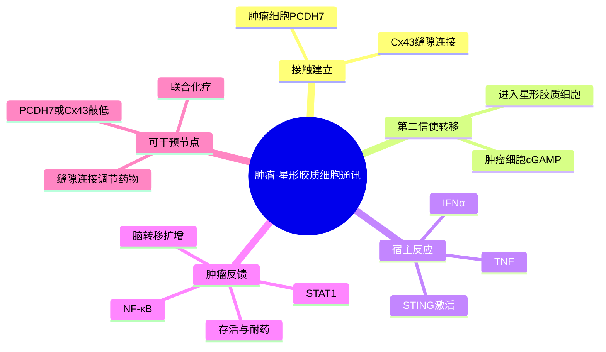

# 星形胶质-cGAMP脑转移-2016

- **标题**：Carcinoma–astrocyte gap junctions promote brain metastasis by cGAMP transfer
- **发表时间**：2016-05-26（在线发表：2016-05-18）
- **期刊**：Nature
- **PubMed**：https://pubmed.ncbi.nlm.nih.gov/27225120/
- **DOI**：https://doi.org/10.1038/nature18268
- **全文**：https://pmc.ncbi.nlm.nih.gov/articles/PMC5021195/
- **研究类型**：代表性机制研究；人源乳腺癌/肺癌脑转移模型、患者组织、共培养、TRAP-RNA-seq、遗传与药理干预

## 选择理由

截至 2026-06-28，复查 6 月 26–28 日 PubMed 新收录结果后，未发现质量和课题相关性明显超过近期已收录 MED4 休眠与 BCBM 空间免疫研究的新机制论文。本轮因此按 fallback 规则补充一篇尚未入库、但能补齐“脑器官嗜性定植后，肿瘤细胞如何利用脑驻留细胞获得生存与耐药”的代表性研究。它把物理细胞连接、第二信使转移、脑内炎症反应和转移灶存活连成了可实验验证的因果链。

## 研究问题

脑转移细胞是否通过与星形胶质细胞建立直接通讯来获得脑内生存优势？如果存在，这种通讯由哪些黏附/连接分子建立、传递什么信号、如何改变肿瘤细胞命运，能否被药理阻断？

## 摘要式结论

乳腺癌和肺癌脑转移细胞上调 `PCDH7`，并与星形胶质细胞共同形成以 `Cx43/GJA1` 为核心的缝隙连接。肿瘤细胞通过这些连接把第二信使 `cGAMP` 转移给星形胶质细胞，激活后者的 `STING` 通路并诱导 `IFNα`、`TNF` 等炎症因子。反馈到肿瘤细胞后，这些因子启动 `STAT1` 与 `NF-κB` 生存程序，降低化疗和生理压力引起的细胞死亡，促进脑转移灶扩增。敲低 `PCDH7` 或 `Cx43`，以及使用缝隙连接调节药物，可抑制脑转移生长；这一效应并非简单等同于抑制原位瘤或肺转移。

## 文章行文逻辑

1. 用患者组织和脑转移模型证明脑转移灶中 `Cx43`/`PCDH7` 及肿瘤—星形胶质细胞接触富集。
2. 通过染料转移、分子互作与遗传敲低证明 `PCDH7-Cx43` 缝隙连接具有功能性，并决定脑转移定植效率。
3. 用肿瘤细胞特异的 TRAP-RNA-seq 分离共培养体系中的翻译中 mRNA，识别星形胶质细胞诱导的 `STAT1/NF-κB` 生存程序。
4. 追踪上游信号，证明肿瘤来源 `cGAMP` 经缝隙连接进入星形胶质细胞，触发宿主 `STING-IFNα/TNF` 反应。
5. 用遗传与药理干预闭合因果链，并评估与化疗联合的治疗潜力。

## 主要创新点

- 揭示脑转移细胞不是只接受星形胶质细胞分泌信号，而是先通过缝隙连接主动把 `cGAMP` 递送给宿主细胞，再利用宿主炎症反馈。
- 说明同一类先天免疫信号在不同空间和细胞归属中可产生相反结果：星形胶质细胞 `STING` 激活在此处形成促转移反馈，而不能简单解释为抗肿瘤。
- 把脑器官嗜性分子 `PCDH7`、物理连接 `Cx43`、第二信使和耐药表型置于一条完整因果链中。

## 关键数据类型与是否可下载

- 患者 TNBC 与 NSCLC 原发灶/脑转移灶组织学和 `Cx43` 检测：论文与补充材料可查，患者级原始病理数据未作为独立开放队列发布。
- 人源 MDA-MB-231-BrM2 脑转移细胞与星形胶质细胞共培养 TRAP-RNA-seq：已公开于 `GSE79256`，共 8 个样本；原始 reads 可从 `SRP071806` 下载，标准化计数可从 GEO 直接下载。
- 体内脑转移、乳腺原位瘤和肺转移 BLI，敲低/回补及药物干预：汇总结果见论文和补充材料，未形成可直接重分析的独立组学队列。

## 可借鉴的方法

- 在混合共培养中使用 TRAP，只捕获肿瘤细胞的翻译中 mRNA，避免把宿主细胞表达变化误判为肿瘤内在程序。
- 将细胞通讯拆成“物理连接—信号货物—受体细胞响应—反馈到肿瘤”的四层证据，而不只依赖配体—受体表达推断。
- 对候选轴同时做器官特异性对照：脑转移、原位瘤和肺转移分开评价，可避免把一般增殖效应误写成脑器官嗜性。

## 可借鉴的创新点

- 在单细胞/空间数据中构建两侧模块：肿瘤细胞 `PCDH7-GJA1-cGAS/cGAMP` 与星形胶质细胞 `TMEM173-IFN/TNF`，再结合空间邻近度验证，而不是把所有基因压成一个平均分数。
- 将“通讯货物”从蛋白配体扩展到第二信使；CellChat/NicheNet 无法直接恢复 `cGAMP` 跨缝隙连接转移，需用连接分子表达、空间接触及下游响应共同佐证。
- 可将近期 BCBM 中的 CD163 巨噬细胞抑制生态位与本研究串联，检验星形胶质细胞 I 型干扰素/CCL2 类程序是否进一步塑造髓系募集与免疫逃逸。

## 与用户课题的潜在关联

- 为 PT/MT 比较提供脑转移特异假设：MT 肿瘤细胞是否获得更强的 `PCDH7/GJA1` 接触程序，并伴随星形胶质细胞 `STING/IFN/TNF` 与肿瘤 `STAT1/NF-κB` 响应增强。
- 对脑转移 CellChat 结果提供重要边界：缺少经典分泌型配体—受体差异并不代表没有通讯，缝隙连接和第二信使可能是主要通道。
- `GSE79256` 可用于先建立肿瘤细胞对星形胶质细胞接触的响应签名，再投射到用户的脑转移单细胞或 bulk 数据；该签名不应直接外推到肺、骨或卵巢转移。

## 局限性

- 核心组学来自细胞系共培养和模型系统，不是患者脑转移单细胞队列。
- 论文同时使用乳腺癌和肺癌模型；共享机制增强了普适性，但乳腺癌亚型特异性仍需独立验证。
- `STING` 的作用依赖细胞类型、空间位置和免疫背景，本研究不能支持笼统的“激活 STING 促进脑转移”结论。
- 缝隙连接调节药物具有多靶点和系统效应，临床转化前需更选择性的干预策略及血脑屏障药代验证。

## 相关笔记

- [[脑转移血脑屏障穿越代表性研究-2009]]
- [[TIMP1星形胶质细胞脑转移免疫抑制-2025]]
- [[FGF2-NCAM1-FGFR1脑转移-2026]]
- [[脑转移空间免疫CD163巨噬细胞-2026]]
- [[乳腺癌脑转移星形胶质互作GSE79256-2026-06-28]]
