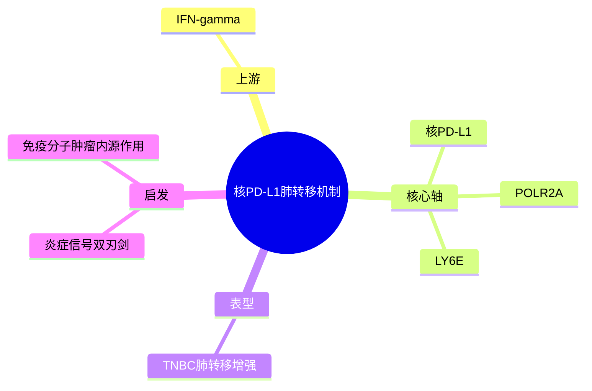

# 核PD-L1驱动肺转移

- 发表时间：2025-06-11
- 期刊：Cell Death & Disease
- PubMed：[PMID: 40447234](https://pubmed.ncbi.nlm.nih.gov/40447234/)
- DOI：[10.1038/s41419-025-07752-5](https://doi.org/10.1038/s41419-025-07752-5)
- 研究类型：机制研究

## 研究问题
IFN-gamma 背景下，三阴性乳腺癌肺转移是否可由核定位 PD-L1 通过转录调控轴直接驱动。

## 摘要式结论
作者提出一个比“PD-L1 免疫检查点”更深入的机制：核内 PD-L1 可在 IFN-gamma 条件下通过 POLR2A 介导转录激活 LY6E，从而促进 TNBC 肺转移。文章的价值在于把免疫相关分子转成肿瘤细胞内源性转移驱动因子，为解释炎症信号与转移促进之间的反常联系提供了可实验化路径。

## 文章行文逻辑
1. 从 TNBC 肺转移和 IFN-gamma 背景切入。
2. 证明 PD-L1 不只在膜上发挥作用，还进入细胞核。
3. 解析核 PD-L1 与 POLR2A/LY6E 轴的转录关系。
4. 用功能实验支持该轴促进肺转移。

## 主要创新点
- 将 PD-L1 从经典膜蛋白功能拓展到核内转录调控。
- 机制链条相对完整，适合后续做靶向干预假设。
- 连接炎症刺激与转移促进，问题切得很准。

## 关键数据类型与是否可下载
- 机制实验数据：主要来自正文和补充材料。
- 若有转录组或 ChIP 类结果，通常可在补充数据库中找到，但需逐项核对。
- 这篇文章更适合提机制，不是公共大队列主资源。

## 可借鉴的方法
- 若用户研究免疫-转移交叉通路，可借鉴“免疫分子核功能”这一思路。
- 可复用的验证链：刺激条件设置 -> 亚细胞定位 -> 转录复合体验证 -> 迁移/转移表型。

## 可借鉴的创新点
- 不把 PD-L1 限定为免疫治疗 marker，而是视为转移程序调节器。
- 适合引出新的联合治疗假设。

## 与用户课题的潜在关联
- 若课题关注 TNBC 肺转移或炎症微环境，这篇文章值得优先跟进。
- 若用户后续在公共数据中看到 LY6E 或 IFN 响应增强，可用本文作为机制解释候选。

## 局限性
- 期刊影响力低于 Cell/Cancer Cell，但机制线索仍有参考价值。
- 若主要依赖模型系统，临床外推仍需人样本验证。
