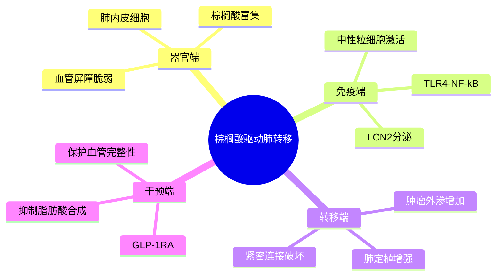

# 棕榈酸中性粒细胞肺转移
- 发表时间：2026-04-24（online ahead of print）
- 期刊：Immunity
- PubMed：[PMID: 42034064](https://pubmed.ncbi.nlm.nih.gov/42034064/)
- DOI：[10.1016/j.immuni.2026.03.026](https://doi.org/10.1016/j.immuni.2026.03.026)
- 研究类型：乳腺癌肺转移机制研究（代谢微环境 + 中性粒细胞 + 血管通透性）

## 研究问题
肺转移前生态位中的脂质变化，是否能通过重编程中性粒细胞和血管内皮相互作用来促进乳腺癌肺转移定植？

## 摘要式结论
这篇文章把“肺转移前生态位”往前又推了一步：不是只说免疫细胞被招募，而是指出肺内皮细胞可成为棕榈酸来源，形成富棕榈酸微环境，驱动中性粒细胞经 `TLR4-NF-kB` 轴上调 `LCN2`，随后破坏内皮紧密连接、增加血管通透性，帮助肿瘤细胞外渗和定植。文章还把 `GLP-1 receptor agonists` 放进了机制链条，说明抑制内皮脂肪酸合成可保护血管完整性并抑制肺转移。对课题最有用的是：器官嗜性不只是肿瘤细胞内在程序，也可以被器官端代谢环境主动塑造。

## 文章行文逻辑
1. 提出问题：肺转移前 niche 中脂质因素被低估。
2. 证明 TNBC 建立棕榈酸富集的肺微环境。
3. 追溯来源到肺内皮细胞，而不是仅归因于肿瘤细胞。
4. 证明棕榈酸激活中性粒细胞产生 LCN2。
5. 进一步证明 LCN2 破坏内皮屏障，促进外渗。
6. 用代谢干预验证该轴具有治疗可塑性。

## 主要创新点
- 把器官嗜性、脂质代谢和中性粒细胞血管互作接成一条闭环机制。
- 把肺内皮细胞明确为棕榈酸来源之一，增强了“目的器官主动塑形”的概念。
- 给出可迁移的干预思路：从代谢端而非肿瘤端切入转移抑制。

## 关键数据类型与是否可下载
- 公开摘要已确认存在机制实验、肺微环境分析和功能干预数据。
- 当前可直接稳定拿到的是 PubMed 元数据与期刊摘要；原始组学数据入口在本次检索中未直接定位到 accession。
- 如果后续准备复现，需专门核对期刊的数据可用性声明与补充材料。

## 可借鉴的方法
- 针对器官转移研究，可把“肿瘤端分泌物/代谢物 -> 器官驻留细胞 -> 免疫细胞 -> 血管屏障”作为标准分析链。
- 在单细胞或 bulk 数据中可优先检查 `LCN2`、脂肪酸合成、TLR4/NF-kB 和内皮 tight junction 程序是否同向变化。
- 若做肺转移时序模型，建议保留“外渗前窗口”而不是只看成灶后终点。

## 可借鉴的创新点
- 把传统代谢药物思路和转移微环境连接，形成更可转化的机制输出。
- 聚焦“血管完整性”这个可测、可干预的中间表型，比只看终点转移负荷更利于机制拆解。

## 与用户课题的潜在关联
- 若课题关注肺转移器官嗜性或前转移生态位，这篇文章是本轮最值得优先保留的新文献之一。
- 可作为脑/肺转移对照：脑转移更偏免疫生态分型，肺转移这里更偏代谢-血管-髓系联动。
- 后续可用肺转移公开队列检验 `LCN2`、中性粒细胞 signature 与血管通透性模块的关联。

## 局限性
- 目前公开可快速获取的信息以摘要为主，完整参数和数据入口需补查。
- 中性粒细胞和内皮互作可能高度依赖模型和时间窗，跨队列迁移时不能直接照搬阈值。
- GLP-1RA 的抗转移效果在临床上未必只通过文中所述单一路径介导。

## 相关笔记
- 肺泡巨噬细胞与肺转移时序-2024
- 核PD-L1驱动肺转移-2025
