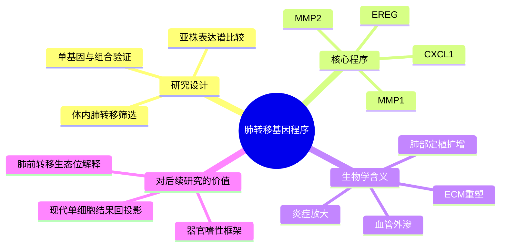

# 肺器官嗜性基因程序代表性研究-2005

- 标题：Genes that mediate breast cancer metastasis to the lung
- 发表时间：2005-08-25
- 期刊：Nature
- PubMed/DOI 链接：
  - PubMed： https://pubmed.ncbi.nlm.nih.gov/16049480/
  - DOI： https://doi.org/10.1038/nature03799
- 研究类型：经典机制原始研究；体内筛选 + 表达谱比较 + 功能回补/敲低验证

## 选择理由
本轮继续重查 2026-06-15 之后的 PubMed 相关窗口，没有看到明显强于库内近几日条目的新发高质量乳腺癌远处转移原始研究，因此按既定规则转向一篇仍然值得反复调用的代表性 founding study。相比再补一篇增量有限的新文，这篇文章更适合作为“肺转移器官嗜性程序”总开关：它把肺转移从泛泛的高侵袭表型，拆成了可验证的协同基因模块，为后续阅读近年的中性粒细胞、血管渗漏、免疫逃逸和代谢适应文献提供共同坐标。

## 研究问题
乳腺癌细胞为什么能对肺形成稳定的器官嗜性转移？这种能力是单个驱动基因决定的，还是由一组彼此协同、分别作用于血管外渗、生长因子回路和肺部微环境适应的基因程序共同完成？

## 摘要式结论
这篇文章最重要的贡献，不是提出“肺转移细胞更恶”，而是提出“肺转移需要协同基因程序”。作者从 MDA-MB-231 体系中体内筛出高肺转移亚株，发现其并非只靠增殖优势，而是形成了一个更适合肺部定植与扩增的基因模块，其中以 `EREG`、`CXCL1`、`MMP1`、`MMP2` 等最具代表性。这个模块共同服务于血管通透性、基质重塑、局部炎症放大和器官位点适应，单个基因部分有效，组合则更强。对用户课题最直接的意义，是它把“肺转移”从静态终点变成可分解的过程模块，便于把近年的免疫微环境和前转移生态位研究映射回一条更早期、更基础的器官嗜性主轴。

## 文章行文逻辑
1. 先用体内反复筛选建立高肺转移亚群，而不是直接把原代与转移灶简单比较。
2. 再用表达谱比较锁定与肺转移能力一致上升的一组候选基因，而不是追单一明星基因。
3. 随后逐个和组合进行功能验证，证明肺转移促进效应具有协同性。
4. 接着把这些基因放回肺转移过程本身解释，包括外渗、局部微环境改造与病灶扩增。
5. 最后提出器官嗜性转移可以由“可迁移的功能模块”定义，而不只是由组织来源或总侵袭性定义。

## 主要创新点
- 把肺转移定义为协同基因程序，而非单一驱动事件。
- 用体内选择得到更贴近器官嗜性的亚群，而不是只靠体外侵袭实验。
- 明确提出不同基因分别作用于不同转移步骤，组合后才形成稳定肺转移表型。

## 关键数据类型与是否可下载
- 体内筛选肺转移亚株：文章内核心实验资源，可读但不是独立公共队列。
- 表达谱比较与候选基因签名：文章可直接复用其 signature 逻辑。
- 原始公共下载入口：本文本轮未额外确认到稳定、独立、现成的原始 accession，因此不把它写成可立即批量下载的数据源。
- 更适合直接下载复用的外部验证入口：见 [[乳腺癌跨器官转移微阵列GSE14020-2026-06-16]]。

## 可借鉴的方法
- 先通过体内器官选择建立“位点偏好”模型，再做分子比较。
- 不把转移拆成单基因故事，而是强制检验基因组合的协同效应。
- 把候选基因对应到转移具体步骤，而不是只停留在差异表达列表。

## 可借鉴的创新点
- 对用户自己的脑/肺/骨/卵巢转移课题，可先建立“步骤模块”再找分子，而不是直接在终末病灶中找差异最高基因。
- 现代单细胞或空间数据可以回过头去问：哪些细胞状态在支持 `EREG-CXCL1-MMP` 这类肺转移程序，而不是只看肿瘤细胞自身。
- 适合把近年的中性粒细胞、内皮通透性、免疫排斥研究整合成同一条肺转移主线。

## 与用户课题的潜在关联
- 肺转移：这是最直接的经典起点，可作为理解近年 `LCN2`、`CHI3L1`、`FAS` 相关肺转移笔记的上游框架。
- 器官嗜性：为和脑、骨、卵巢位点对照提供了“器官程序”而非“单点 marker”思路。
- 肿瘤微环境：提示真正值得追问的是谁在支持肺定植程序，而不仅是病灶里谁上调。

## 局限性
- 模型驱动较强，离患者真实异质性仍有距离。
- 时代较早，缺少单细胞、空间和免疫分层解析。
- 更像“肺转移 founding program”而不是可直接照搬到所有分型的临床定量模型。

## 相关笔记
- [[柠檬酸-中性粒细胞-LCN2肺转移前生态位-2026]]
- [[CHI3L1中性粒细胞肺转移-2026]]
- [[糖皮质激素-FAS转移播散免疫逃逸-2026]]
- [[器官嗜性转移营养需求-2026]]
