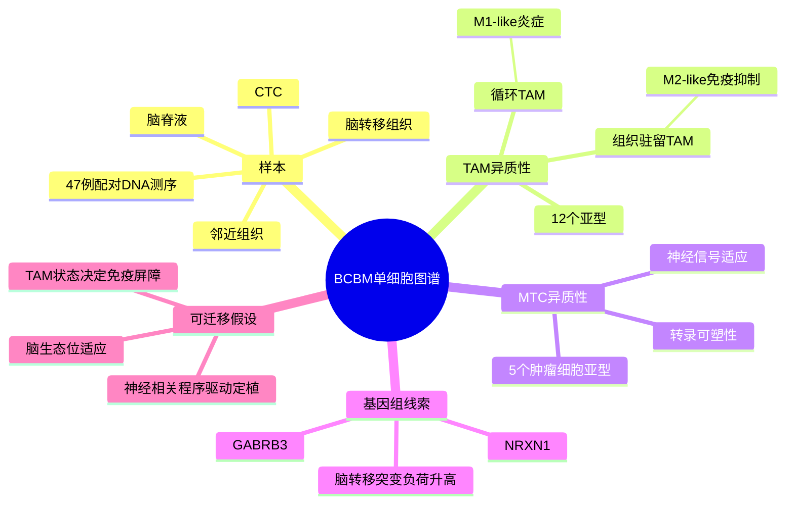

# 脑转移TAM-MTC单细胞图谱-2026

## 标题
Single-cell profiling reveals distinct populations of tumor-associated macrophages and metastatic tumor cells in breast cancer brain metastasis

## 发表时间与期刊
- 发表时间：2026-04-25
- 期刊：Cell Death & Disease
- PubMed：<https://pubmed.ncbi.nlm.nih.gov/42034645/>
- DOI：<https://doi.org/10.1038/s41419-026-08807-w>

## 研究类型
人源乳腺癌脑转移单细胞转录组 + 配对 bulk DNA 测序 + 小鼠异种移植功能验证。

## 研究问题
乳腺癌脑转移灶中，免疫微环境和转移癌细胞本身是否存在可解释脑定植能力的细胞状态？这些状态是否能指向可验证的脑转移适应因子？

## 摘要式结论
作者对 7 例 BCBM 患者的脑转移组织、邻近组织、脑脊液和 CTC 做 scRNA-seq，并对 47 例患者的原发灶、外周血和脑转移灶做 bulk DNA 测序。共分析 131,880 个单细胞，识别出 12 类 TAM 和 5 类 metastatic tumor cell (MTC) 状态。循环 TAM 更偏 M1-like 炎症表型，组织驻留 TAM 更偏 M2-like；MTC 中存在神经相关转录程序。脑转移灶较原发灶具有更高突变负荷，GABRB3 与 NRXN1 复发突变和较差生存相关，敲低或缺失这些基因可削弱异种移植模型中的肿瘤生长和脑定植。

## 文章行文逻辑
1. 先用多来源 BCBM 样本建立单细胞图谱，证明脑转移不是单一癌细胞群体，而是 TAM 与 MTC 共同塑造的异质生态位。
2. 再比较循环与组织驻留 TAM，提出脑转移局部免疫抑制更可能由驻留/定植后的髓系状态维持，而不是简单由外周炎症细胞输入决定。
3. 接着解析 MTC 亚群，指出神经信号相关程序可能代表癌细胞对脑微环境的适应。
4. 最后用 DNA 测序和功能实验把描述性图谱推进到候选驱动因子：GABRB3、NRXN1 不是单纯 marker，而是可能参与脑定植 fitness。

## 主要创新点
- 同时覆盖脑转移组织、邻近组织、脑脊液和 CTC，比单一转移灶取样更适合追踪“循环-脑内定植”的状态转换。
- 将 TAM 细分为 12 个亚型，避免只用 M1/M2 二分法解释 BCBM 免疫环境。
- 将单细胞转录状态与 bulk DNA 突变、生存关联和体内功能验证串联，给出 GABRB3/NRXN1 两个可继续实验验证的脑转移适应因子。

## 关键数据类型与是否可下载
- scRNA-seq：7 例患者，脑转移组织、邻近组织、脑脊液、CTC；页面摘要给出 131,880 个单细胞。文章页目前列出补充表和原始数据 PDF，但未在可见页面明确给出 GEO/SRA 原始测序 accession，需要后续追踪最终正式版本或补充材料。
- bulk DNA sequencing：47 例患者的原发肿瘤、外周血、脑转移灶；可用于复核脑转移突变负荷和 GABRB3/NRXN1 事件。
- 功能实验：GABRB3/NRXN1 loss-of-function 异种移植模型，用于支持候选基因的因果性。

## 可借鉴的方法
- BCBM 样本设计：把脑转移组织、脑脊液和 CTC 放在同一分析框架中，适合迁移到“脑转移前后免疫状态变化”的课题。
- 分析策略：先做细胞状态定义，再把状态与突变/生存/功能实验连接，避免只停留在 CellChat 或 marker 描述。
- 验证路径：对候选神经相关基因先做 bulk 队列生存和突变关联，再做脑定植模型验证。

## 可借鉴的创新点
用户课题若聚焦乳腺癌多器官转移，可借鉴其“器官微环境适应因子”筛选逻辑：在脑转移中寻找神经通路，在骨转移中寻找骨/髓系通路，在肺转移中寻找血管通透性和中性粒细胞通路，再比较不同器官的共性与特异性。

## 与用户课题的潜在关联
- 脑转移：GABRB3/NRXN1 可作为脑特异性适应轴候选，用已有脑转移单细胞或 bulk 队列检查表达、CNV/突变、以及与 TAM 状态的相关性。
- 免疫微环境：TAM 的循环炎症态与组织驻留免疫抑制态差异，可用于解释为什么外周免疫信号不一定等价于脑内抗肿瘤免疫。
- CellChat/配体受体分析：不要只看泛化的 macrophage-tumor 互作，应先区分 CSF/CTC/组织来源与 TAM 子状态，再分析通讯。

## 局限性
- 患者级 scRNA 样本量仍小，7 例 BCBM 难以稳定覆盖分子亚型、治疗史和脑转移部位差异。
- 文章当前为 early access/in press，数据开放信息在页面可见部分不完整；原始表达矩阵是否可直接下载需要继续核对 GEO/SRA 或正式版 Data availability。
- GABRB3/NRXN1 的功能验证支持脑定植相关性，但仍需要判断它们是脑特异性依赖，还是一般增殖/适应性压力下的共同 fitness 因子。

## 思维导图

## 相关笔记
- [[脑转移免疫生态分型-2026]]
- [[p53-SCD1脑转移_2026]]
- [[乳腺癌脑转移单细胞与脑生态位数据-2026-05-30]]
