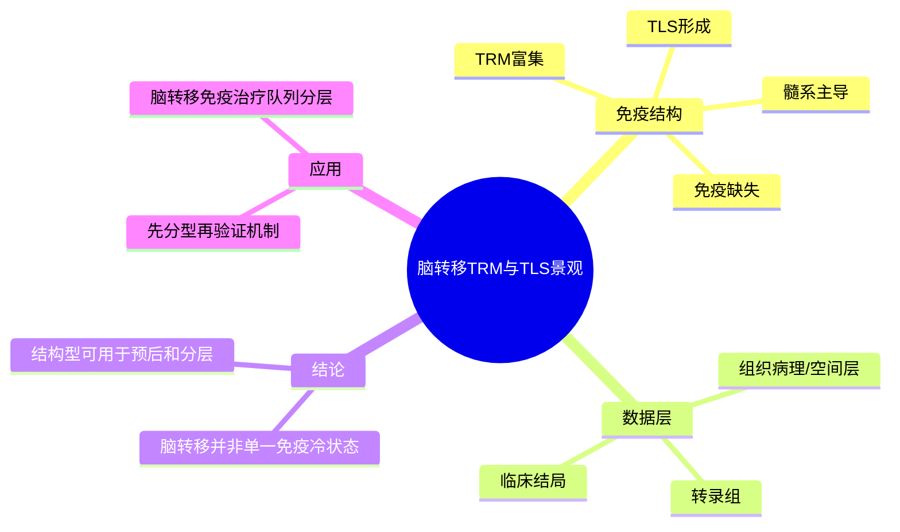

# 脑转移TRM与TLS景观-2026

- 发表时间：2026-04-01
- 期刊：Cancer Cell
- PubMed：[PMID: 42049023](https://pubmed.ncbi.nlm.nih.gov/42049023/)
- DOI：[10.1016/j.ccell.2026.03.016](https://doi.org/10.1016/j.ccell.2026.03.016)
- 研究类型：人样本脑转移多组学分型研究

## 研究问题
乳腺癌脑转移内部是否存在可重复识别的免疫结构型；这些结构型是否与组织驻留记忆 T 细胞、三级淋巴结构和预后差异稳定相关？

## 摘要式结论
这篇文章把乳腺癌脑转移的免疫异质性从“浸润高低”推进到“组织结构型”。作者识别出不同脑转移病灶中，TRM 富集、TLS 形成、髓系主导和免疫缺失等不同生态位，并显示这些状态与患者结局相关。对课题最直接的启发是：脑转移不是简单的免疫冷肿瘤，而是存在可用于分层验证和机制延展的微环境亚型；如果后续要做脑转移验证，不应只比较单个基因，而应先确定病灶落在哪一类免疫结构框架中。

## 文章行文逻辑
1. 以脑转移临床异质性为切入点，指出既往研究样本少、分层不足。
2. 对脑转移病灶做多模态 profiling，重点观察 T 细胞驻留状态和局部淋巴结构。
3. 从数据中归纳免疫结构型，并与分子特征和结局挂钩。
4. 提出 TRM/TLS 富集型病灶可能对应更活跃的局部抗肿瘤免疫。
5. 用结果反推脑转移免疫治疗和分层设计的现实意义。

## 主要创新点
- 聚焦 TRM 和 TLS 这类更接近局部组织免疫组织化结构的指标，而非泛化的浸润高低。
- 将脑转移微环境亚型与结局相联系，提升了结果的转化价值。
- 给脑转移免疫研究提供了“结构型”而非“单 marker 型”的分析框架。

## 关键数据类型与是否可下载
- 脑转移转录组：通常是公开验证的第一层数据，适合做亚型重算。
- 组织层与空间层信息：对 TLS/TRM 的解释关键，但部分原始层可能需受控访问。
- 临床注释：可用于生存和分层验证，但粒度可能受限。
- 下载性判断：中等到偏高。适合做亚型迁移、signature 打分和外部验证。

## 可借鉴的方法
- 在脑转移数据中优先构建 TRM、TLS、髓系压制和免疫缺失四类 signature。
- 用组织结构相关 marker 而非单基因解释脑转移免疫差异，更稳健。
- 对单细胞结果回填到 bulk 或空间数据时，可先做亚型打分，再做局部细胞状态追踪。

## 可借鉴的创新点
- 把脑转移的免疫景观描述提升到组织学结构层面。
- 将 TRM/TLS 作为后续验证和分层设计的切入点，便于与空间组学结合。

## 与用户课题的潜在关联
- 若用户关注脑转移免疫逃逸或免疫治疗响应，这篇文章可作为优先级很高的分层参考。
- 若后续要比较脑转移与肺/骨转移，可直接问：不同器官是否也存在“TRM/TLS 富集型”与“髓系排斥型”的对应结构。
- 若要做公共数据验证，可将本研究提出的亚型逻辑迁移到 [[乳腺癌脑转移免疫景观-2026]] 与现有脑转移队列中重算。

## 局限性
- 结构型定义对空间和病理上下文依赖较强，单纯 bulk 数据迁移时会损失信息。
- 样本来源和病灶处理流程差异，可能影响 TRM/TLS 的可比性。
- 结局关联强，不等于所有上游机制都已被证明。

## 相关笔记
- [[乳腺癌脑转移免疫景观-2026]]
- [[乳腺癌脑转移单细胞图谱-2026]]
- [[脑转移起始生态位与结构-2024]]

