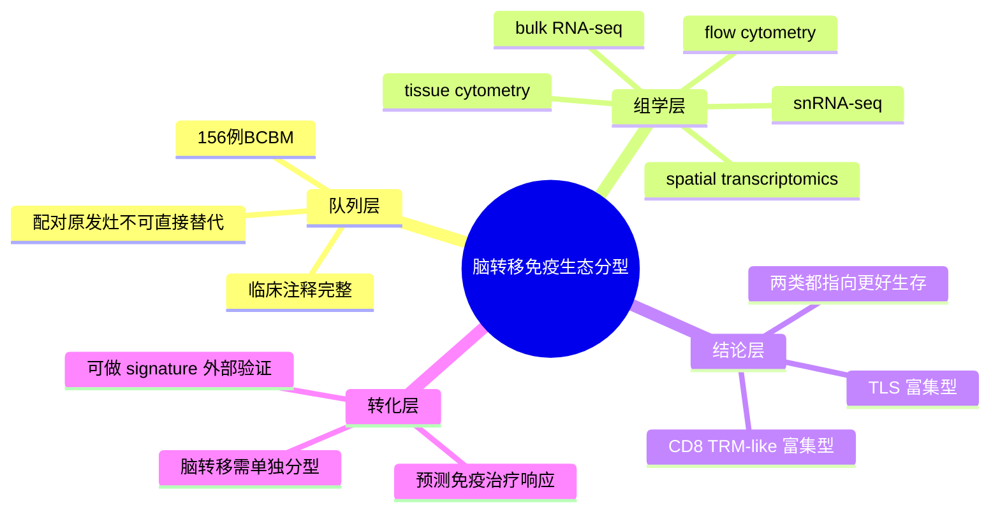

# 脑转移免疫生态分型
- 发表时间：2026-04-30（Epub 2026-04）
- 期刊：Cancer Cell
- PubMed：[PMID: 42049023](https://pubmed.ncbi.nlm.nih.gov/42049023/)
- DOI：[10.1016/j.ccell.2026.03.016](https://doi.org/10.1016/j.ccell.2026.03.016)
- 研究类型：人乳腺癌脑转移多模态队列研究（tissue cytometry + bulk/snRNA-seq + flow cytometry + spatial transcriptomics + patient-derived model）

## 研究问题
乳腺癌脑转移灶内部是否存在可稳定复现、且比原发灶更能预测预后和免疫治疗反应的免疫生态位？

## 摘要式结论
这篇文章的核心不是简单描述“脑转移也有免疫细胞”，而是把乳腺癌脑转移拆成了两类更有转化价值的有利免疫生态：一类是富含 `CD8+ tissue-resident-like memory T cells` 的肿瘤内控制型生态，另一类是含有 `tertiary lymphoid structures, TLS` 的类淋巴组织生态。两类生态都和更长生存、更少转移灶、以及更好的免疫治疗响应相关，而且这些信息不能从配对原发乳腺癌直接推断出来。对课题的直接价值是：脑转移应被当作独立免疫器官位点来分型，而不是把原发灶免疫特征简单外推。

## 文章行文逻辑
1. 先提出临床痛点：BCBM 预后差，原发灶分型不足以指导脑转移治疗。
2. 用 156 例临床注释完善的 BCBM 队列做组织层面的系统描图。
3. 结合 tissue cytometry、bulk/snRNA-seq、flow 和空间转录组定义免疫组成与空间结构。
4. 从综合分析中提炼出两类“好预后免疫生态”。
5. 用独立队列和功能模型去验证这些生态与免疫控制、疗效预测之间的关系。

## 主要创新点
- 不是单一组学，而是把脑转移免疫结构做成“多模态一致结论”。
- 明确指出配对原发灶不能替代脑转移灶的免疫状态判断。
- 把 `CD8 TRM-like` 与 `TLS` 两种结构性特征提升为可预后、可转化的脑转移免疫标志。

## 关键数据类型与是否可下载
- 组织细胞定量、多模态转录组、空间转录组、流式数据：公开摘要和期刊页面已确认存在。
- 本次检索中未直接定位到明确 GEO/ArrayExpress accession：当前可视为“数据大概率会公开或可申请获取，但需后续专门核对数据可用性声明”。
- 因为是大队列脑转移临床样本，后续若公开，极适合做 signature 外部验证而不一定适合从 raw data 起步重做全流程。

## 可借鉴的方法
- 脑转移队列优先做“细胞组成 + 空间结构”联合分型，而不是只看差异基因。
- 把 `CD8 TRM-like`、`TLS` 这类结构性特征下沉为 signature，在 bulk 队列或其他单细胞队列中外推验证。
- 做原发灶与转移灶比较时，不把“相关”误写成“可替代”；这篇文章的设计很适合指导 paired analysis。

## 可借鉴的创新点
- 先定义生态型，再回推功能和临床结局，比从单基因出发更稳。
- 用空间信息解释免疫有效性，能避免仅凭浸润比例做过度推断。

## 与用户课题的潜在关联
- 如果课题关注乳腺癌脑转移免疫微环境，这篇文章可直接作为“脑转移免疫分型”主参考。
- 如果后续想比较脑/肺/骨转移的免疫共性与器官特异性，可以把 `CD8 TRM-like` 与 `TLS` 作为脑转移端的锚点。
- 若准备做公开数据验证，可优先在既有脑转移数据里测试这些 signature 是否稳定。

## 局限性
- 当前公开页面未直接给出 accession，数据落地重分析仍需二次核对。
- 文章强调的是脑转移灶内异质性和预后关联，未必直接给出可药物化的单一驱动轴。
- 脑转移临床样本常伴随治疗史差异，做外部比较时要谨慎处理治疗偏倚。

## 相关笔记
- 乳腺癌脑转移单细胞图谱-2026
- 乳腺癌脑转移免疫景观-2026
- 脑转移基因组免疫组学-2025
