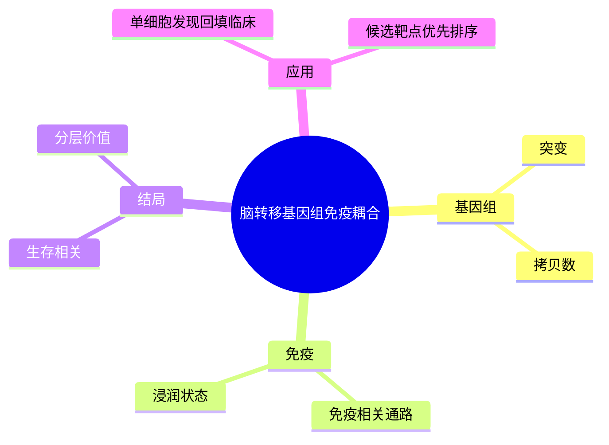

# 脑转移基因组免疫组学

- 发表时间：2025-05-06
- 期刊：NPJ Breast Cancer
- PubMed：[PMID: 40355907](https://pubmed.ncbi.nlm.nih.gov/40355907/)
- DOI：[10.1038/s41523-025-00717-9](https://doi.org/10.1038/s41523-025-00717-9)
- 研究类型：脑转移大队列基因组 + 免疫特征关联研究

## 研究问题
乳腺癌脑转移的基因组改变与免疫微环境之间是否存在可解释的关联，并能否进一步连接到患者生存。

## 摘要式结论
这篇研究是脑转移“组学分层”方向的重要过渡稿。文章不只做突变列表，而是将基因组改变、免疫特征和生存结局放在一起看，说明脑转移病灶内存在可分辨的分子-免疫耦合模式。对用户课题的意义是：如果后续要把单细胞发现推进到临床队列验证，本文提供了非常实用的 bulk/临床层桥梁。

## 文章行文逻辑
1. 描述脑转移的临床问题与样本获取难点。
2. 建立脑转移队列并做基因组、免疫层画像。
3. 识别与生存有关的分子和免疫特征。
4. 讨论这些特征对治疗分层与机制研究的价值。

## 主要创新点
- 脑转移场景下把基因组与免疫信息做联动解读。
- 为“脑转移亚型”提供更贴近临床终点的证据。
- 能作为单细胞研究和临床队列研究之间的连接层。

## 关键数据类型与是否可下载
- 基因组/转录组级别数据：需查看作者提供的补充材料和数据库挂载，公开程度通常中等。
- 免疫表征结果：摘要和补充表通常可直接使用。
- 临床结局信息：多为整理后结果表，可用于二次分析但粒度有限。

## 可借鉴的方法
- 做公共数据整合时，不要把基因组和免疫分开处理。
- 可先用 bulk 层结果筛选候选轴，再回到单细胞确认其落在哪类细胞。
- 若用户计划构建“脑转移风险模块”，可优先保留同时关联免疫和生存的特征。

## 可借鉴的创新点
- 不是只做“脑转移 vs 原发灶”，而是进一步关联结局。
- 强调临床可转化价值，适合课题中后期做验证闭环。

## 与用户课题的潜在关联
- 适合作为脑转移验证队列层面的参考。
- 若课题目标是把微环境机制与预后联系起来，这篇文章有直接借鉴价值。

## 局限性
- 多组学整合质量受样本来源和缺失值影响较大。
- 文章更偏相关性建模，功能机制深度通常不及实验论文。
